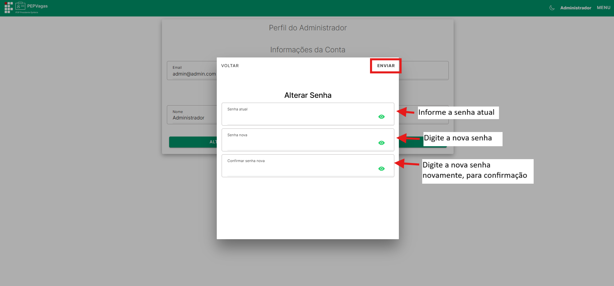
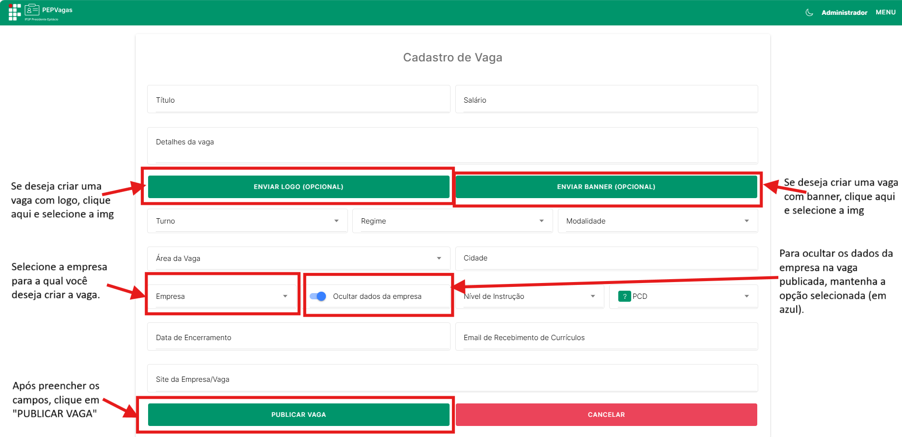
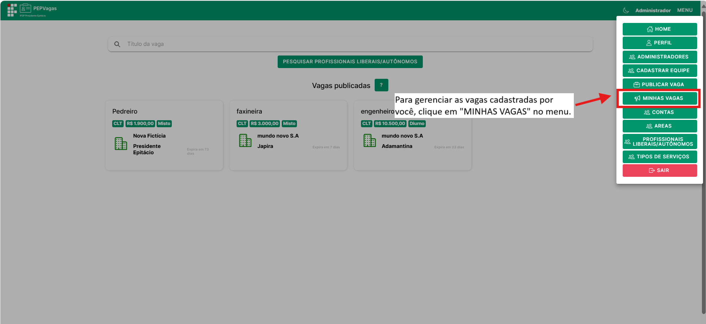

title: Administrador
---

# Administrador

O **Administrador** é o usuário com o mais alto nível de acesso dentro da plataforma PEPVagas. Ele tem permissão para gerenciar todos os usuários, vagas, áreas, tipos de serviço e demais recursos do sistema.  

Este perfil é fundamental para manter o funcionamento geral da plataforma, garantindo que todas as informações estejam organizadas e atualizadas.

**Principais ações**

- Gerenciar **administradores** (cadastrar, editar, excluir).  
- Gerenciar **contas de usuários** (candidatos, empresas, membro de equipe, representantes e profissionais liberais).  
- Publicar e gerenciar **vagas** para qualquer empresa cadastrada.  
- Cadastrar, alterar e remover **áreas** e **tipos de serviço**.  
- Visualizar **profissionais liberais/autônomos**.  
- Gerenciar **seu próprio perfil** (dados e senha).

---

## Login
Para acessar a conta de **Administrador**, clique no botão **Entrar** no canto superior direito da tela.  

  

Na tela de login, informe seu **e-mail** e **senha** de administrador, e clique em **Entrar**.  

  

---

## Menu
No canto superior direito da plataforma, localiza-se o **Menu**, que dá acesso a todas as áreas administrativas:  

 

  

- **Home** – tela inicial.  
 

  

- **Publicar Vaga** – criação de vagas para qualquer empresa cadastrada.  

 

  

- **Minhas Vagas** – gerenciamento de vagas publicadas.  

 

  

- **Administradores** – cadastro e gerenciamento de contas com nível admin. 

 

  

- **Cadastrar Equipe** – cadastrar membros da equipe PEPVagas.

 

  

- **Contas** – visualização e exclusão de todos os usuários cadastrados.  

 

  

- **Áreas** – cadastro e organização das categorias profissionais.

 

  

- **Tipos de Serviço** – cadastro e organização dos serviços oferecidos por profissionais liberais.

 

  

- **Profissionais Liberais/Autônomos** – listagem completa de profissionais liberal cadastrado. 

 

  

- **Perfil** – gerenciamento das suas informações pessoais e senha. 

 

  

- **Sair** – encerra a sessão e redireciona para a tela de login.  

---

## Perfil
(Menu → **Perfil**)  

Na tela de **Perfil**, o Membro de Equipe pode gerenciar seus dados de acesso e informações pessoais. As opções disponíveis são:

 

  

Após clicar em "PERFIL" no menu, você será redirecionado para essa pagina:

 

  

- **Alterar Informações** – onde é possível **alterar apenas o nome**. Após inserir o novo nome, clique no **botão Enviar** no canto superior direito para salvar a alteração.  

 

  

- **Alterar Senha** – ao clicar neste botão, abre a tela de alteração de senha. É necessário informar:
  1. **Senha atual**
  2. **Nova senha**
  3. **Confirmar nova senha**  
  Depois de preencher todos os campos corretamente, clique no **botão Enviar** no canto superior direito para atualizar a senha.  

 

  

---

## Gerenciamento de Administradores
(Menu → **Administradores**)  

Esta seção permite criar e gerenciar contas com permissões administrativas.
 

  

Após clicar em "ADMINISTRADORES" no menu, voce vai ser redirecionado para essa tela:
 

  

- **Cadastrar:** clique em **Cadastrar**, preencha os campos (Nome, E-mail, Senha, Confirmar Senha) e clique no botão **Cadastrar**.  

 

  

- **Alterar:** selecione um administrador da lista e clique no botão **Alterar**. Nessa tela, é possível **alterar apenas o nome** do administrador. Após editar, clique no **botão Enviar** no canto superior direito para salvar a alteração.  

 

  

- **Excluir:** remova uma conta de administrador, se necessário, selecionando o administrador na lista e clicando no botão **Excluir**.  

---

## Gerenciamento de Contas
(Menu → **Contas**)  

Esta seção permite ao administrador acessar todas as contas existentes na plataforma, independentemente do tipo de usuário.

 

  

- **Visualizar:** exibe a lista completa de todas as contas cadastradas, incluindo administradores, candidatos, empresas, membros de equipe, representantes e profissionais liberais.  

 

  

- **Excluir:** selecione a conta desejada na lista e clique no botão **Excluir** para removê-la permanentemente do sistema.  

 

  

---

## Gerenciamento de Vagas
(Menu → **Publicar Vaga** / **Minhas Vagas**)  

Como administrador, você pode publicar vagas para qualquer empresa cadastrada.

**Publicar Vaga**

1. Clique em **Publicar Vaga** no menu.  

 

  

2. Preencha os campos obrigatórios (Título, Salário, Descrição, Turno, Regime, Modalidade, Área, Cidade, etc.).  
3. Selecione a **Empresa** para a qual a vaga está sendo criada (campo obrigatório para administradores).  
4. Clique em **Publicar Vaga** para finalizar.  

 

  

 

**Gerenciar Vagas**

(Menu → **Minhas Vagas**)  

Na seção **Minhas Vagas**, o administrador pode visualizar, editar ou excluir qualquer vaga publicada. 

 

  

Todas as vagas criadas por você ficam visíveis na tela inicial. 

  

Basta clicar sobre a vaga desejada para que apareçam os botões: **Visualizar**, **Editar** e **Excluir**.  

  

 

- **Visualizar:** detalhes da vaga.  

   Ao clicar no botão “Visualizar”, a página com as informações completas da vaga será aberta:
   

  

- **Editar:** alterar informações da vaga.
   
   Ao clicar no botão “Editar”, a página com os dados completos da vaga para alteração será aberta:
   

     
   
  

---

## Gerenciamento de Áreas
(Menu → **Áreas**)  

Esta seção permite organizar e editar as áreas de atuação disponíveis no sistema. As funcionalidades são:

 

  

- **Visualizar:** exibe todas as áreas cadastradas.  
- **Cadastrar:** clique em **Cadastrar**, informe o nome da nova área e confirme.  
- **Alterar:** selecione uma área da lista, clique em **Alterar**, edite o nome e clique em **Enviar** no canto superior direito para salvar.  
- **Excluir:** selecione uma área e clique em **Excluir** para removê-la, se não for mais necessária.  

  

---

## Gerenciamento de Tipos de Serviço
(Menu → **Tipos de Serviço**)  

Esta seção funciona de forma semelhante à gestão de áreas e permite organizar os tipos de serviço oferecidos pelos profissionais liberais.  

- **Visualizar:** lista completa dos tipos de serviço cadastrados.  
- **Cadastrar:** clique em **Cadastrar**, informe o novo tipo e clique em **Enviar**.  
- **Alterar:** selecione um tipo de serviço, clique em **Alterar**, edite o nome e clique em **Enviar** no canto superior direito.  
- **Excluir:** selecione um tipo de serviço e clique em **Excluir** para removê-lo, se não for mais necessário.  

---

## Profissionais Liberais
(Menu → **Profissionais Liberais/Autônomos**)  

Nesta seção, o administrador pode visualizar a lista completa de profissionais liberais cadastrados na plataforma.  

- **Visualizar detalhes:** selecione um profissional na lista e clique no botão **Ver Detalhes** para acessar todas as informações do perfil.  

---

## Sair
No menu, clique em **Sair** para encerrar sua sessão. Você será redirecionado para a tela de login.  

---

✅ **Dica:** como administrador, você tem acesso total à plataforma. Use com atenção, pois alterações feitas nesta conta impactam todos os usuários e dados do sistema.
