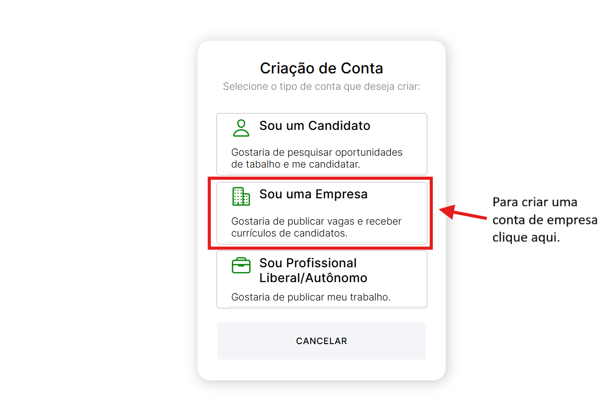
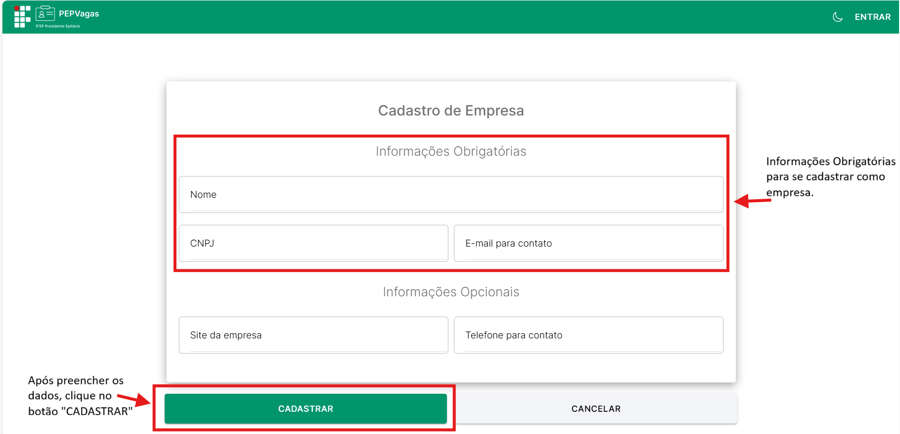
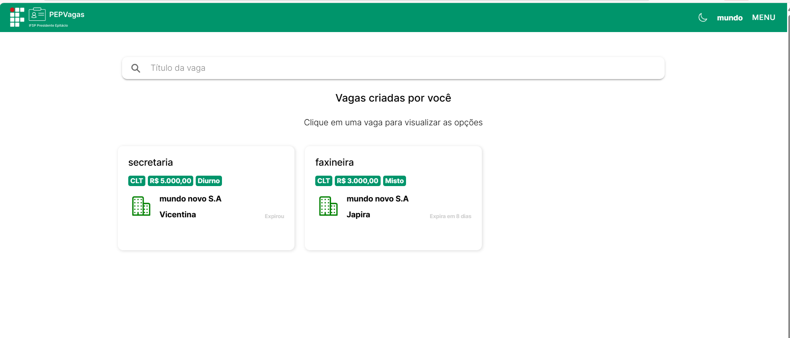
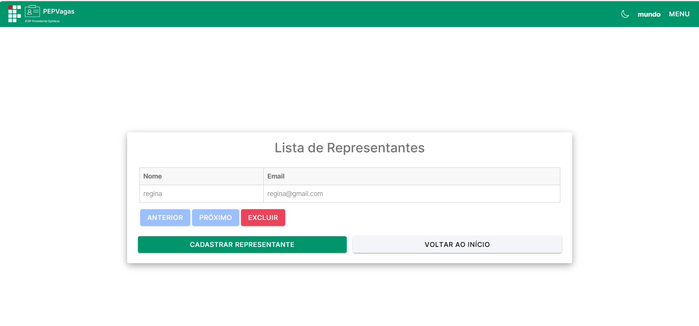
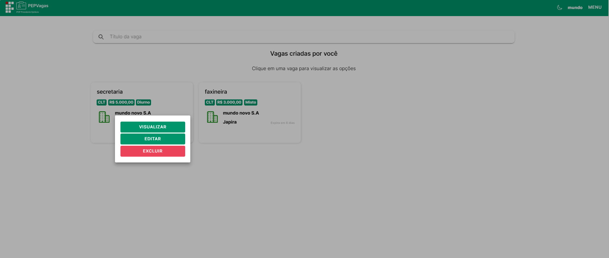
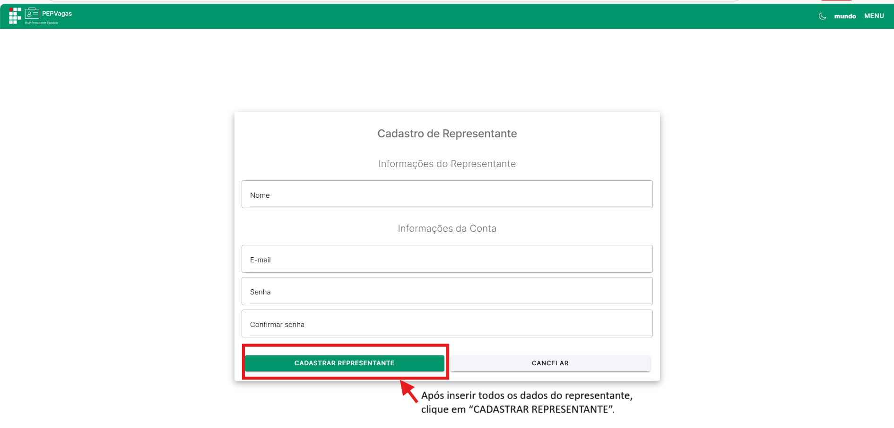

title: Empresa
---

# Empresa

A **Empresa** é um dos principais perfis da plataforma PEPVagas. Esse tipo de usuário representa organizações que desejam **divulgar oportunidades de trabalho** e **gerenciar seus processos seletivos** de forma prática e centralizada.  

Este perfil é fundamental para que empresas possam cadastrar informações institucionais, publicar vagas, gerenciar representantes e acompanhar candidaturas.

**Principais ações**

- Cadastrar e gerenciar o **perfil institucional** da empresa.  
- **Publicar vagas** vinculadas à própria empresa.  
- **Visualizar e gerenciar vagas diretamente na tela inicial**.  
- **Receber candidaturas por e-mail** no momento em que um candidato se candidata a uma vaga.  
- Cadastrar e gerenciar **representantes** (usuários que auxiliam na administração das vagas).  
- Gerenciar **suas próprias informações de acesso**.  

---

## Login
Para acessar a conta de **Empresa**, clique no botão **Entrar** no canto superior direito da tela.  

  

Na tela de login, informe o **e-mail** e **senha** cadastrados e clique em **Entrar**.

  

---

## Registrar-se
Se você ainda não possui uma conta de empresa, siga os passos abaixo:  

1. Na tela inicial, clique em **Registre-se**.  

  

2. Selecione **Sou uma Empresa**.

  

 

3. Preencha os campos obrigatórios:
   - **E-mail**  
   - **Senha**  
   - **Confirmação de Senha**  
4. Clique em **Continuar**.  

  

5. Preencha os dados da empresa:
   - **Nome da Empresa**  
   - **CNPJ**  
   - **E-mail de contato**  
   - **Telefone** (opcional)  
   - **Site** (opcional)  

6. Clique em **Cadastrar** para finalizar a criação da conta. 
 

  

Após concluir o cadastro, você será redirecionado para a tela de login para acessar a conta.  

---

## Menu
No canto superior direito, clique no **Menu** para acessar as opções:  

  

- **Home:** tela inicial com listagem de todas as vagas da empresa.  

  

- **Perfil:** gerenciamento das informações institucionais e de acesso.  

  

- **Gerenciar Representantes:** cadastro e administração de representantes.  

  

- **Publicar Vaga:** criação de novas vagas.

  

- **Sair:** encerra a sessão e redireciona para a tela de login.

---

## Perfil
(Menu → **Perfil**)  

Na tela de **Perfil**, a empresa pode gerenciar seus dados institucionais e de acesso:  

- **Visualizar Dados:** nome, CNPJ, e-mail, telefone e site.  
- **Editar Informações:** atualizar dados institucionais.  
- **Alterar Senha:** modificar senha de acesso.  

  

Após clicar no botão “ALTERAR SENHA”, esta página será exibida:

  

Após clicar no botão “ALTERAR INFORMAÇÕES”, esta página será exibida:

  

---

## Publicação de Vagas
(Menu → **Publicar Vaga**)  

Empresas podem divulgar vagas de trabalho diretamente na plataforma.

  

**Como publicar uma vaga:**

1. Clique em **Publicar Vaga** no menu.

Após clicar em "Publicar Vaga", voce será redirecionado para essa pagina:

  

2. Preencha os campos obrigatórios:
   - **Título da Vaga**  
   - **Salário**  
   - **Detalhes da Vaga**  
   - **Turno**  
   - **Regime**  
   - **Modalidade**  
   - **Área**  
   - **Cidade**  
   - **Nível de Instrução Exigido**  
   - **Vaga destinada a PCD?**  
   - **Data de Encerramento**  
   - **E-mail para recebimento de currículos**  
3. Preencha os campos opcionais:
   - **Site da empresa/vaga**  
   - **Logo da empresa**  
   - **Banner de divulgação**  
4. Clique em **Publicar Vaga**.  

---

## Gerenciamento de Vagas
(Menu → **Home**)  

Todas as vagas da empresa ficam visíveis na tela inicial. 

  

**Como gerenciar:**

1. Clique na vaga desejada.  
2. Os botões de ação disponíveis:

  

 

   - **Visualizar:** detalhes da vaga.  
   Ao clicar no botão “Visualizar”, a página com as informações completas da vaga será aberta:
   

  

   - **Editar:** alterar informações da vaga.
   
   Ao clicar no botão “Editar”, a página com os dados completos da vaga para alteração será aberta:
   

     
   
  

   - **Excluir:** remover a vaga. 

---

## Gerenciamento de Representantes
(Menu → **Gerenciar Representantes**)  

Empresas podem cadastrar representantes para auxiliar na administração das vagas.

  

 

**Como gerenciar representantes:**

1. Clique em **Gerenciar Representantes**.  
2. Para **cadastrar**:
   - Clique em **Cadastrar Representante**.  
   Após clicar em "CADASTRAR REPRESENTANTE", a pagina de cadastro do representante é aberta:
   

  

 

   - Preencha: Nome, E-mail, Senha, Confirmar Senha.  
   - Clique em **Cadastrar Representante**.  
3. Para **excluir**:
   - Selecione o representante na lista da tabela.  
   - Clique em **Excluir**.  

---

## Recebimento de Candidaturas
Quando um candidato se candidata, o responsável recebe automaticamente um **e-mail** com:

- Dados básicos do candidato.  
- Currículo anexado (se disponível).  

Segue exemplo de email enviado pelo sistema:

  

> Importante: o candidato não pode remover a candidatura após enviada.

✅ **Dica:** mantenha o **e-mail de contato da empresa atualizado** para não perder candidaturas.

---

## Sair
(Menu → **Sair**)  

Clique em **Sair** para encerrar a sessão. Você será redirecionado para a tela de login.  

---

✅ **Dica:** mantenha o perfil institucional sempre completo e atualizado — isso aumenta a visibilidade das vagas e a confiança dos candidatos.
