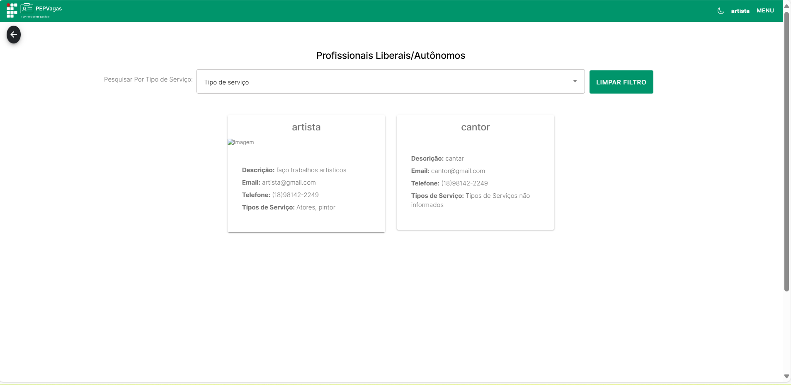
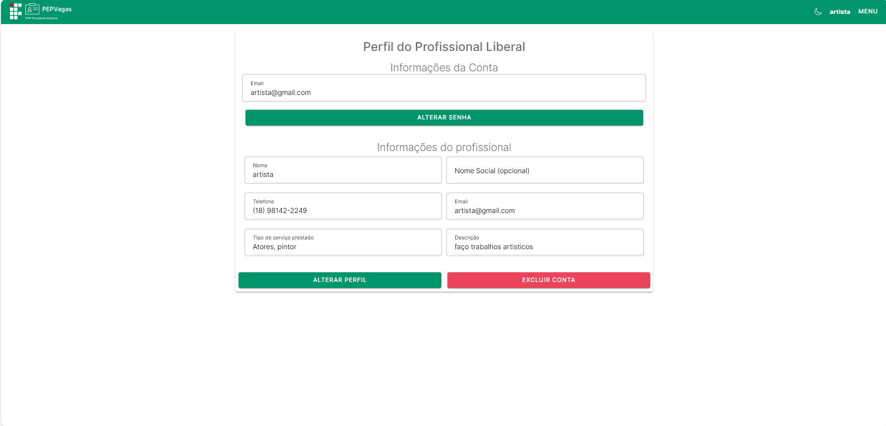
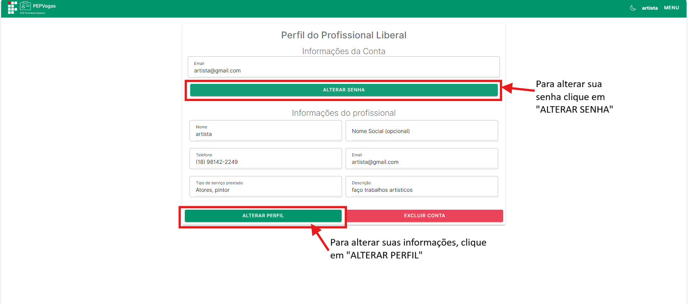

title: Profissional Liberal
---

# Profissional Liberal

O **Profissional Liberal** é um perfil destinado a **autônomos** e prestadores de serviços que desejam divulgar seu trabalho na plataforma PEPVagas.  

Ele é ideal para profissionais que querem **divulgar seus serviços, atrair clientes e parceiros** diretamente na plataforma.

**Principais ações**

- Criar e gerenciar **seu perfil profissional**.  
- Indicar **um ou mais tipos de serviço prestado**.  
- Receber **contato de clientes via e-mail ou telefone**.  
- Visualizar **todos os profissionais liberais cadastrados** na Home e filtrar por tipo de serviço.  
- Gerenciar **suas próprias informações de acesso**.  

---

## Login
Para acessar a conta de **Profissional Liberal**, clique no botão **Entrar** no canto superior direito da tela.  

  

Informe o **e-mail** e **senha** definidos no momento em que criou o login e clique em **Entrar**.

  

---

## Menu
No canto superior direito, clique no **Menu** para acessar as funcionalidades:

 

  

- **Home** – visualizar todos os profissionais liberais cadastrados na plataforma e aplicar filtros por tipo de serviço.  
 

  

- **Perfil** – gerenciamento completo das informações do profissional.

  

- **Sair** – encerra a sessão e redireciona para a tela de login.  

---

## Cadastro e Gerenciamento do Perfil
(Menu → **Perfil**)  

O profissional deve preencher e atualizar seus dados para garantir que seu perfil seja bem divulgado.

Se você ainda não for cadastrado, clique em **Registre-se** na tela de login.  

  

Selecione **Sou um Profissional Liberal/Autônomo**:

  

 

**Campos do Perfil:**
- **Nome**  
- **E-mail**  
- **Telefone**  
- **Tipo(s) de serviço prestado** (pode informar mais de um)  
- **Descrição do serviço** (detalhe suas habilidades, experiência e o que oferece)  
- **Imagem de divulgação** (foto ou logo do serviço)

  

 

Para visualizar e alterar os dados:

  

 

Após clicar em "PERFIL", voce será redirecionado para essa pagina:

  

 

- **Alterar Senha:** permite editar a senha de acesso.  

  

Após clicar no botão de alterar senha, essa tela vai se abrir:

  

- **Alterar Perfil:** editar dados.  

  

Após clicar no botão alterar perfil, essa tela vai se abrir:

  

✅ **Dica:** Preencha todos os campos para que clientes encontrem seu perfil com mais facilidade.  

---

## Home – Listagem de Profissionais Liberais
(Menu → **Home**)  

Na Home, o profissional liberal pode visualizar **todos os profissionais cadastrados**, inclusive o próprio perfil.

**Funcionalidades:**

- **Visualizar perfis** – acessar detalhes do perfil de outros profissionais.  
- **Filtro por tipo de serviço** – selecionar um tipo de serviço específico para refinar a lista.  

Na tela home de profissional liberal, estão listadas todos os anuncios dos profissionais liberais cadastrados:

  

 

  

 

---

## Contato de Clientes

Quando um cliente se interessa pelo serviço, ele deve entrar em contato diretamente utilizando os dados informados no perfil do profissional.  

Todas as negociações, propostas e confirmações acontecem **fora da plataforma**, via e-mail ou telefone.  

✅ **Dica:** Mantenha seu **e-mail e telefone de contato sempre atualizados** para garantir que os clientes consigam falar com você.

---

## Sair
(Menu → **Sair**)  

Clique em **Sair** para encerrar a sessão. Você será redirecionado para a tela de login.  

*Espaço para imagem do botão Sair*

---

✅ **Dica:** Um perfil completo e atualizado aumenta a visibilidade do profissional e a chance de novos clientes.
