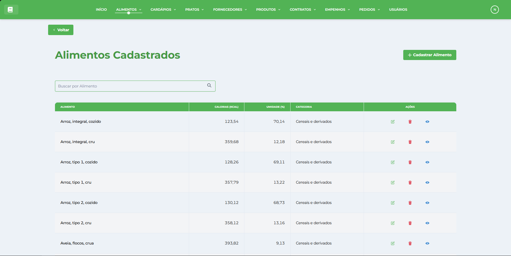

# Alimentos

* * *

## Visão Geral

A tela de Gestão de Alimentos é um dos módulos fundamentais do Sistema de Gestão Nutricional (SGN). Esta interface permite cadastrar, visualizar, editar e gerenciar todos os alimentos utilizados no planejamento de _[Pratos](../../prato/pratos/)_, com informações nutricionais detalhadas e categorização organizada.

## Características da Interface

### Layout e Navegação

*   **Barra superior verde**: Menu principal com acesso a todos os módulos do sistema
*   **Botão Voltar**: Navegação intuitiva para retornar à tela anterior
*   **Design responsivo**: Interface adaptável para diferentes tamanhos de tela
*   **Identidade visual consistente**: Seguindo o padrão verde do SGN

### Área Principal de Dados

A interface apresenta uma tabela organizada com as seguintes colunas:

#### Informações Exibidas

*   **ALIMENTO**: Nome completo e descrição do alimento
*   **CALORIAS (KCAL)**: Valor energético por 100g do alimento
*   **UNIDADE (%)**: Unidade de medida padrão para cálculos
*   **CATEGORIA**: Classificação do alimento por grupo alimentar
*   **AÇÕES**: Botões para editar, excluir e visualizar detalhes

### Funcionalidades de Busca

*   **Campo de busca**: "Buscar por Alimento" para filtrar registros rapidamente
*   **Filtro em tempo real**: Resultados atualizados conforme digitação

### Ações Disponíveis

*   **Cadastrar Alimento**: Botão verde no canto superior direito
*   **Editar**: Ícone de lápis para modificar informações
*   **Excluir**: Ícone de lixeira para remover alimentos
*   **Visualizar**: Ícone de olho para ver detalhes completos

## Dados dos Alimentos

### Informações Nutricionais

Cada alimento possui dados precisos de:

*   **Valor calórico** por 100g
*   **Unidade de medida** padrão
*   **Categoria alimentar** para organização
*   **Composição nutricional** detalhada (acessível via visualização)

## Funcionalidades Principais

### Cadastro de Alimentos

*   Registro completo com informações nutricionais
*   Categorização por grupos alimentares
*   Validação de dados obrigatórios
*   Integração com tabelas nutricionais oficiais

### Pesquisa e Filtros

*   Busca por nome do alimento
*   Filtros por categoria
*   Ordenação por diferentes critérios
*   Resultados em tempo real

### Edição e Atualização

*   Modificação de informações cadastradas
*   Atualização de valores nutricionais
*   Correção de categorias
*   Histórico de alterações

### Visualização Detalhada

*   Informações nutricionais completas
*   Composição de macros e micronutrientes
*   Dados de origem e fonte
*   Recomendações de uso

### Exclusão Controlada

*   Verificação de vínculos com pratos
*   Confirmação de exclusão
*   Proteção contra remoção acidental
*   Backup de dados removidos

### Integração com Outros Módulos

*   **Pratos**: Alimentos usados como ingredientes
*   **Cardápios**: Cálculos nutricionais automáticos
*   **Relatórios**: Análises de consumo nutricional
*   **Compras**: Planejamento de aquisições

## Benefícios do Módulo

### Eficiência

*   Centralização de informações nutricionais
*   Busca rápida e filtros inteligentes
*   Integração completa com outros módulos
*   Redução de erros em cálculos

### Precisão Nutricional

*   Dados confiáveis e atualizados
*   Cálculos automáticos precisos
*   Rastreabilidade de informações
*   Conformidade com normas técnicas

* * *

**Dica:** Mantenha sempre uma base de dados atualizada e bem categorizada para garantir a qualidade dos cardápios e a precisão dos cálculos nutricionais.