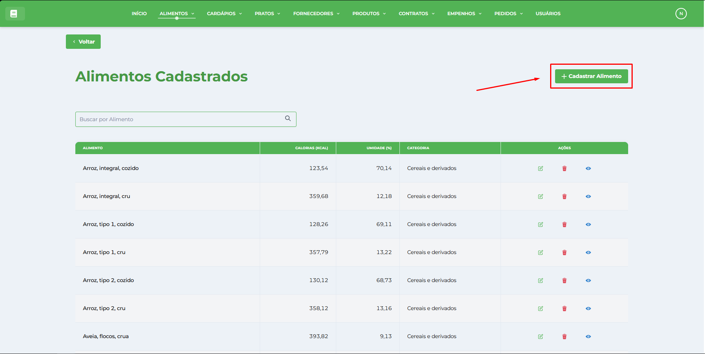
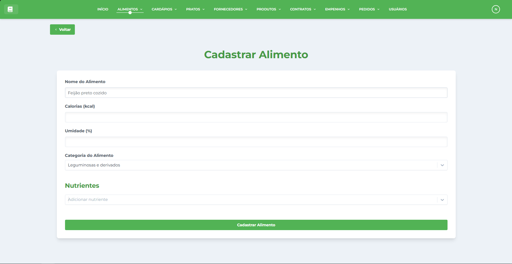
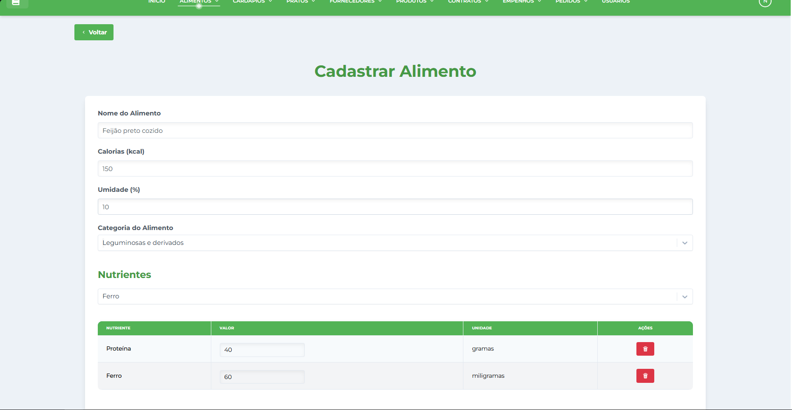
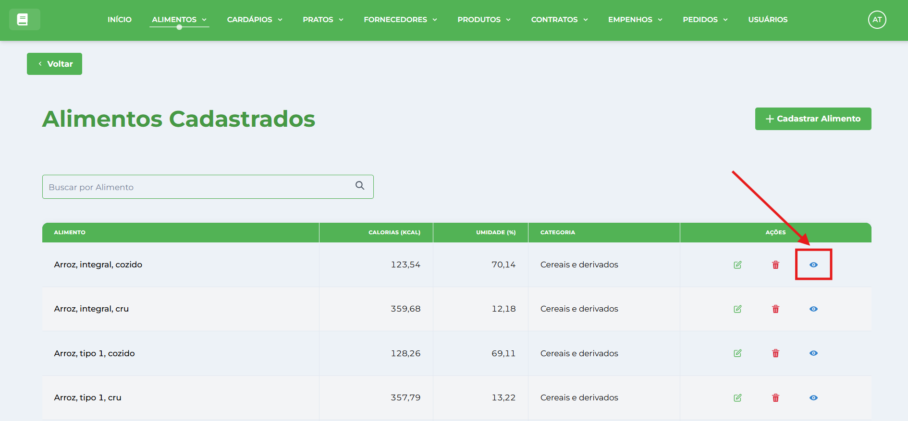
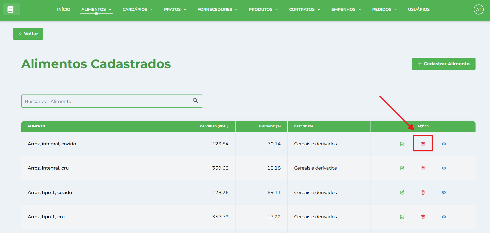
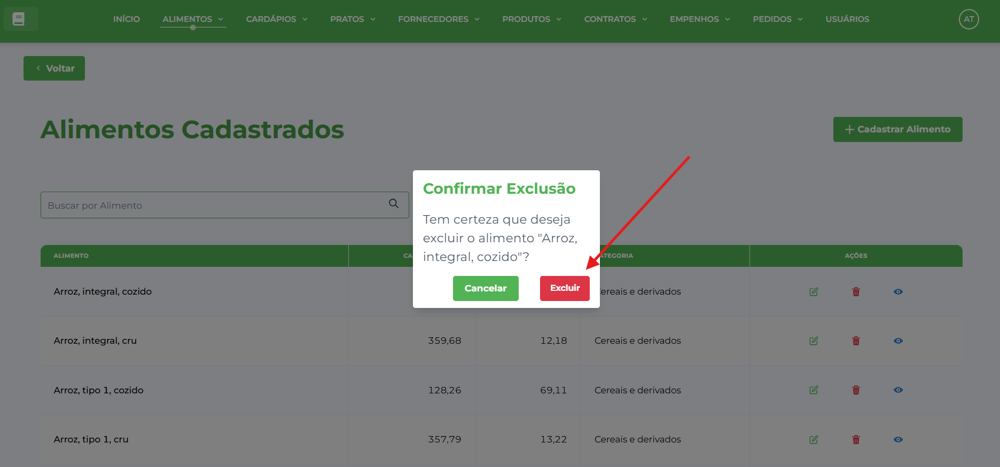

# Alimentos

**Localização**: Menu principal → Alimentos

* * *

## Visão Geral

Nesta tela você gerencia os alimentos do sistema: cadastrar, editar, visualizar, excluir e gerar relatórios. A gestão de alimentos é fundamental para o planejamento de _[Pratos](../../prato/pratos/)_ e _[Cardápios](../../cardapio/cardapios/)_ com informações nutricionais precisas.

## Ações principais (barra superior)

*   **Cadastrar Alimento** — abre a janela de cadastro.
*   **Gerar Relatório** — gera um relatório da listagem atual.
*   **Campo de pesquisa** (à direita) — pesquisa/filtra os registros por nome do alimento.

## Como cadastrar um novo Alimento

1.  No menu clique em **Alimentos**.
2.  Clique no botão **Cadastrar Alimento** (barra superior).

1.  Na janela **Cadastrar Alimento** preencha os campos:
    
    *   **Nome do Alimento** — digite o nome completo e específico (ex.: "Arroz branco cozido").
    *   **Categoria** — selecione a categoria no menu dropdown (Cereais, Leguminosas, Carnes, Vegetais, etc.).
    *   **Valor Energético** — insira as calorias por 100g do alimento.
    *   **Macronutrientes** (opcional) — selecione na lista de nutrientes e preencha os valores na tabela.
    *   **Micronutrientes** (opcional) — selecione na lista de nutrientes e preencha os valores na tabela.
    *   **Umidade (%)** (opcional) — preencha o percentual de umidade.
    
     
    
2.  Clique em **Cadastrar Alimento** para confirmar. A janela será fechada e o registro aparecerá na tabela.
    

## Como editar um registro

1.  Localize o alimento na tabela (use a pesquisa se necessário).
2.  Clique em **Editar** na coluna de Ações da linha desejada.
    
    
    
3.  A janela abrirá em modo de edição — altere os campos desejados e clique em **Confirmar**.
    

## Como visualizar um alimento

1.  Na lista, clique em **Visualizar** para abrir os detalhes completos do alimento.
    
    
    
2.  Você verá todas as informações nutricionais e dados cadastrais.
    
3.  Para fechar, clique em **Cancelar** ou no botão de fechar da janela.

## Como excluir um registro

1.  Clique em **Excluir** (ícone de lixeira) na coluna Ações da linha correspondente.
    
    
    
2.  Confirme a exclusão clicando em **Confirmar** no diálogo de confirmação.
    
3.  ⚠️ **Atenção**: Não é possível excluir alimentos que estão sendo utilizados em pratos.
    
    
    

* * *

## Dicas Importantes

### Campos Obrigatórios

*   **Nome do Alimento**: Deve ser específico e descritivo
*   **Categoria**: Escolha a classificação correta para facilitar a busca
*   **Valor Energético**: Fundamental para os cálculos nutricionais

### Boas Práticas

*   Use nomes padronizados (ex.: "Arroz branco cozido" ao invés de apenas "Arroz")
*   Preencha os dados nutricionais quando disponíveis
*   Verifique a categoria correta para facilitar futuras consultas
*   Teste a busca após cadastrar para verificar se o alimento aparece corretamente

### Validações do Sistema

*   O sistema impede exclusão de alimentos em uso
*   Campos obrigatórios são validados antes do salvamento
*   Nomes duplicados podem gerar alertas
*   Valores nutricionais devem ser numéricos positivos