# Cardápios

**Localização**: Menu principal → Cardápios

* * *

## Visão Geral

Nesta tela você gerencia os cardápios do sistema: cadastrar, editar, visualizar, excluir e gerar relatórios. O módulo de cardápios é central para o planejamento nutricional, organizando _[Pratos](../../prato/pratos/)_ em refeições completas.

[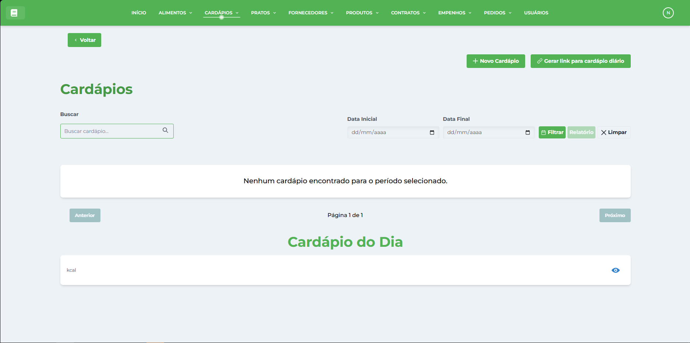](../../img/telacardapio/telacardapios.png)

## Ações principais (barra superior)

*   **Novo Cardápio** — abre a janela de cadastro.
*   **Gerar Relatório** — gera um relatório da listagem atual.
*   **Campo de pesquisa** (à direita) — pesquisa/filtra os registros por nome do cardápio.

## Pré-requisitos

⚠️ **Importante**: Antes de criar um cardápio, você deve ter:

1.  **Alimentos cadastrados** - Siga o manual de [Alimentos](../../alimento/tutoriais-alimento/)
2.  **Pratos cadastrados** - Siga o manual de [Pratos](../../prato/tutoriais-prato/)

## Como cadastrar um novo Cardápio

1.  Faça login no sistema SGN seguindo o _[Tutorial: Fazer Login](../../login/tutorial-login/)_
2.  No menu lateral clique em **Cardápios**.
3.  Clique no botão **Novo Cardápio** (barra superior).
    
    [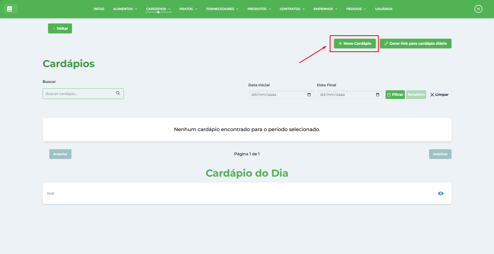](../../img/telacardapio/botaonovocardapio.png)
    
4.  Na janela **Novo Cardápio** preencha os campos:
    
    *   **Nome do Cardápio** — digite um nome descritivo e identificativo.
    *   **Descrição** (opcional) — adicione informações sobre o objetivo ou características especiais.
    *   **Refeição** — selecione uma refeição para relacionar ao prato (Café da Manhã, Almoço, Café da Tarde, etc.).
    *   **Prato** — selecione um prato para relacionar à refeição.
    
    [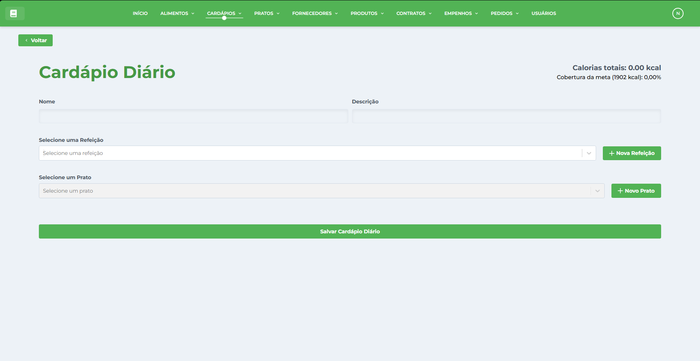](../../img/telacardapio/telanovocardapio.png) [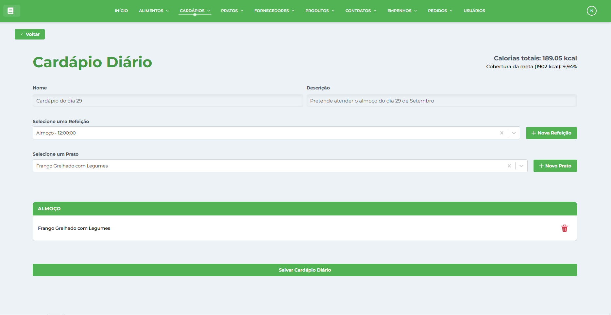](../../img/telacardapio/telacadastrocardapioinfos.png)
    
5.  **Dicas importantes**:
    
    *   Caso não exista uma refeição, crie uma nova através do botão **"Nova Refeição"**.
    *   Caso deseje criar um novo prato, use o botão **"Novo Prato"**.
    *   **Repita o processo** para adicionar todos os pratos que compõem o cardápio.
    *   Use o botão "🗑️ (Lixeira)" para remover pratos adicionados por engano.
6.  Clique em **Salvar Cardápio Diário** para confirmar. A janela será fechada e o registro aparecerá na tabela.
    

## Como editar um registro

1.  Localize o cardápio na tabela (use a pesquisa se necessário).
2.  Clique em **Editar** na coluna de Ações da linha desejada.
    
    [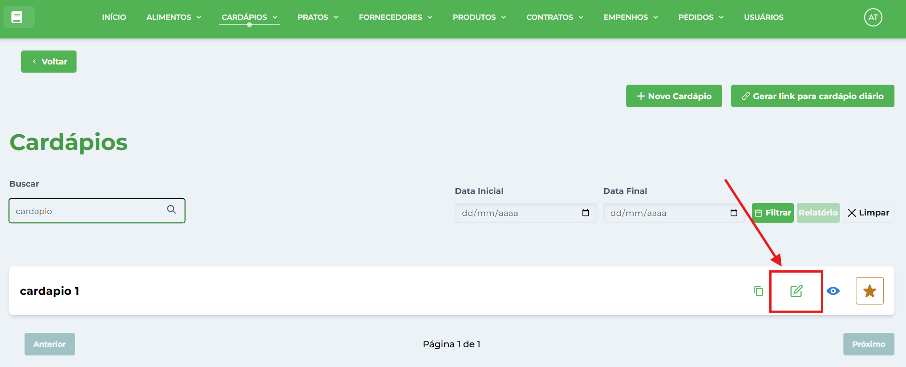](../../img/telacardapio/telacardapioEditar.png)
    
3.  A janela abrirá em modo de edição — altere os campos desejados e clique em **Confirmar**.
    

## Como visualizar um cardápio

1.  Na lista, clique em **Visualizar** para abrir os detalhes completos do cardápio.
    
    [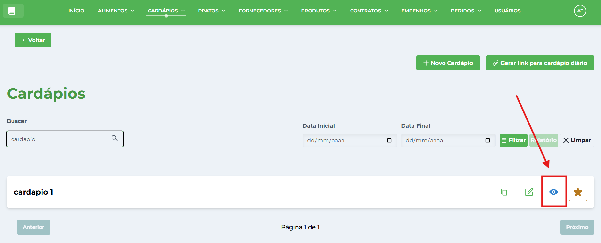](../../img/telacardapio/telacardapioVisualizar.png)
    
2.  Você verá todas as refeições, pratos e informações nutricionais.
    
3.  Para fechar, clique em **Cancelar** ou no botão de fechar da janela.
    

## Como clonar um cardápio

1.  Clique em **Clonar** (ícone de cópia) na coluna Ações da linha desejada.
2.  O sistema criará uma cópia do cardápio que poderá ser editada conforme necessário.

[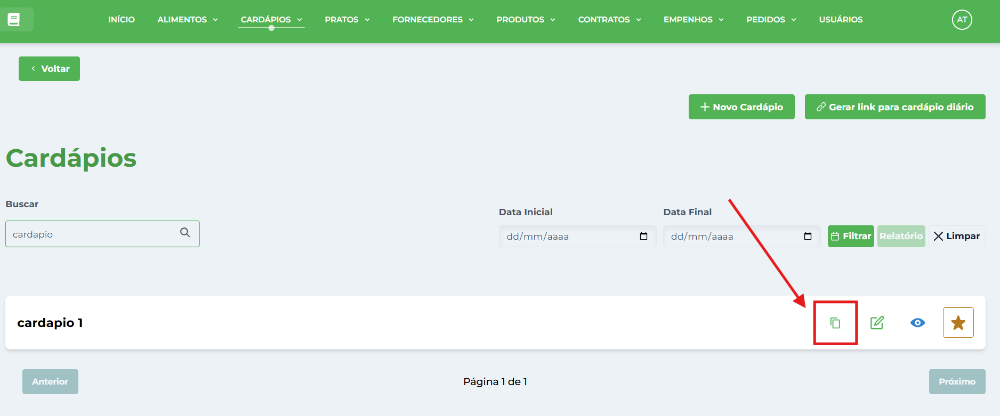](../../img/telacardapio/telacardapioClonar.png)

## Como definir um cardápio como diário

1.  Localize o cardápio que deseja definir como cardápio do dia.
2.  Clique no botão **⭐ (Estrela)** "Cardápio do dia" na coluna Ações da linha desejada.
    
    [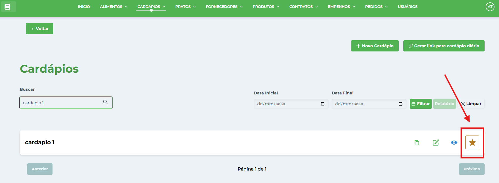](../../img/telacardapio/telacardapioDefinirDiario.png)
    
3.  Confirme a seleção clicando em **Sim** no diálogo de confirmação que aparecerá com a mensagem "Tem certeza que deseja escolher o cardápio '\[Nome do Cardápio\]'?".
    
    [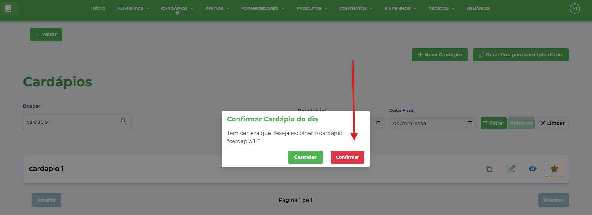](../../img/telacardapio/telacardapioDefinirDiarioConfirmar.png)
    
4.  O sistema definirá automaticamente esse cardápio como o cardápio oficial do dia atual.
    
    [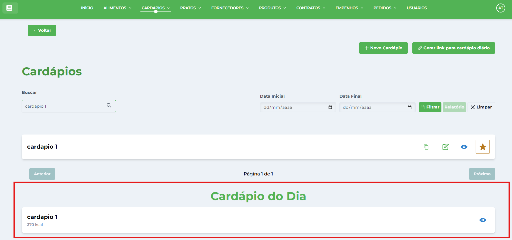](../../img/telacardapio/telacardapioDiario.png)
    
5.  Uma mensagem de sucesso será exibida confirmando a operação.
    

**💡 Dica**: O cardápio diário é o que será exibido aos alunos e usado para gerar links de compartilhamento.

## Como gerar link de compartilhamento

1.  Primeiro, certifique-se de que existe um **cardápio definido para o dia atual** (veja seção anterior).
    
2.  Clique no botão **🔗 Gerar link para cardápio diário** (barra superior).
    
    [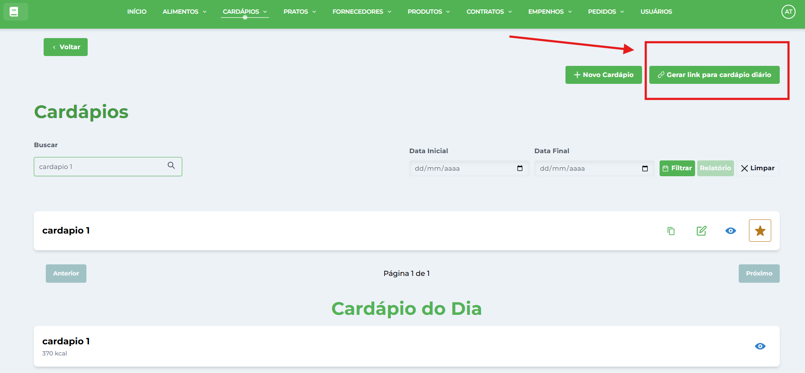](../../img/telacardapio/telacardapioDiarioLink.png)
    
3.  Se houver um cardápio do dia definido:
    
4.  Uma janela modal abrirá com o **Link de Compartilhamento**.
    
    [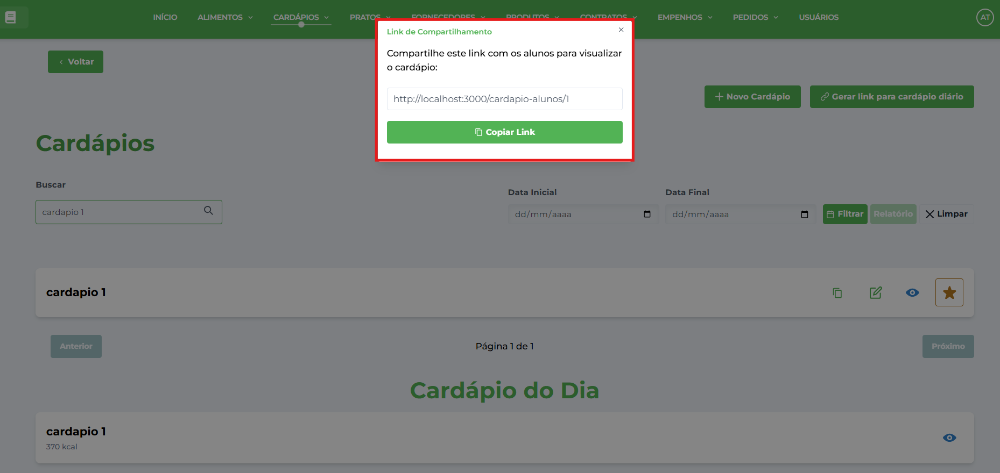](../../img/telacardapio/telacardapioDiarioLinkModal.png)
    
5.  Clique no botão **📋 Copiar Link** para copiar o link para a área de transferência.
    
6.  **Compartilhe este link** com os alunos para que possam visualizar o cardápio do dia.
    

**⚠️ Importante**: - Caso não haja um cardápio definido para o dia atual, será exibida a mensagem: "Não existe cardápio cadastrado para a data atual". - O link gerado permite que os alunos vejam o cardápio sem precisar fazer login no sistema.

## Gerar Relatório

1.  Selecione a data inicial e a data final do período que deseja gerar o relatório. O intervalo máximo permitido é de 5 dias — escolha datas que não ultrapassem esse limite.
    
    [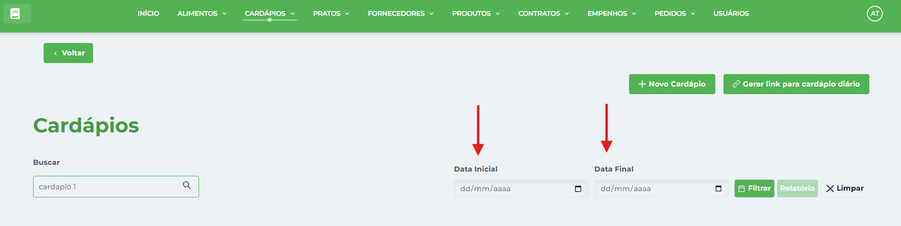](../../img/telacardapio/telacardapiosDatas.png)
    
2.  Clique em **Relatório** para exportar/baixar relatório dos cardápios cadastrados.
    
    [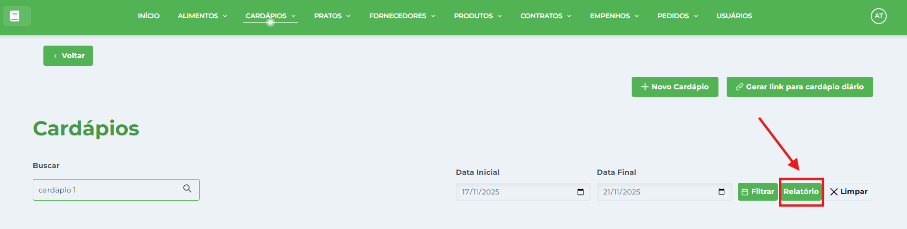](../../img/telacardapio/telacardapiosBotaoRelatorio.png)
    
3.  Escolha entre Relatório Simples (Nome dos Pratos e a data) ou Relatório Detalhado (Detalhes dos pratos e a data) .
    
    ## [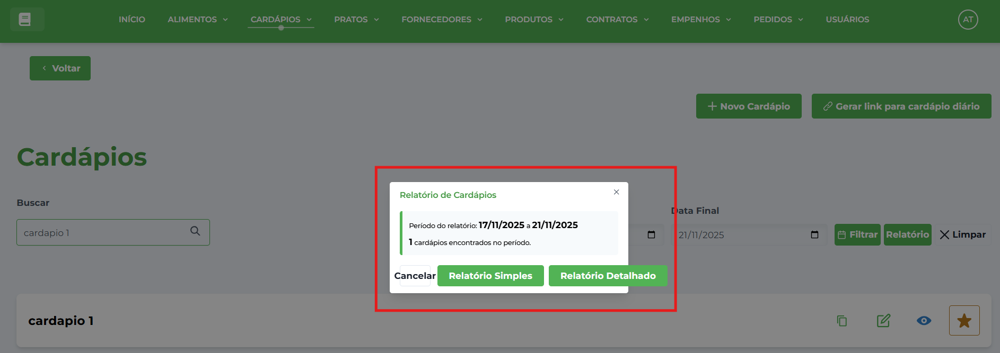](../../img/telacardapio/telacardapiosBotoesRelatorio.png)
    

## Dicas Importantes

### ✅ **Para um Cadastro Bem-sucedido**

*   **Nome descritivo**: Use nomes que facilitem a identificação temporal ou temática
*   **Pratos variados**: Inclua diferentes tipos de pratos para uma alimentação balanceada
*   **Refeições completas**: Organize adequadamente café, almoço, lanche e jantar
*   **Valores nutricionais**: Monitore os cálculos automáticos de calorias

### **Informações Obrigatórias**

*   **Nome do cardápio**: Identificação clara e única
*   **Pelo menos uma refeição**: Com prato associado
*   **Período de vigência**: Para controle temporal

### **Boas Práticas**

*   **Planejamento semanal**: Organize cardápios por semana
*   **Variedade nutricional**: Alterne tipos de alimentos ao longo dos dias
*   **Sazonalidade**: Considere produtos da época
*   **Público-alvo**: Adapte as porções e pratos conforme necessidade
*   **Cardápio diário**: Defina sempre um cardápio para o dia atual
*   **Links de compartilhamento**: Atualize os links compartilhados quando mudar o cardápio do dia

### **Funcionalidades Especiais**

*   **Cardápio do Dia**: Sistema permite definir qual cardápio será oficial para o dia atual
*   **Compartilhamento Público**: Links gerados permitem acesso sem login para alunos
*   **Clonagem**: Facilita criação de cardápios similares
*   **Relatórios**: Exportação de dados para análise e controle

### **Validações do Sistema**

*   Cálculos nutricionais automáticos baseados nos pratos
*   Validação de períodos de vigência
*   Controle de duplicação de nomes
*   Verificação de pratos ativos
*   Apenas um cardápio pode ser definido como "do dia" por vez
*   Links de compartilhamento requerem cardápio diário ativo