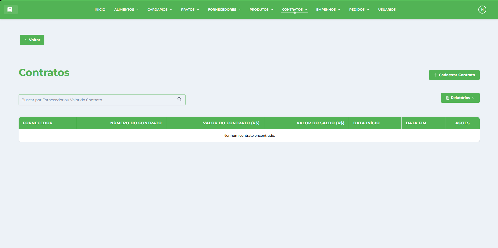

# Contratos

* * *

## Visão Geral

A tela de Gestão de Contratos é um módulo estratégico do Sistema de Gestão Nutricional (SGN), responsável pela formalização e controle de acordos comerciais com [Fornecedores](../../fornecedor/fornecedores/) para aquisição de [Produtos](../../produto/produtos/). Esta interface permite cadastrar, visualizar, editar e acompanhar contratos completos com especificações de produtos, quantidades, valores e prazos, integrando diretamente com os módulos de [Empenhos](../../empenho/empenhos/) e [Pedidos](../../pedido/pedidos/).

## Características da Interface

### Layout e Navegação

*   **Barra superior verde**: Menu principal com acesso a todos os módulos do sistema
*   **Botão Voltar**: Navegação intuitiva para retornar à tela anterior
*   **Design responsivo**: Interface adaptável para diferentes tamanhos de tela
*   **Identidade visual consistente**: Seguindo o padrão verde do SGN

### Área Principal de Dados

A interface apresenta uma tabela organizada com as seguintes colunas:

#### Informações Exibidas

*   **NÚMERO DO CONTRATO**: Identificação única do contrato
*   **FORNECEDOR**: Empresa contratada para fornecimento
*   **VALOR TOTAL**: Montante total do contrato
*   **DATA DE INÍCIO**: Data de vigência inicial
*   **DATA DE FIM**: Data de término da vigência
*   **STATUS**: Situação atual (Ativo, Vencido, Suspenso, Cancelado)
*   **PRODUTOS**: Quantidade de itens incluídos no contrato
*   **AÇÕES**: Botões para visualizar, editar, consultar produtos e gerar relatórios

### Funcionalidades de Busca e Filtros

*   **Campo de busca**: "Buscar por Contrato" para filtrar registros rapidamente
*   **Busca por número**: Localização por identificação do contrato
*   **Busca por fornecedor**: Filtro por empresa contratada
*   **Filtro por status**: Exibição de contratos ativos, vencidos ou cancelados
*   **Filtro por período**: Seleção por data de início ou fim de vigência
*   **Filtro em tempo real**: Resultados atualizados conforme digitação

### Ações Disponíveis

*   **Novo Contrato**: Botão verde no canto superior direito
*   **Visualizar**: Ícone de olho para ver detalhes completos do contrato
*   **Editar**: Ícone de lápis para modificar informações e produtos
*   **Produtos**: Ícone específico para gerenciar itens do contrato
*   **Relatórios**: Acesso a relatórios detalhados e documentos contratuais

## Estrutura dos Contratos

### Informações Contratuais Básicas

Cada contrato possui dados essenciais de:

*   **Número único**: Identificação exclusiva e controlada
*   **Fornecedor vinculado**: Empresa responsável pelo fornecimento
*   **Período de vigência**: Datas de início e fim do contrato
*   **Valor total**: Montante global do acordo comercial
*   **Status atual**: Situação de validade e execução
*   **Condições especiais**: Cláusulas e observações específicas

### Produtos Contratados

*   **Lista de produtos**: Itens incluídos no acordo comercial
*   **Quantidades contratadas**: Volumes específicos por produto
*   **Valores unitários**: Preços acordados para cada item
*   **Especificações técnicas**: Características dos produtos contratados
*   **Prazos de entrega**: Cronogramas específicos para cada item

### Controles de Execução

*   **Quantidades já pedidas**: Controle de utilização do contrato
*   **Saldo disponível**: Valores e quantidades ainda disponíveis
*   **Percentual de execução**: Acompanhamento do andamento
*   **Histórico de pedidos**: Registro de todas as solicitações
*   **Previsão de conclusão**: Estimativas baseadas no consumo

## Funcionalidades Principais

### Cadastro de Contratos

*   **Formulário completo**: Campos para todas as informações contratuais
*   **Seleção de fornecedor**: Escolha de empresas cadastradas
*   **Definição de produtos**: Inclusão de itens com quantidades e valores
*   **Validação de números**: Verificação de unicidade do número do contrato
*   **Cálculo automático**: Valor total baseado nos produtos incluídos
*   **Configuração de vigência**: Definição de período de validade

### Visualização Detalhada

*   **Dados contratuais completos**: Todas as informações do acordo
*   **Lista de produtos detalhada**: Especificações, quantidades e valores
*   **Status de execução**: Situação atual de cada item contratado
*   **Histórico de movimentações**: Registro de pedidos e entregas
*   **Documentos associados**: Anexos e arquivos relacionados
*   **Análise financeira**: Valores executados e saldos disponíveis

### Edição e Atualização

*   **Modificação de dados**: Alteração de informações contratuais
*   **Inclusão de produtos**: Adição de novos itens ao contrato
*   **Ajuste de quantidades**: Modificação de volumes contratados
*   **Atualização de valores**: Correção de preços quando permitido
*   **Alteração de vigência**: Extensão ou redução de prazos
*   **Gestão de status**: Mudança de situação do contrato

### Gestão de Produtos

*   **Adição inteligente**: Interface para incluir produtos no contrato
*   **Configuração detalhada**: Definição de quantidades, preços e especificações
*   **Validação de dados**: Verificação de informações obrigatórias
*   **Cálculo automático**: Valores parciais e totais computados automaticamente
*   **Controle de limites**: Verificação de quantidades máximas e mínimas
*   **Especificações técnicas**: Detalhamento de características dos produtos

### Controle de Execução

*   **Acompanhamento de pedidos**: Controle de solicitações realizadas
*   **Saldo disponível**: Verificação de quantidades ainda não utilizadas
*   **Alertas de vencimento**: Notificações sobre prazos contratuais
*   **Relatórios de execução**: Análises de utilização e desempenho
*   **Previsão de conclusão**: Estimativas de finalização do contrato
*   **Controle financeiro**: Acompanhamento de valores executados

### Status e Situações

*   **Ativo**: Contrato vigente e disponível para pedidos
*   **Vencido**: Contrato com prazo expirado
*   **Suspenso**: Temporariamente indisponível para novos pedidos
*   **Cancelado**: Contrato encerrado antes do prazo
*   **Em execução**: Com pedidos em andamento
*   **Finalizado**: Totalmente executado

### Relatórios e Documentação

*   **Relatório de contrato**: Documento completo com todos os dados
*   **Lista de produtos**: Detalhamento de itens contratados
*   **Histórico de execução**: Registro de pedidos e entregas
*   **Análise financeira**: Valores executados e saldos
*   **Documentos legais**: Geração de termos e anexos contratuais
*   **Relatórios gerenciais**: Análises para tomada de decisão

### Integração com Outros Módulos

*   **Fornecedores**: Base de empresas para seleção
*   **Produtos**: Catálogo de itens disponíveis para contratação
*   **Pedidos**: Origem das solicitações de compra
*   **Empenhos**: Vinculação com recursos orçamentários
*   **Pagamentos**: Controle financeiro das execuções
*   **Relatórios**: Análises integradas de desempenho

## Benefícios do Módulo

### Controle Rigoroso de Acordos

*   **Formalização completa**: Registro detalhado de todos os termos contratuais
*   **Acompanhamento contínuo**: Monitoramento da execução em tempo real
*   **Controle de prazos**: Alertas e notificações sobre vencimentos
*   **Gestão de valores**: Controle financeiro rigoroso de execução
*   **Documentação organizada**: Registro sistemático de toda documentação

### Eficiência Operacional

*   **Automatização de cálculos**: Valores e saldos computados automaticamente
*   **Interface intuitiva**: Processo simplificado de gestão contratual
*   **Integração sistêmica**: Fluxo contínuo com outros módulos
*   **Relatórios automáticos**: Geração de documentos e análises
*   **Controle centralizado**: Gestão unificada de todos os contratos

### Transparência e Conformidade

*   **Rastreabilidade completa**: Histórico detalhado de toda execução
*   **Documentação auditável**: Registros para verificação e controle
*   **Conformidade legal**: Adequação às normas de contratação
*   **Transparência de processos**: Informações claras e acessíveis
*   **Prestação de contas**: Base sólida para relatórios gerenciais

### Otimização de Recursos

*   **Controle de gastos**: Acompanhamento rigoroso de valores executados
*   **Planejamento orçamentário**: Base para projeções financeiras
*   **Negociação estratégica**: Histórico para melhores condições futuras
*   **Redução de desperdícios**: Controle preciso de quantidades
*   **Maximização de benefícios**: Aproveitamento integral dos acordos

### Gestão de Relacionamentos

*   **Histórico de fornecedores**: Base para avaliação de desempenho
*   **Controle de qualidade**: Acompanhamento da execução contratual
*   **Fortalecimento de parcerias**: Gestão profissional de relacionamentos
*   **Negociação baseada em dados**: Informações para melhores acordos
*   **Confiabilidade operacional**: Segurança nos processos de aquisição

* * *

**Dica:** Mantenha sempre os contratos atualizados e monitore regularmente os prazos de vigência. Use os relatórios de execução para acompanhar o desempenho dos fornecedores e planejar renovações. Aproveite a integração com outros módulos para otimizar o processo de compras e garantir o cumprimento dos acordos estabelecidos.