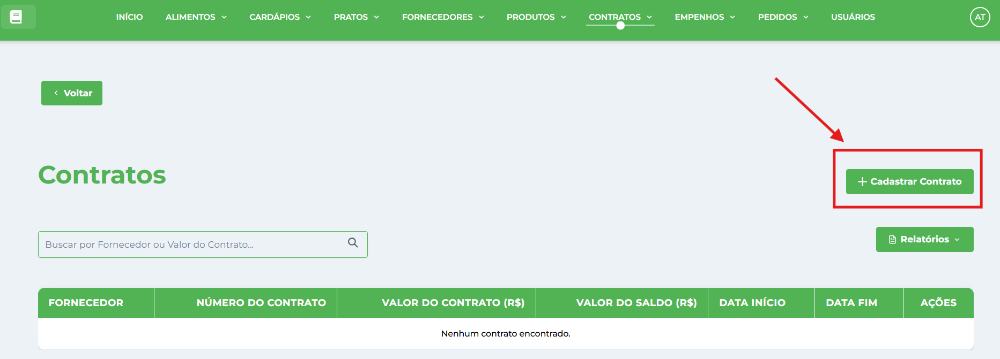
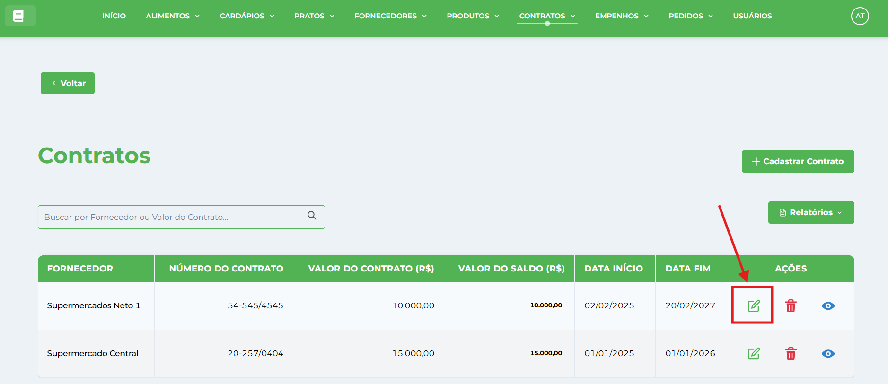
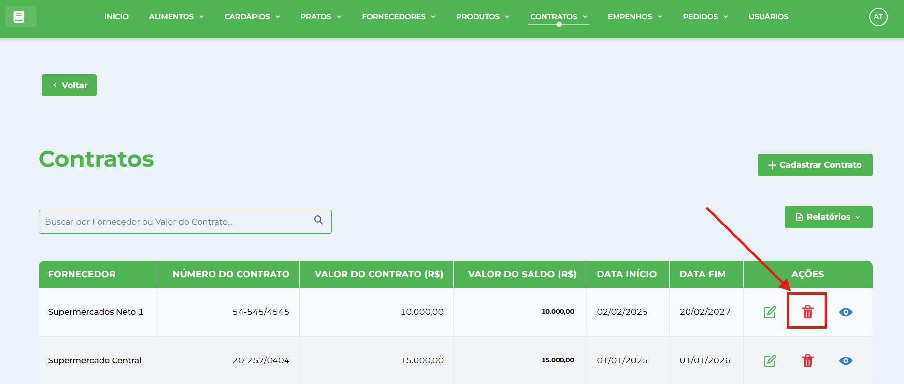
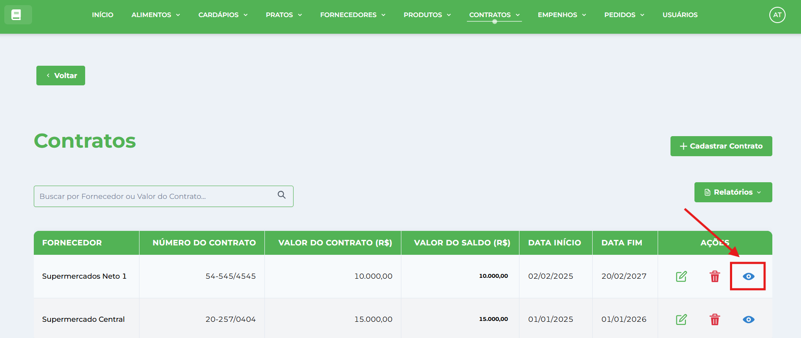
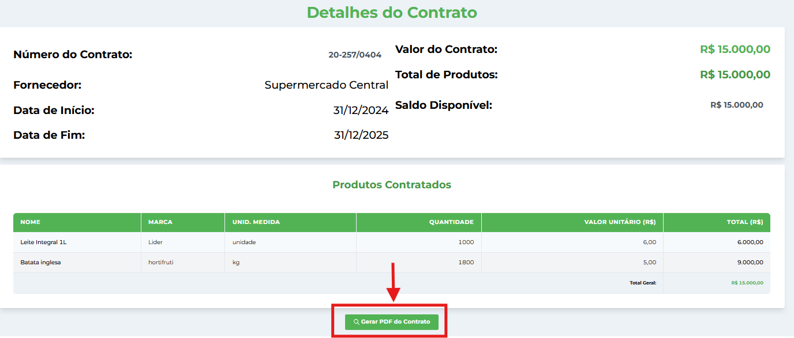
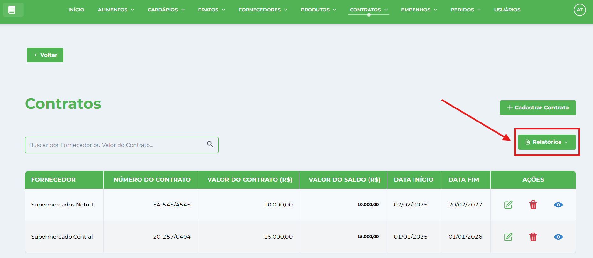
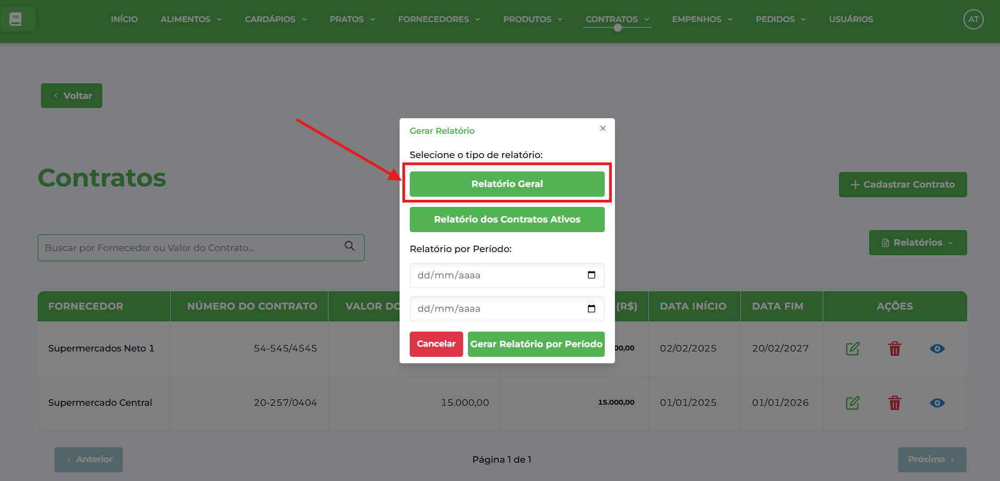
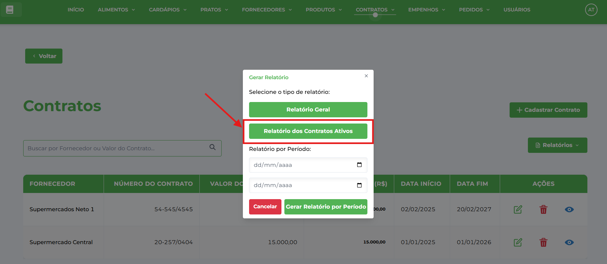
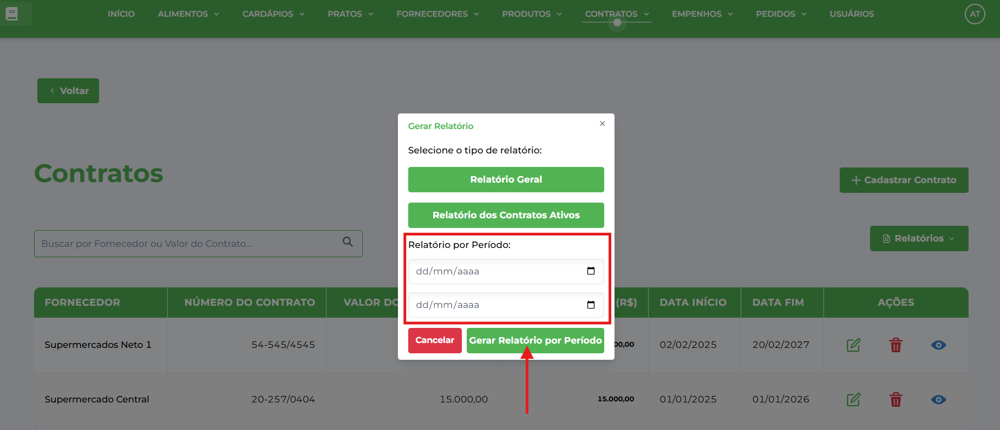

# Contratos

**Localização**: Menu principal → Contratos

* * *

## Visão Geral

Nesta tela você gerencia os contratos da instituição: cadastrar, editar, visualizar, excluir e gerar relatórios. Os contratos formalizam acordos comerciais com [Fornecedores](../../fornecedor/tutoriais-fornecedor/) para aquisição de [Produtos](../../produto/tutoriais-produto/), integrando com [Empenhos](../../empenho/tutoriais-empenho/) e [Pedidos](../../pedido/tutoriais-pedido/).

## Ações principais (barra superior)

*   **Novo Contrato** — abre a janela de cadastro.
*   **Gerar Relatório** — gera um relatório da listagem atual.
*   **Campo de pesquisa** (à direita) — pesquisa/filtra os registros por número do contrato ou fornecedor.

## Pré-requisitos

⚠️ **Importante**: Antes de criar um contrato, você deve ter:  
1\. **Fornecedores cadastrados** - Siga o manual de [Fornecedores](../../fornecedor/tutoriais-fornecedor/)  
2\. **Produtos cadastrados** - Siga o manual de [Produtos](../../produto/tutoriais-produto/)

## Como cadastrar um novo Contrato

1.  No menu clique em **Contratos**.
2.  Clique no botão **Cadastrar Contrato**.
    
    
    
3.  Na janela **Cadastrar Contrato** preencha os campos:
    
    *   **Número do Contrato** — digite o número oficial do contrato.
    *   **Fornecedor** — selecione o fornecedor no dropdown.
    *   **Data de Início** — escolha a data de vigência inicial (clique no campo para abrir o calendário).
    *   **Data de Fim** — escolha a data de término da vigência.
    *   **Valor Total** — insira o montante total do contrato.
    *   **Produtos** — adicione os produtos incluídos no contrato com suas especificações.
4.  Clique em **Salvar Contrato** para salvar. A janela será fechada e o registro aparecerá na tabela.
    

## Como editar um Contrato

1.  Localize o contrato na tabela (use a pesquisa se necessário).
2.  Clique em **Editar** na coluna de Ações da linha desejada.
    
    
    
3.  A janela abrirá em modo de edição — altere os campos desejados e clique em **Atualizar Contrato**.
    

## Como excluir um Contrato

1.  Localize o contrato na tabela (use a pesquisa se necessário).
2.  Clique em **Excluir** na coluna Ações da linha correspondente.
    
    
    
3.  Confirme a exclusão clicando em **Excluir** no diálogo de confirmação.
    
4.  ⚠️ **Atenção**:
    *   Não é possível excluir contratos que possuem pedidos vinculados
    *   O sistema exibirá a mensagem "O contrato está vinculado a um pedido" se houver impedimento

## Como visualizar um contrato

1.  Localize o contrato na tabela (use a pesquisa se necessário).
2.  Clique em **Visualizar** na coluna Ações da linha correspondente.
    
    
    
3.  Na página de visualização você pode:
    
    *   **Gerar PDF do Contrato**: Cria um PDF detalhado do contrato específico 

## Como verificar saldo do contrato

O sistema calcula automaticamente o saldo disponível de cada contrato:

*   **Valor Contratado**: Montante total do contrato
*   **Valor Utilizado**: Soma de todos os pedidos realizados
*   **Saldo Disponível**: Diferença entre contratado e utilizado
*   O saldo é exibido na lista principal e na página de detalhes

## Gerar Relatórios

*   Clique no botão **Relatórios**: 

### Relatório Geral

1.  Na janela **Gerar Relatório**
2.  Selecione **"Relatório Geral"** para gerar PDF com todos os contratos.
    
    
    

### Relatório de Contratos Ativos

1.  Na janela **Gerar Relatório**
2.  Selecione **"Relatório de Contratos Ativos"** para gerar PDF apenas com contratos vigentes.
    
    
    

### Relatório por Período

1.  Na janela **Gerar Relatório**
2.  Defina a **Data de Início** e **Data de Fim**.
3.  Clique em **"Gerar Relatório por Período"** para criar PDF com contratos do período especificado.
    
    
    

* * *

## Dicas Importantes

### **Boas Práticas**

*   Inclua todos os produtos relevantes desde o início
*   Verifique as datas de vigência periodicamente
*   Monitore regularmente o saldo disponível dos contratos
*   Use relatórios para análise de execução orçamentária

### **Controle Orçamentário**

*   **Saldo Automático**: O sistema calcula automaticamente o saldo disponível
*   **Controle de Pedidos**: Valores são descontados conforme pedidos realizados
*   **Histórico Completo**: Acompanhe todos os pedidos e pagamentos por contrato
*   **Relatórios Detalhados**: Múltiplos tipos de relatórios para diferentes análises

### **Funcionalidades Especiais**

*   **Visualização Detalhada**: Página completa com todos os dados do contrato
*   **Múltiplos Relatórios**: Geral, por período, apenas ativos e individual
*   **Controle de Saldo**: Cálculo automático de valores disponíveis
*   **Integração Completa**: Vinculação com pedidos, pagamentos e fornecedores

### **Validações do Sistema**

*   Sistema impede exclusão quando há pedidos vinculados
*   Datas são validadas para coerência
*   Números de contrato devem ser únicos
*   Valores devem ser numéricos positivos
*   Controle automático de saldos e utilização
*   Verificação de vínculos antes de exclusões