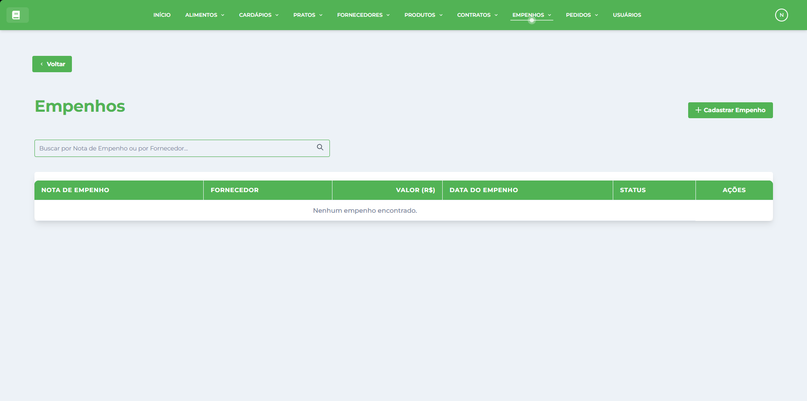
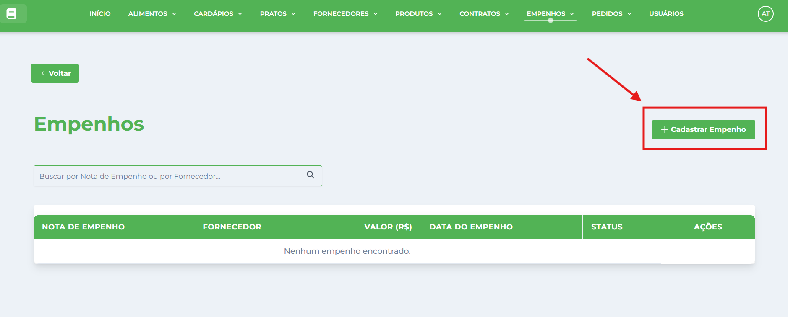
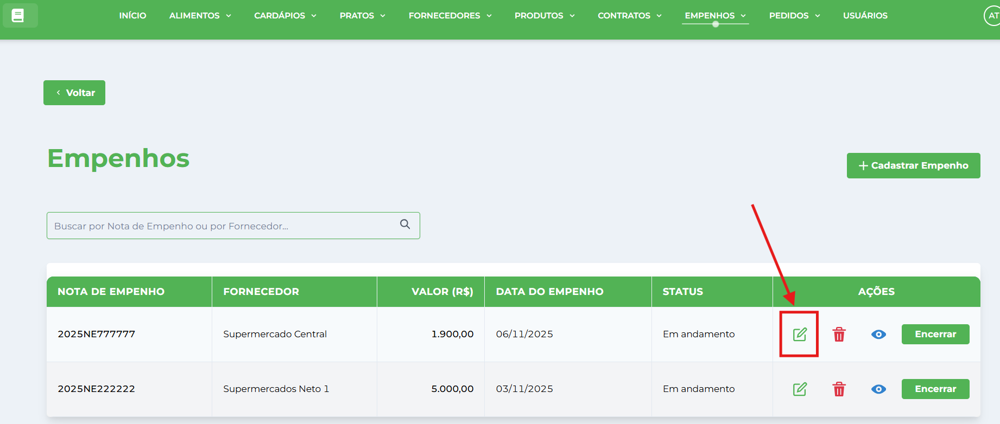
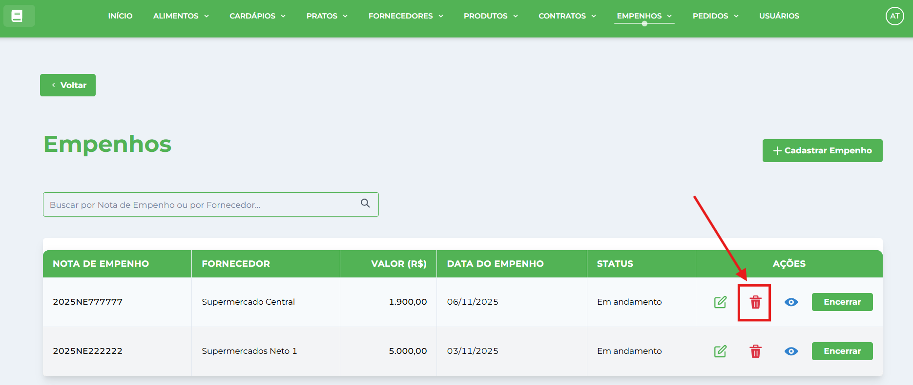
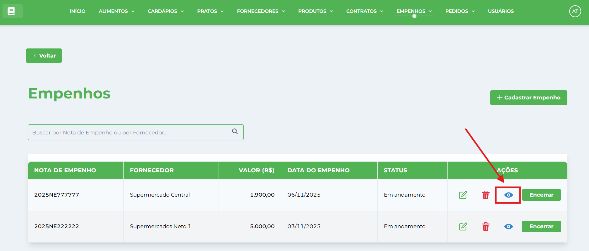
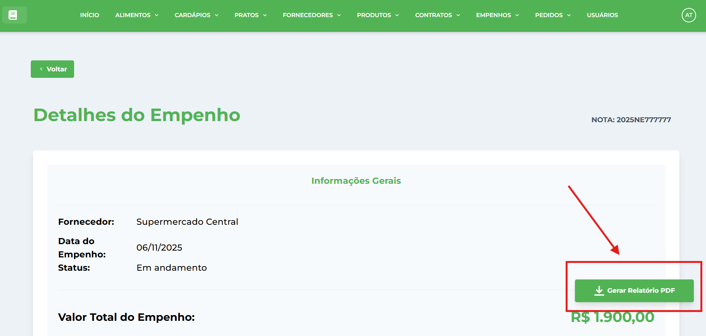
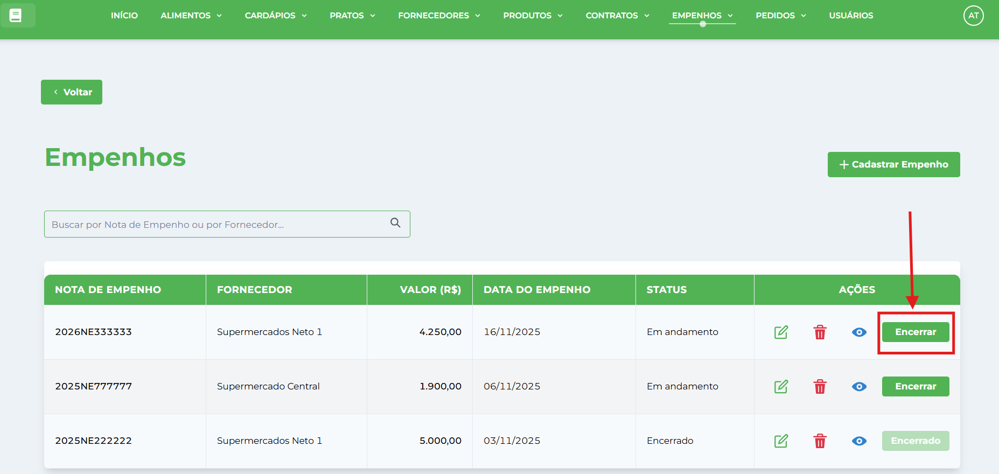

# Empenhos

**Localização**: Menu principal → Empenhos

* * *

## Visão Geral

Nesta tela você gerencia os empenhos da instituição: cadastrar, editar, visualizar, excluir e gerar relatórios. Os empenhos controlam o orçamento e recursos financeiros vinculados aos [Contratos](../../contrato/tutoriais-contrato/) e [Produtos](../../produto/tutoriais-produto/), garantindo controle adequado para os [Pedidos](../../pedido/tutoriais-pedido/).

## Ações principais (barra superior)

*   **Novo Empenho** — abre a janela de cadastro.
*   **Gerar Relatório** — gera um relatório da listagem atual.
*   **Campo de pesquisa** (à direita) — pesquisa/filtra os registros por nota de empenho ou contrato.

## Pré-requisitos

⚠️ **Importante**: Antes de criar um empenho, você deve ter:  
1\. **Contratos cadastrados** — Siga o manual de [Contratos](../../contrato/tutoriais-contrato/)  
2\. **Produtos cadastrados** — Siga o manual de [Produtos](../../produto/tutoriais-produto/)  
3\. **Fornecedor cadastrado** — Siga o manual de [Fornecedor](../../fornecedor/tutoriais-fornecedor/)

## Como cadastrar um novo Empenho

1.  Clique no botão **Cadastrar Empenho** (barra superior).
    
    
    
2.  Na janela **Novo Empenho** preencha os campos:
    
    *   **Nota de Empenho** — número oficial da nota de empenho.
    *   **Contrato** — selecione o contrato vinculado no dropdown.
    *   **Valor Empenhado** — montante total reservado orçamentariamente.
    *   **Data de Emissão** — data de criação do empenho.
    *   **Status** — selecione a situação (Ativo, Executado, Cancelado, Vencido).
    *   **Produtos** — adicione os produtos incluídos no empenho.
3.  Clique em **Salvar** para confirmar o cadastro.
    

## Como editar um registro

1.  Localize o empenho na tabela (use a pesquisa se necessário).
2.  Clique em **Editar** na coluna de Ações da linha desejada.
    
    
    
3.  A janela abrirá em modo de edição — altere os campos desejados e clique em **Salvar**.
    

## Como excluir um registro

1.  Localize o empenho na tabela (use a pesquisa se necessário).
2.  Clique em **Excluir** na coluna Ações da linha correspondente.
    
    
    
3.  Confirme a exclusão clicando em **Excluir** no diálogo de confirmação.
    
4.  ⚠️ **Atenção**:
    *   Não é possível excluir empenhos que possuem pedidos vinculados
    *   Empenhos encerrados não podem ser excluídos
    *   O sistema verificará automaticamente vínculos antes da exclusão

## Como visualizar um empenho

1.  Localize o empenho na tabela (use a pesquisa se necessário).
2.  Na lista, clique em **Visualizar** na coluna de Ações da linha desejada.
    
    
    
3.  Você será direcionado para a página de detalhes do empenho que mostra:
    
    *   **Informações Gerais**: Nota,fornecedor, valor, data, status.
    *   **Produtos do Empenho**: Lista dos produtos
4.  Na página de visualização você pode:
    
    *   **Gerar Relatório em PDF** para imprimir ou fazer o download.
    
    
    

## Como encerrar um empenho

⚠️ **Funcionalidade Principal**: Encerrar empenhos é uma operação crucial que finaliza o uso orçamentário.

1.  Localize o empenho na tabela (use a pesquisa se necessário).
2.  Clique no botão **"Encerrar"** na coluna de Status da linha desejada.
    
    *   **Nota**: Se já estiver encerrado, aparecerá "Encerrado" (não clicável).
    
    
    
3.  Na janela de confirmação que abrir, preencha os campos obrigatórios:
    
    *   **Número do Empenho Final** — digite exatamente 10 números (formato: XXXXNEXXXX)
    *   **Data de Encerramento** — selecione a data oficial de encerramento
4.  Clique em **"Confirmar Encerramento"**.
5.  O sistema:
    *   Alterará o status para "Encerrado"
    *   Registrará a data e número final do empenho
    *   Impedirá novas alterações no empenho
    *   Caso haja saldo disponível, ele será transferido automaticamente para o novo empenho

**💡 Dicas para Encerramento**:  
\- Verifique se todos os pedidos foram processados antes de encerrar  
\- O número do empenho deve seguir o padrão - Data de encerramento não pode ser anterior à data de emissão  
\- Após encerrado, o empenho não pode ser reaberto

* * *

## Dicas Importantes

### **Campos Obrigatórios**

*   **Nota de Empenho**: Deve ser única no sistema
*   **Contrato vinculado**: Deve estar ativo e válido
*   **Valor Empenhado**: Deve ser positivo e dentro do contrato
*   **Data de Emissão**: Deve estar dentro da vigência do contrato

### **Controle Orçamentário**

*   **Valor Empenhado**: Montante total reservado
*   **Valor Utilizado**: Consumido em pedidos realizados
*   **Saldo Disponível**: Calculado automaticamente (Empenhado - Utilizado)
*   **Status Controlado**: Ativo → Encerrado (processo irreversível)

### **Processo de Encerramento**

*   **Encerramento Definitivo**: Operação que finaliza permanentemente o empenho
*   **Data Consistente**: Encerramento posterior à data de emissão
*   **Bloqueio Automático**: Após encerrado, impede novas modificações

### **Boas Práticas**

*   Mantenha o status atualizado conforme execução
*   Monitore o saldo disponível regularmente
*   Vincule produtos específicos quando necessário
*   Documente alterações orçamentárias
*   **Encerre apenas quando apropriado**: Operação irreversível

### **Validações do Sistema**

*   Sistema impede exclusão quando há pedidos vinculados
*   Valores utilizados são calculados automaticamente
*   Status é atualizado conforme uso do saldo
*   Validação de datas conforme vigência do contrato
*   **Formato de número de empenho**: Validação automática do padrão
*   **Encerramento irreversível**: Não permite reabertura após encerrado
*   **Produtos vinculados**: Controle de produtos associados ao empenho