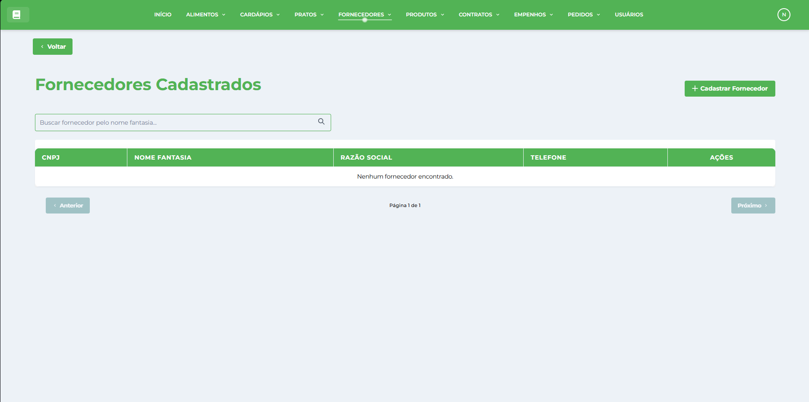

# Fornecedores

* * *

## Visão Geral

A tela de Gestão de Fornecedores é um módulo fundamental do Sistema de Gestão Nutricional (SGN), responsável pelo cadastro e gerenciamento de empresas fornecedoras de produtos e serviços. Esta interface permite cadastrar, visualizar, editar e organizar informações completas dos fornecedores, incluindo dados comerciais, de contato e endereço, integrando diretamente com os módulos de [Contratos](../../contrato/contratos/), [Produtos](../../produto/produtos/) e [Pedidos](../../pedido/pedidos/).

## Características da Interface

### Layout e Navegação

*   **Barra superior verde**: Menu principal com acesso a todos os módulos do sistema
*   **Botão Voltar**: Navegação intuitiva para retornar à tela anterior
*   **Design responsivo**: Interface adaptável para diferentes tamanhos de tela
*   **Identidade visual consistente**: Seguindo o padrão verde do SGN

### Área Principal de Dados

A interface apresenta uma tabela organizada com as seguintes colunas:

#### Informações Exibidas

*   **CNPJ**: Identificação fiscal única do fornecedor
*   **RAZÃO SOCIAL**: Nome empresarial oficial registrado
*   **NOME FANTASIA**: Nome comercial utilizado pela empresa
*   **TELEFONE CELULAR**: Contato móvel principal
*   **TELEFONE FIXO**: Linha fixa para contato comercial
*   **ENDEREÇO**: Localização completa da empresa
*   **CONTATO**: Nome da pessoa responsável
*   **TEL. CONTATO**: Telefone direto do responsável
*   **AÇÕES**: Botões para visualizar, editar e excluir fornecedores

### Funcionalidades de Busca

*   **Campo de busca**: "Buscar por Fornecedor" para filtrar registros rapidamente
*   **Busca por CNPJ**: Localização por identificação fiscal
*   **Busca por razão social**: Filtro por nome empresarial
*   **Busca por nome fantasia**: Localização por nome comercial
*   **Filtro em tempo real**: Resultados atualizados conforme digitação

### Ações Disponíveis

*   **Cadastrar Fornecedor**: Botão verde no canto superior direito
*   **Visualizar**: Ícone de olho para ver dados completos do fornecedor
*   **Editar**: Ícone de lápis para modificar informações cadastrais
*   **Excluir**: Ícone de lixeira para remover fornecedores (com validação de vínculos)

## Dados dos Fornecedores

### Informações Empresariais

Cada fornecedor possui dados completos de:

*   **CNPJ**: Cadastro Nacional de Pessoa Jurídica (validado)
*   **Razão Social**: Nome oficial da empresa
*   **Nome Fantasia**: Nome comercial de uso público
*   **Dados de contato**: Telefones celular e fixo
*   **Endereço completo**: Logradouro, número, bairro, cidade, CEP e estado
*   **Contato responsável**: Nome e telefone da pessoa de referência

### Validações e Controles

*   **CNPJ único**: Verificação de duplicidade no cadastro
*   **Formatação automática**: Máscara para CNPJ e telefones
*   **Validação de campos**: Verificação de dados obrigatórios
*   **Controle de vínculos**: Proteção contra exclusão de fornecedores com contratos ativos

## Funcionalidades Principais

### Cadastro de Fornecedores

*   **Formulário completo**: Campos para todas as informações empresariais
*   **Validação em tempo real**: Verificação de CNPJ e campos obrigatórios
*   **Formatação automática**: Aplicação de máscaras nos campos
*   **Verificação de duplicidade**: Controle de CNPJ já cadastrado
*   **Composição automática de endereço**: Concatenação dos campos de localização

### Visualização Detalhada

*   **Dados empresariais completos**: Todas as informações cadastrais
*   **Histórico de contratos**: Vínculos com contratos existentes
*   **Produtos fornecidos**: Lista de itens já contratados
*   **Status de relacionamento**: Situação atual do fornecedor
*   **Informações de contato**: Dados atualizados para comunicação

### Edição e Atualização

*   **Modificação de dados**: Alteração de informações cadastrais
*   **Atualização de contatos**: Mudança de responsáveis e telefones
*   **Correção de endereço**: Atualização de localização
*   **Validação contínua**: Verificação em tempo real das alterações
*   **Histórico de mudanças**: Registro de modificações realizadas

### Exclusão Controlada

*   **Verificação de vínculos**: Proteção contra exclusão com dependências
*   **Validação de contratos**: Verificação de contratos ativos ou históricos
*   **Confirmação de segurança**: Diálogo de confirmação antes da remoção
*   **Análise de dependências**: Verificação de uso em pedidos e produtos
*   **Notificações claras**: Mensagens informativas sobre restrições

### Pesquisa e Filtros Avançados

*   **Busca múltipla**: Pesquisa por diferentes campos simultaneamente
*   **Filtros inteligentes**: Resultados refinados automaticamente
*   **Ordenação personalizada**: Classificação por diferentes critérios
*   **Exportação de dados**: Geração de relatórios e listas
*   **Busca por proximidade**: Filtro por localização geográfica

### Gestão de Contatos

*   **Múltiplos contatos**: Cadastro de diferentes responsáveis
*   **Hierarquia de contatos**: Definição de contatos principais e secundários
*   **Histórico de comunicação**: Registro de interações realizadas
*   **Agenda integrada**: Lembretes e compromissos com fornecedores
*   **Canais de comunicação**: E-mail, telefone e outros meios de contato

### Integração com Outros Módulos

*   **Contratos**: Vinculação automática com contratos cadastrados
*   **Produtos**: Associação com itens fornecidos
*   **Pedidos**: Integração no processo de compras
*   **Pagamentos**: Controle financeiro de fornecedores
*   **Relatórios**: Análises de desempenho e relacionamento

### Análise de Fornecedores

*   **Histórico de fornecimento**: Registro completo de entregas
*   **Avaliação de desempenho**: Métricas de qualidade e pontualidade
*   **Análise financeira**: Histórico de pagamentos e crédito
*   **Certificações**: Controle de documentos e habilitações
*   **Classificação**: Ranking por critérios de qualidade e confiabilidade

## Benefícios do Módulo

### Centralização de Informações

*   **Base única de dados**: Informações consolidadas de todos os fornecedores
*   **Acesso rápido**: Consulta eficiente de dados empresariais
*   **Histórico completo**: Registro de todo relacionamento comercial
*   **Integração total**: Conexão com todos os módulos do sistema
*   **Controle de qualidade**: Padronização de informações cadastrais

### Eficiência no Relacionamento

*   **Comunicação facilitada**: Contatos organizados e acessíveis
*   **Agilidade em cotações**: Acesso rápido aos dados de fornecedores
*   **Controle de prazos**: Acompanhamento de entregas e compromissos
*   **Negociação otimizada**: Histórico para melhores condições comerciais
*   **Gestão de risco**: Análise de confiabilidade e capacidade

### Conformidade e Controle

*   **Documentação completa**: Registro de todas as informações legais
*   **Validação de dados**: Verificação de CNPJ e documentos
*   **Auditoria facilitada**: Rastro completo de fornecedores e transações
*   **Compliance**: Adequação às normas de contratação pública
*   **Transparência**: Informações claras e verificáveis

### Otimização de Processos

*   **Automatização de tarefas**: Redução de trabalho manual
*   **Padronização**: Processos uniformes de cadastro e gestão
*   **Integração sistêmica**: Fluxo contínuo entre módulos
*   **Relatórios automáticos**: Geração de análises e indicadores
*   **Tomada de decisão**: Informações para escolhas estratégicas

* * *

**Dica:** Mantenha sempre os dados dos fornecedores atualizados, especialmente informações de contato e documentação. Use a função de busca para localizar rapidamente fornecedores específicos e aproveite a integração com outros módulos para otimizar o processo de compras.