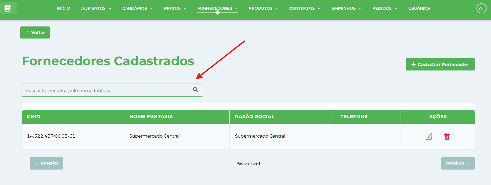
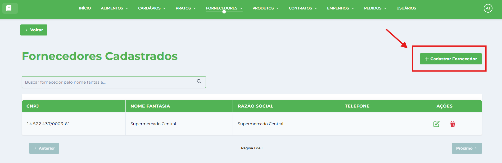
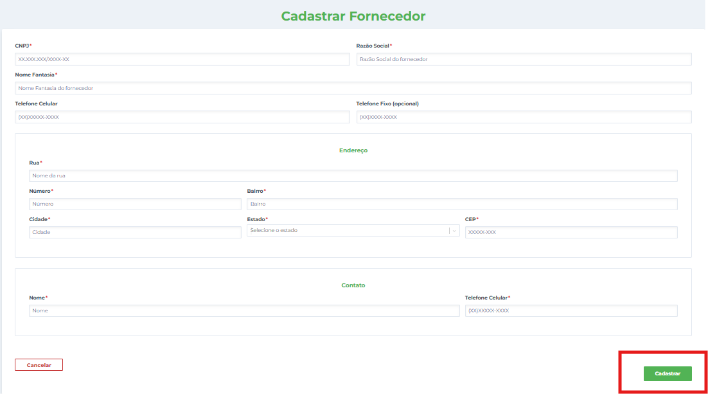
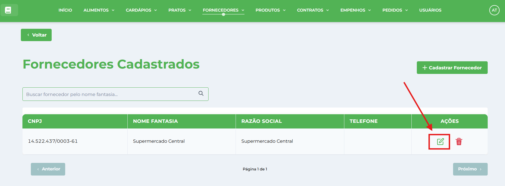
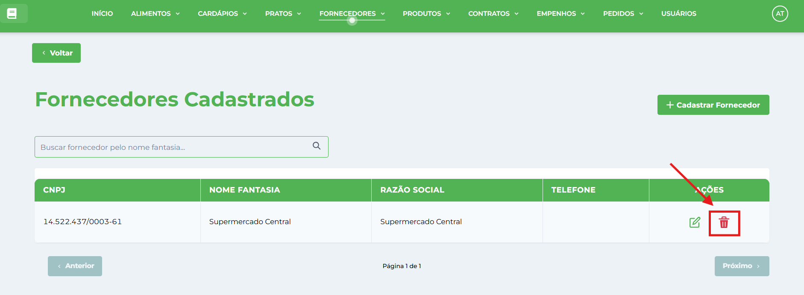

# Fornecedores

**Localização**: Menu principal → Fornecedores

* * *

## Visão Geral

Nesta tela você gerencia os fornecedores da instituição: cadastrar, editar, visualizar, excluir e gerar relatórios. Os fornecedores são essenciais para a operação do sistema, integrando com [Contratos](../../contrato/tutoriais-contrato/), [Produtos](../../produto/tutoriais-produto/) e [Pedidos](../../pedido/tutoriais-pedido/).

## Ações principais (barra superior)

*   **Cadastrar Fornecedor** — abre a janela de cadastro.
*   **Campo de pesquisa** (à direita) — pesquisa/filtra os registros por **nome fantasia**. 

## Como cadastrar um novo Fornecedor

1.  No menu, clique **Fornecedores**.
2.  Clique no botão **Cadastrar Fornecedor**.
    
    
    
3.  Na janela **Cadastrar Fornecedor** preencha os campos:
    
    *   **CNPJ** — digite o número do CNPJ (apenas números).
    *   **Razão Social** — nome empresarial oficial registrado.
    *   **Nome Fantasia** — nome comercial utilizado pela empresa.
    *   **Telefone Celular** — contato móvel principal.
    *   **Telefone Fixo** — linha fixa para contato comercial.
    *   **Endereço** — localização completa da empresa.
    *   **Contato** — nome da pessoa responsável.
    *   **Tel. Contato** — telefone direto do responsável.
4.  Clique em **Cadastrar** para salvar. A janela será fechada e o registro aparecerá na tabela.
    
    
    

## Como editar um registro

1.  Localize o fornecedor na tabela (use a pesquisa se necessário).
2.  Clique em **Editar** na coluna de Ações da linha desejada.
    
    
    
3.  A janela abrirá em modo de edição — altere os campos desejados e clique em **Salvar Alterações**.
    

## Como excluir um registro

1.  Clique em **Excluir** (ícone de lixeira) na coluna Ações da linha correspondente.
    
    
    
2.  Confirme a exclusão clicando em **Confirmar** no diálogo de confirmação.  
    ⚠️ **Atenção**: Não é possível excluir fornecedores que possuem contratos ou pedidos vinculados.
    

* * *

## Dicas Importantes

### **Validação de CNPJ**

*   **Formato Obrigatório**: XX.XXX.XXX/XXXX-XX (máscara automática)
*   **Algoritmo de Validação**: Verificação matemática dos dígitos verificadores
*   **Verificação de Duplicidade**: Sistema consulta base antes do cadastro/edição
*   **Busca Inteligente**: Remove pontuações para comparação
*   **Bloqueio Automático**: Impede cadastro de CNPJ já existente

### **Máscaras de Entrada**

*   **CNPJ**: XX.XXX.XXX/XXXX-XX (14 dígitos)
*   **CEP**: XXXXX-XXX (8 dígitos)
*   **Telefone Celular**: (XX)XXXXX-XXXX
*   **Telefone Fixo**: (XX)XXXX-XXXX
*   **Telefone Contato**: (XX)XXXXX-XXXX

### **Campos Obrigatórios**

*   **CNPJ**: Deve ser válido e único no sistema
*   **Razão Social**: Nome oficial da empresa
*   **Nome Fantasia**: Nome comercial da empresa
*   **Telefone Celular**: Contato móvel principal
*   **Telefone Fixo**: Linha comercial da empresa
*   **Endereço Completo**: Estado, CEP, cidade, rua, número, bairro
*   **Nome do Contato**: Responsável pela empresa
*   **Telefone do Contato**: Contato direto do responsável

### **Processo de Verificação**

*   **Antes do Cadastro**: Sistema verifica se CNPJ já existe
*   **Durante Edição**: Permite alterar dados do mesmo fornecedor
*   **Prevenção de Duplicatas**: Compara IDs para evitar conflito em edições
*   **Feedback Imediato**: Mensagens específicas para cada tipo de erro

### **Boas Práticas**

*   **Verifique CNPJ**: Sistema valida automaticamente, mas confirme os dados
*   **Contatos Atualizados**: Mantenha telefones e responsáveis sempre atuais
*   **Nome Fantasia**: Use quando diferente da razão social
*   **Endereço Completo**: Preencha todos os campos para facilitar entregas
*   **Responsável Definido**: Cadastre contato direto para agilizar comunicações

### **Validações do Sistema**

*   **CNPJ**: Formato, dígitos verificadores e unicidade
*   **Telefones**: Formatos específicos para cada tipo
*   **CEP**: Formato brasileiro padrão
*   **Campos Obrigatórios**: Validação de preenchimento
*   **Vínculos Ativos**: Impede exclusão quando há contratos/pedidos
*   **Integridade**: Mantém consistência com outros módulos do sistema