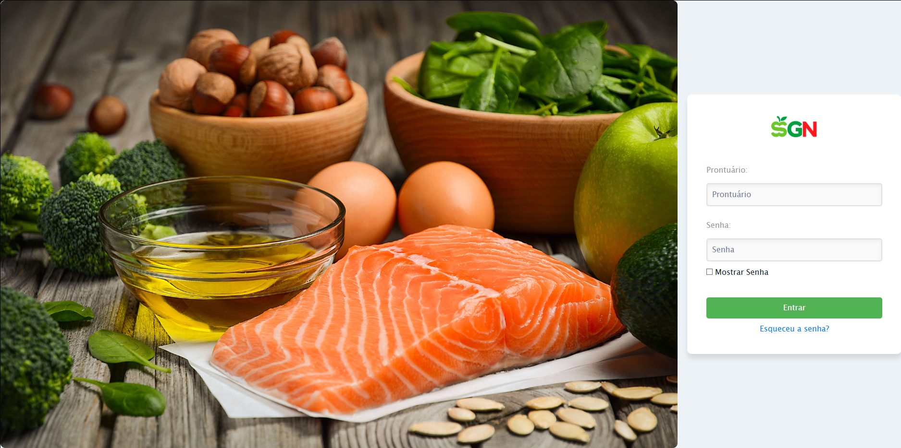
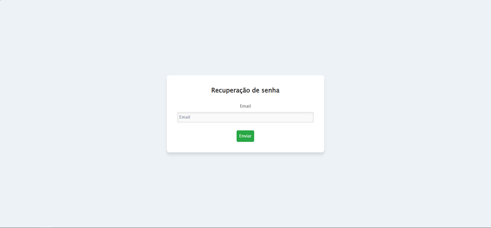

# Tutorial: Recuperar Senha

Este tutorial apresenta o passo a passo completo para recuperar sua senha do Sistema de Gestão Nutricional (SGN) quando você não consegue acessar sua conta.

* * *

## Como Recuperar Sua Senha

### Passo 1: Acessar a Tela de Login

1.  Abra seu navegador web
2.  Digite o endereço do SGN
3.  Aguarde o carregamento da tela de login

### Passo 2: Clicar em "Esqueceu a senha?"

1.  **Localize o link**: Na tela de login, encontre o link "Esqueceu a senha?" abaixo dos campos de login
2.  **Clique no link**: Isso o redirecionará para a página de recuperação de senha

### Passo 3: Inserir seu Prontuário

1.  **Digite seu prontuário**: No campo solicitado, insira seu e-mail completo
2.  **Verifique os dados**: Certifique-se de que digitou corretamente, sem espaços extras
3.  **Clique em "Enviar"**: Para solicitar a recuperação da senha

### Passo 4: Verificar seu E-mail

1.  **Acesse sua caixa de entrada**: Verifique o e-mail cadastrado no sistema
2.  **Procure por spam**: Se não encontrar, verifique as pastas de spam/lixo eletrônico
3.  **Aguarde alguns minutos**: O e-mail pode demorar até 5 minutos para chegar

### Passo 5: Seguir o Link de Recuperação

1.  **Abra o e-mail**: Clique no e-mail recebido do Sistema SGN
2.  **Clique no link**: Encontre e clique no link "Redefinir Senha" no e-mail
3.  **Você será redirecionado**: Para a página de criação de nova senha

### Passo 6: Criar Nova Senha

1.  **Nova senha**: Digite uma senha forte e segura
2.  **Confirmar senha**: Digite a mesma senha novamente para confirmação
3.  **Clique em "Atualizar Senha"**: Para salvar sua nova senha

### Passo 7: Fazer Login com a Nova Senha

Siga o fluxo do [Tutorial: Fazer Login](../tutorial-login/)

* * *

## Dicas Importantes

### ✅ **Para uma Recuperação Bem-sucedida**

*   **E-mail atualizado**: Certifique-se de que seu e-mail no sistema está correto
*   **Prontuário correto**: Digite exatamente como está cadastrado no sistema
*   **Verifique spam**: Sempre confira as pastas de spam/lixo eletrônico
*   **Link temporário**: O link de recuperação expira em 1 hora

### **Criando uma Senha Segura**

*   **Mínimo 8 caracteres**: Use pelo menos 8 caracteres
*   **Combine elementos**: Misture letras maiúsculas, minúsculas, números e símbolos
*   **Evite dados pessoais**: Não use datas de nascimento, nomes ou informações óbvias
*   **Seja único**: Use uma senha diferente de outros sistemas

* * *

**✅ Sucesso!** Após seguir este tutorial, você terá recuperado o acesso ao seu Sistema de Gestão Nutricional com uma nova senha segura.