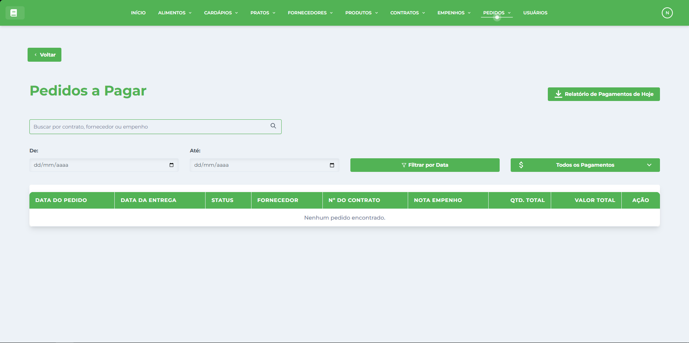

# Pedidos

* * *

## Visão Geral

A tela de Gestão de Pedidos é o módulo operacional central do Sistema de Gestão Nutricional (SGN), responsável pela criação e acompanhamento de solicitações de compra de produtos junto aos [Fornecedores](../../fornecedor/fornecedores/). Esta interface permite criar, visualizar, editar e gerenciar pedidos completos baseados nos [Contratos](../../contrato/contratos/) vigentes, controlando automaticamente os [Empenhos](../../empenho/empenhos/) orçamentários e integrando com todo o fluxo de aquisição de [Produtos](../../produto/produtos/).

## Características da Interface

### Layout e Navegação

*   **Barra superior verde**: Menu principal com acesso a todos os módulos do sistema
*   **Botão Voltar**: Navegação intuitiva para retornar à tela anterior
*   **Design responsivo**: Interface adaptável para diferentes tamanhos de tela
*   **Identidade visual consistente**: Seguindo o padrão verde do SGN

### Área Principal de Dados

A interface apresenta uma tabela organizada com as seguintes colunas:

#### Informações Exibidas

*   **NÚMERO DO PEDIDO**: Identificação única e sequencial
*   **DATA DO PEDIDO**: Data de criação da solicitação
*   **FORNECEDOR**: Empresa destinatária do pedido
*   **VALOR TOTAL**: Montante total da solicitação
*   **STATUS**: Situação atual (Pendente, Enviado, Em Entrega, Entregue, Cancelado)
*   **NOTA DE EMPENHO**: Vinculação orçamentária
*   **ITENS**: Quantidade de produtos incluídos no pedido
*   **DATA DE ENTREGA**: Prazo previsto para recebimento
*   **AÇÕES**: Botões para visualizar, editar, imprimir, registrar entrega e controlar pagamentos

### Funcionalidades de Busca e Filtros

*   **Campo de busca**: "Buscar por Pedido" para filtrar registros rapidamente
*   **Busca por número**: Localização por identificação do pedido
*   **Busca por fornecedor**: Filtro por empresa destinatária
*   **Filtro por status**: Exibição por situação do pedido
*   **Filtro por período**: Seleção por data de criação ou entrega
*   **Filtro por empenho**: Busca por nota de empenho específica
*   **Filtro em tempo real**: Resultados atualizados conforme digitação

### Ações Disponíveis

*   **Novo Pedido**: Botão verde no canto superior direito
*   **Visualizar**: Ícone de olho para ver detalhes completos
*   **Editar**: Ícone de lápis para modificar pedidos pendentes
*   **Registrar Entrega**: Ícone específico para confirmar recebimento
*   **Pagamentos**: Acesso ao controle financeiro do pedido

## Estrutura dos Pedidos

### Informações Básicas do Pedido

Cada pedido possui dados essenciais de:

*   **Número sequencial**: Identificação única e automática
*   **Data de criação**: Quando o pedido foi elaborado no sistema
*   **Fornecedor destinatário**: Empresa que receberá a solicitação
*   **Data de entrega prevista**: Prazo acordado para recebimento
*   **Valor total**: Montante global do pedido calculado automaticamente
*   **Nota de empenho**: Vinculação orçamentária obrigatória

### Itens do Pedido

*   **Lista de produtos**: Itens solicitados com especificações completas
*   **Quantidades requisitadas**: Volumes específicos por produto
*   **Valores unitários**: Preços conforme contrato vinculado
*   **Valores parciais**: Cálculo automático por item
*   **Especificações técnicas**: Características detalhadas dos produtos
*   **Observações**: Informações adicionais sobre os itens

### Controle de Status e Acompanhamento

*   **Status evolutivo**: Acompanhamento de todas as fases do pedido
*   **Histórico de movimentações**: Registro completo de alterações
*   **Prazos de entrega**: Controle de cumprimento de cronograma
*   **Comunicação com fornecedor**: Registro de contatos e confirmações
*   **Documentação**: Anexos e comprovantes relacionados

## Funcionalidades Principais

### Criação de Pedidos

*   **Seleção de contrato**: Escolha do acordo comercial base
*   **Seleção de produtos**: Itens disponíveis no contrato escolhido
*   **Definição de quantidades**: Volumes a serem solicitados
*   **Validação de saldos**: Verificação de disponibilidade no contrato e empenho
*   **Cálculo automático**: Valores computados automaticamente
*   **Definição de prazo**: Data prevista para entrega
*   **Vinculação orçamentária**: Consumo automático do empenho correspondente

### Visualização Detalhada

*   **Dados completos**: Todas as informações do pedido
*   **Lista de itens detalhada**: Produtos com quantidades e valores
*   **Status de andamento**: Situação atual e histórico de mudanças
*   **Informações do fornecedor**: Dados de contato e entrega
*   **Documentação anexa**: Arquivos relacionados ao pedido
*   **Controle orçamentário**: Impacto no empenho vinculado
*   **Previsões de entrega**: Cronograma e prazos

### Edição e Atualização

*   **Modificação de itens**: Alteração de produtos e quantidades (pedidos pendentes)
*   **Ajuste de prazos**: Modificação de datas de entrega
*   **Inclusão de observações**: Informações adicionais relevantes
*   **Atualização de status**: Mudança de situação do pedido
*   **Correção de dados**: Ajustes em informações cadastrais
*   **Cancelamento**: Anulação de pedidos quando necessário

### Controle de Status do Pedido

#### Status Disponíveis:

*   **Pendente**: Pedido criado aguardando envio ao fornecedor
*   **Enviado**: Solicitação transmitida ao fornecedor
*   **Confirmado**: Fornecedor confirmou recebimento e prazo
*   **Em Produção**: Fornecedor iniciou preparação dos itens
*   **Em Transporte**: Produtos despachados para entrega
*   **Entregue Parcial**: Recebimento parcial dos itens
*   **Entregue**: Recebimento completo conforme solicitado
*   **Cancelado**: Pedido anulado por algum motivo

### Registro de Entregas

*   **Confirmação de recebimento**: Registro da entrega dos produtos
*   **Verificação de quantidades**: Conferência de volumes recebidos
*   **Controle de qualidade**: Avaliação da conformidade dos itens
*   **Registro de divergências**: Apontamento de problemas ou diferenças
*   **Documentação de entrega**: Anexo de notas fiscais e comprovantes
*   **Atualização automática**: Mudança de status para "Entregue"
*   **Liberação para pagamento**: Habilitação do processo financeiro

### Geração de Documentos

*   **Ordem de compra**: Documento oficial do pedido
*   **Requisição de materiais**: Formulário interno de solicitação
*   **Relatório de pedido**: Análise completa com todos os dados
*   **Lista de itens**: Detalhamento dos produtos solicitados
*   **Controle de entrega**: Formulário para conferência de recebimento
*   **Documentos fiscais**: Base para emissão de notas fiscais

### Controle de Pagamentos

*   **Vinculação com entregas**: Liberação baseada em recebimento
*   **Controle de vencimentos**: Acompanhamento de prazos financeiros
*   **Histórico de pagamentos**: Registro de todas as liquidações
*   **Análise de pendências**: Identificação de pagamentos em atraso
*   **Relatórios financeiros**: Análises de gastos por fornecedor
*   **Integração contábil**: Conexão com sistemas de contabilidade

### Comunicação com Fornecedores

*   **Envio automático**: Transmissão eletrônica de pedidos
*   **Confirmações**: Registro de aceites e prazos informados
*   **Acompanhamento**: Comunicação sobre andamento da produção
*   **Alertas de atraso**: Notificações sobre descumprimento de prazos
*   **Histórico de contatos**: Registro de toda comunicação realizada
*   **Avaliação de desempenho**: Controle de cumprimento de compromissos

### Relatórios e Análises

*   **Relatório de pedidos**: Análise por período, fornecedor ou produto
*   **Controle de prazos**: Acompanhamento de cumprimento de cronogramas
*   **Análise de gastos**: Valores por período, categoria ou fornecedor
*   **Desempenho de fornecedores**: Avaliação de qualidade e pontualidade
*   **Execução orçamentária**: Impacto nos empenhos disponíveis
*   **Previsões**: Estimativas de demanda e necessidades futuras

### Integração com Outros Módulos

*   **Contratos**: Origem dos produtos e preços disponíveis
*   **Empenhos**: Controle automático de disponibilidade orçamentária
*   **Fornecedores**: Destinatários e dados para comunicação
*   **Produtos**: Especificações e características técnicas
*   **Estoque**: Atualização de quantidades disponíveis
*   **Pagamentos**: Fluxo financeiro de liquidação

## Benefícios do Módulo

### Automatização do Processo de Compras

*   **Fluxo integrado**: Processo contínuo desde o planejamento até o recebimento
*   **Controles automáticos**: Verificação de saldos e disponibilidades
*   **Cálculos precisos**: Valores computados automaticamente sem erros
*   **Documentação automática**: Geração de documentos necessários
*   **Atualizações sistêmicas**: Propagação de informações entre módulos

### Controle Rigoroso e Transparência

*   **Rastreabilidade completa**: Histórico detalhado de todo o processo
*   **Controle orçamentário**: Verificação contínua de disponibilidade financeira
*   **Documentação auditável**: Registros para controle e fiscalização
*   **Transparência de processos**: Informações claras e acessíveis
*   **Conformidade**: Adequação às normas de compras públicas

### Eficiência Operacional

*   **Redução de tempo**: Agilidade na criação e gestão de pedidos
*   **Minimização de erros**: Controles automáticos e validações
*   **Comunicação otimizada**: Canais diretos com fornecedores
*   **Acompanhamento centralizado**: Gestão unificada de todas as solicitações
*   **Relatórios automáticos**: Análises geradas automaticamente

### Gestão Financeira Integrada

*   **Controle orçamentário**: Consumo automático de empenhos
*   **Prevenção de gastos excessivos**: Bloqueio de pedidos sem cobertura
*   **Fluxo de caixa**: Previsibilidade de pagamentos futuros
*   **Análise de custos**: Acompanhamento de gastos por categoria
*   **Otimização de recursos**: Uso eficiente do orçamento disponível

### Relacionamento com Fornecedores

*   **Comunicação profissional**: Canais organizados de relacionamento
*   **Avaliação de desempenho**: Controle de qualidade e cumprimento
*   **Histórico de relacionamento**: Base para negociações futuras
*   **Confiabilidade operacional**: Segurança no processo de aquisição
*   **Parcerias estratégicas**: Fortalecimento de relacionamentos comerciais

* * *

**Dica:** Utilize sempre os controles automáticos de saldo para evitar pedidos sem cobertura orçamentária. Mantenha o status dos pedidos sempre atualizado para facilitar o acompanhamento. Use os relatórios para analisar o desempenho dos fornecedores e otimizar futuras contratações. A integração com outros módulos garante o controle completo do processo de compras.