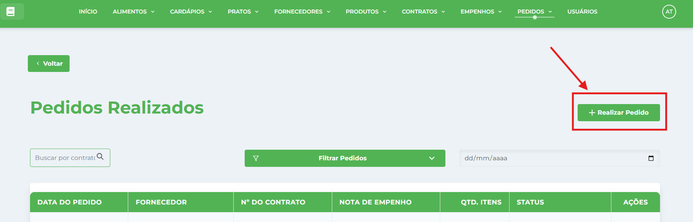
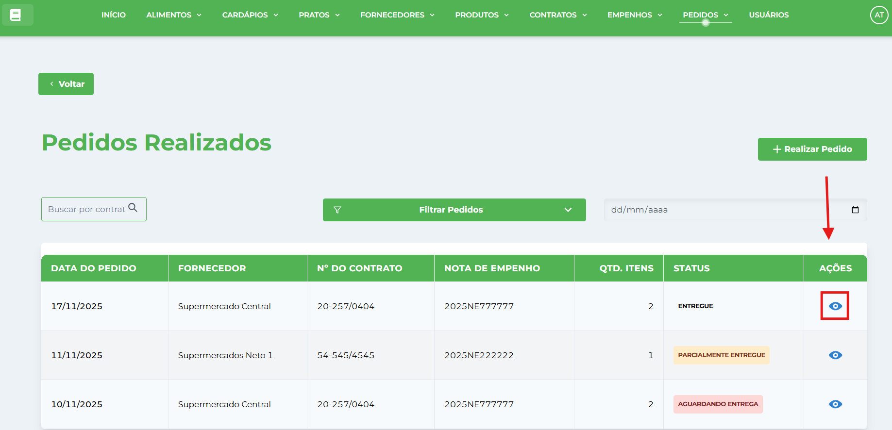
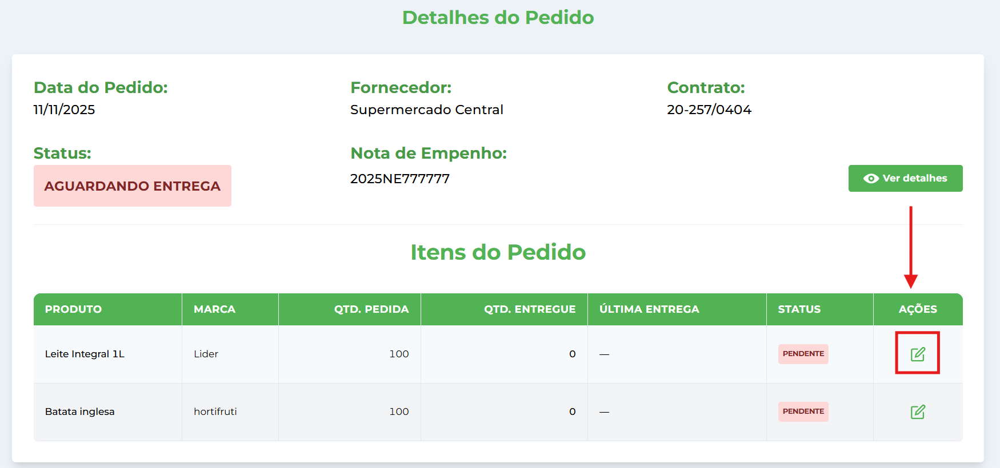
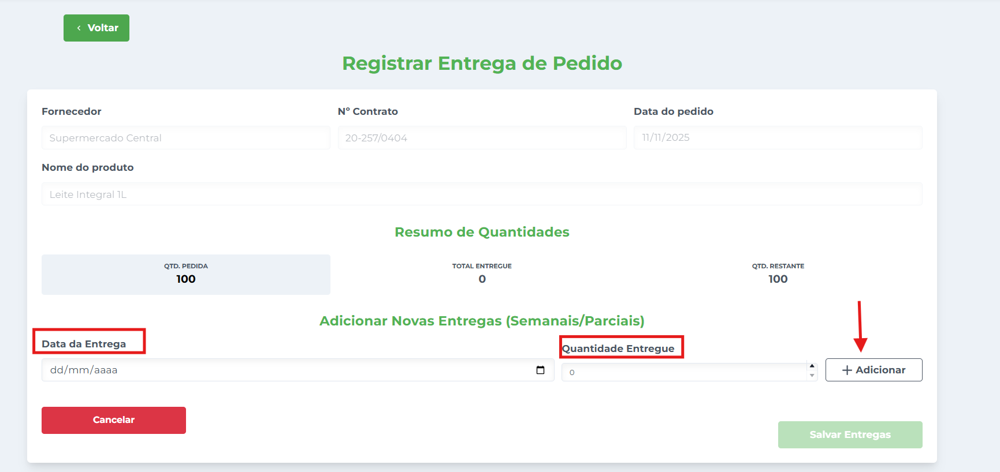
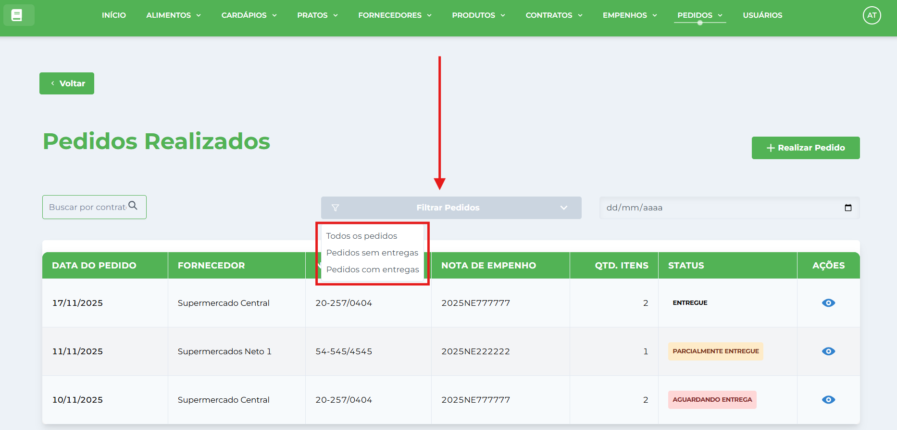
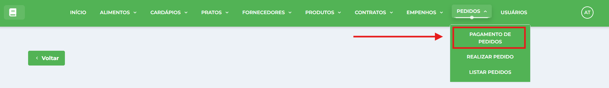
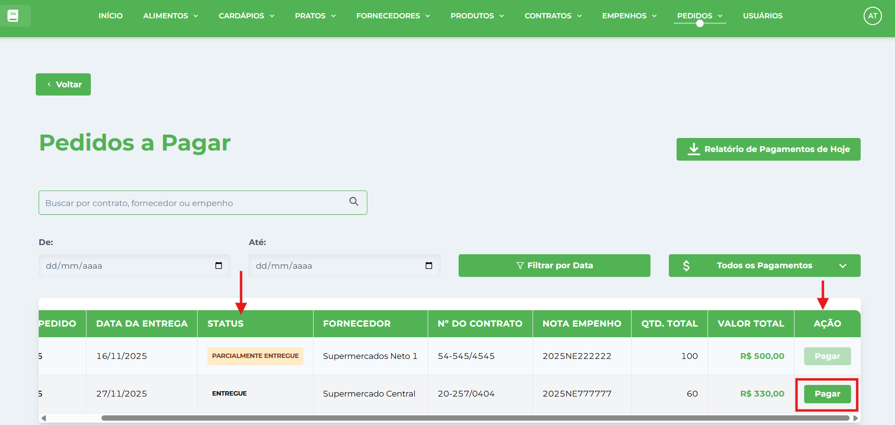
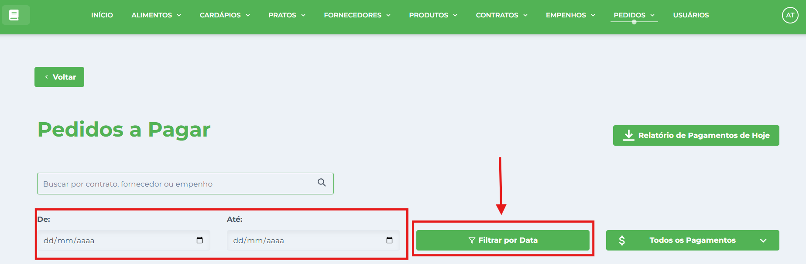
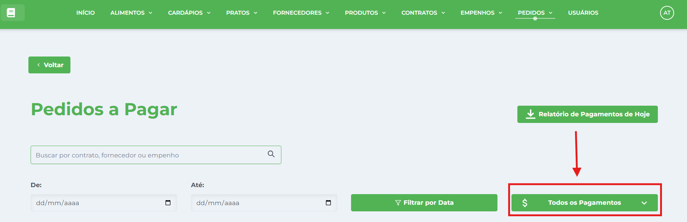
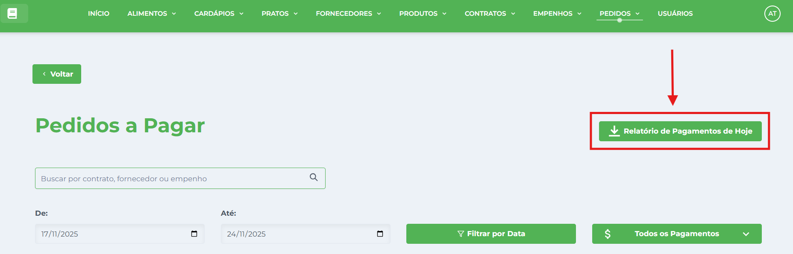

# Pedidos

**Localização**: Menu principal → Pedidos

* * *

## Visão Geral

Nesta tela você gerencia os pedidos da instituição: cadastrar, editar, visualizar, excluir e gerar relatórios. Os pedidos são solicitações de compra realizadas junto aos [Fornecedores](../../fornecedor/tutoriais-fornecedor/), baseadas nos [Contratos](../../contrato/tutoriais-contrato/) vigentes e controladas pelos [Empenhos](../../empenho/tutoriais-empenho/) orçamentários.

## Ações principais (barra superior)

*   **Novo Pedido** — abre a janela de cadastro.
*   **Gerar Relatório** — gera relatório por período ou status.
*   **Filtros por Status** — botões para filtrar:
*   **Todos os Pedidos** — visualização completa
*   **Sem Entrega** — pedidos aguardando recebimento
*   **Com Entrega** — pedidos já recebidos
*   **Pagamentos** — controle financeiro dos pedidos
*   **Campo de pesquisa** (à direita) — pesquisa/filtra os registros por dados do pedido.

## Pré-requisitos

⚠️ **Importante**: Antes de criar um pedido, você deve ter:  
1\. **Fornecedores cadastrados** - Siga o manual de [Fornecedores](../../fornecedor/tutoriais-fornecedor/)  
2\. **Contratos ativos** - Siga o manual de [Contratos](../../contrato/tutoriais-contrato/)  
3\. **Empenhos disponíveis** - Siga o manual de [Empenhos](../../empenho/tutoriais-empenho/)

## Como cadastrar um novo Pedido

1.  No menu clique em **Pedidos** → **Listar Pedidos**.
2.  Clique no botão **Realizar Pedido**.
    
    
    
3.  Na janela **Realizar Pedido** preencha os campos:
    
    *   **Data do Pedido** — data do pedido.
    *   **Fornecedor** — selecione a empresa.
    *   **Contrato** — selecione o número do contrato.
    *   **Data do empenho** - data do empenho relacionado ao contrato
    *   **Itens** — digite a quantidade que deseja de cada item.
4.  Clique em **Salvar Pedido** para salvar. A janela será fechada e o registro aparecerá na tabela.

## Como visualizar um pedido

1.  Localize o pedido na tabela (use a pesquisa se necessário).
2.  Clique em **Visualizar** na coluna de Ações da linha desejada.
    
    
    
3.  Você verá as informações.
    

## Como registrar entrega

1.  Siga os passos de [Como visualizar um pedido](#como-visualizar-um-pedido)
2.  Na tabela **Itens do Pedidos**, clique em **Editar** na coluna de Ações da linha desejada.
    
    
    
3.  Na página **Registrar Entrega de Pedido**, informe:
    
    *   **Data da Entrega** - Data em que os produtos foram recebidos.
    *   **Quantidade Entregue** - Quantidade efetivamente recebida por item.
    *   Clique em **Adicionar** - para salvar os dados.
    
    
    
4.  Clique em **Salvar Entregas** para confirmar o registro.
    
5.  **Atualização Automática do Status**:
    
    *   **Entregue**: Quando quantidade entregue = quantidade pedida
    *   **Parcialmente Entregue**: Quando quantidade entregue < quantidade pedida
    *   **Pendente**: Quando nenhuma quantidade foi entregue
6.  **Validações**:
    
    *   Quantidade entregue não pode ser negativa
    *   Data de entrega não pode ser futura
    *   Sistema permite entregas parciais múltiplas

## Como filtrar pedidos

1.  Clique no menu de filtro **Filtrar Pedidos** para selecionar o tipo de pedido que deseja visualizar
    
    
    
    *   **Todos os Pedidos**: Visualização completa de todos os registros
    *   **Sem Entrega**: Pedidos que ainda não receberam produtos
    *   **Com Entrega**: Pedidos que já tiveram produtos recebidos

## Como realizar pagamentos

1.  **Acessar**: **Pedidos** → **Pagamento de Pedidos**
    
    
    
2.  Localize o pedido a ser pago na tabela (use a pesquisa se necessário).
    
    
    
3.  Clique em **Pagar** na coluna de Ações da linha desejada.
    
    *   O pagamento somente poderá ser realizado caso o **status** do pedido esteja definido como **Entregue**.
4.  Na janela **Confirmar Pagamento**, clique no botão **Confirmar Pagamento**.

### **Como filtrar os pagamentos por período**

*   Selecione as datas e clique no botão **Filtrar por Data** 

### **Como filtrar os pagamentos pelo menu de filtros**

1.  Clique no menu de filtros e selecione a opção desejada para exibir os registros: 
2.  **Visualização Específica**:
    *   Todos os pagamentos
    *   Pedidos com o pagamento realizado
    *   Pedidos sem o pagamento

### **Como gerar relatório**

*   Clique no **botão Relatório de Pagamentos de Hoje** 

## Dicas Importantes

### **Campos Obrigatórios**

*   **Fornecedor**: Deve ter contrato ativo
*   **Nota de Empenho**: Deve ter saldo disponível
*   **Data de Entrega**: Deve ser futura
*   **Pelo menos um item**: Com produto e quantidade

### **Controle Automático de Estoque**

*   **Entrada Automática**: Produtos são adicionados ao estoque quando entrega é registrada
*   **Quantidade Acumulativa**: Sistema soma entregas parciais múltiplas
*   **Rastreabilidade**: Mantém histórico completo de movimentações
*   **Integração**: Estoque é atualizado automaticamente sem intervenção manual

### **Controle Orçamentário Integrado**

*   **Reserva Automática**: Valor comprometido no empenho ao criar pedido
*   **Validação Prévia**: Sistema impede pedidos acima do saldo disponível
*   **Atualização Simultânea**: Saldos atualizados em tempo real
*   **Rastreamento Completo**: Valor empenhado vs utilizado vs pago