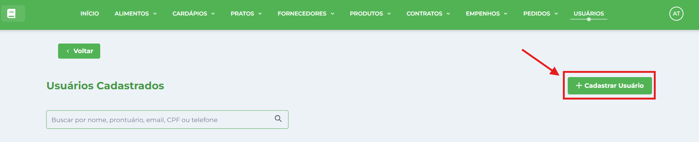
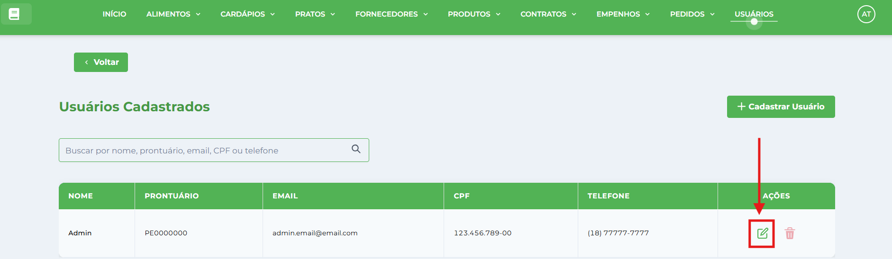

# Perfis de Usuários - Nutricionistas

**Localização**: Menu principal → Usuários

* * *

## Visão Geral

O Sistema de Gestão Nutricional do IFSP é desenvolvido especificamente para **Nutricionistas** que atuam no planejamento, controle e execução da alimentação escolar. O sistema possui um modelo de usuário único focado no perfil profissional de nutricionistas, permitindo acesso completo a todas as funcionalidades de gestão nutricional e administrativa.

## Perfil do Usuário Nutricionista

### **Características do Perfil**

*   **Público-alvo**: Nutricionistas do Instituto Federal de São Paulo (IFSP)
*   **Identificação**: Prontuário institucional único
*   **Acesso**: Completo a todos os módulos do sistema
*   **Responsabilidades**: Gestão completa da alimentação escolar

### **Dados do Usuário**

*   **Nome Completo**: Identificação profissional
*   **Prontuário**: Número funcional no IFSP (único no sistema)
*   **CPF**: Documento de identificação (opcional)
*   **E-mail**: Contato institucional obrigatório
*   **Telefone**: Contato direto (opcional)
*   **Senha**: Acesso criptografado ao sistema

## Funcionalidades Disponíveis

### **1\. Planejamento Nutricional**

*   **Cadastro de Alimentos**: Base completa com informações nutricionais
*   **Criação de Pratos**: Receitas padronizadas com cálculo nutricional
*   **Elaboração de Cardápios**: Planejamento diário e semanal
*   **Análise Nutricional**: Verificação de adequação nutricional

### **2\. Gestão Administrativa**

*   **Controle de Fornecedores**: Cadastro e gestão de empresas
*   **Gestão de Contratos**: Controle de vigência e produtos
*   **Empenhos Orçamentários**: Reserva e controle financeiro
*   **Pedidos e Entregas**: Solicitações e recebimento de produtos

### **3\. Controle de Estoque**

*   **Cadastro de Produtos**: Controle de ingredientes e insumos
*   **Movimentação**: Entrada e saída de produtos
*   **Utilização**: Controle de uso em preparações
*   **Relatórios**: Acompanhamento de consumo

### **4\. Gestão de Usuários**

*   **Cadastro de Colegas**: Inclusão de outros nutricionistas
*   **Controle de Acesso**: Gerenciamento de senhas e permissões
*   **Perfil Pessoal**: Atualização de dados próprios

## Como Gerenciar Usuários

### **Cadastrar Novo Nutricionista**

1.  **Acessar**: Menu → Usuários
2.  Clique no botão **Cadastrar Usuário**.
    
    
    
3.  **Preencher Dados Obrigatórios**:
    
    *   **Nome**: Nome completo do profissional
    *   **Prontuário**: Número funcional no IFSP
    *   **E-mail**: E-mail institucional
    *   **Senha**: Senha segura (mínimo 8 caracteres)
    *   **Confirmar Senha**: Repetir senha para validação
4.  **Dados Opcionais**:
    
    *   **CPF**: Documento de identificação
    *   **Telefone**: Contato direto
5.  **Validações do Sistema**:
    
    *   Prontuário único (não pode repetir)
    *   E-mail válido
    *   Senha com critérios de segurança
    *   CPF válido (se informado)

### **Gerenciar Usuários Existentes**

1.  **Listar**: Visualizar todos os usuários cadastrados
2.  **Buscar**: Pesquisar por nome, prontuário, e-mail ou CPF
3.  **Editar**: Atualizar dados de qualquer usuário
4.  **Excluir**: Remover usuários inativos
5.  **Resetar Senha**: Recuperação via e-mail

### **Atualizar Perfil Próprio**

1.  Clique em **Editar** na coluna de Ações.
    
    
    
2.  A janela abrirá em modo de edição — altere os campos desejados e clique em **Salvar Alterações**.
    

## Sistema de Autenticação

### **Login no Sistema**

*   **Credenciais**: Prontuário + Senha

### **Recuperação de Senha**

1.  **Esqueci minha Senha**: na tela de [Login](../../login/tutorial-recuperar-senha/)
2.  **Informar E-mail**: E-mail cadastrado no sistema
3.  **Nova Senha Temporária**: Enviada por e-mail automaticamente
4.  **Primeiro Acesso**: Obrigatório alterar senha temporária

## Responsabilidades do Nutricionista

### **Planejamento Alimentar**

*   Elaborar cardápios nutricionalmente adequados
*   Calcular porções e valores nutricionais
*   Considerar faixa etária e necessidades específicas
*   Garantir variedade e aceitação das preparações

### **Controle Administrativo**

*   Gerenciar contratos com fornecedores
*   Controlar orçamento e empenhos
*   Supervisionar entregas e qualidade dos produtos
*   Manter estoque adequado de ingredientes

### **Documentação e Relatórios**

*   Gerar relatórios nutricionais
*   Documentar cardápios executados
*   Controlar custos por refeição
*   Manter registros para auditoria

### **Qualidade e Segurança**

*   Garantir qualidade nutricional das refeições
*   Controlar especificações de produtos
*   Supervisionar condições de armazenamento
*   Assegurar cumprimento das normas sanitárias

## Validações e Restrições

### **Cadastro de Usuários**

*   **Prontuário Único**: Não permite duplicação
*   **E-mail Obrigatório**: Para recuperação de senha
*   **Validação de CPF**: Formato e dígitos verificadores
*   **Critérios de Senha**: Mínimo 8 caracteres, segurança

### **Controle de Acesso**

*   **Autenticação Obrigatória**: Todas as funcionalidades protegidas
*   **Sessão Controlada**: Timeout automático
*   **Permissões Iguais**: Todos os usuários têm acesso completo

## Boas Práticas

### **Segurança**

*   **Senhas Fortes**: Use combinações seguras
*   **Logout Regular**: Encerre sessões ao terminar
*   **E-mail Atualizado**: Mantenha contato válido
*   **Dados Precisos**: Informações sempre atualizadas

* * *

## Suporte Técnico

### **Problemas de Acesso**

*   **Esqueci Senha**: Use recuperação por e-mail
*   **Prontuário Bloqueado**: Contate administrador
*   **Erro de Sistema**: Aguarde e tente novamente

### **Dúvidas Funcionais**

*   **Manuais Específicos**: Consulte documentação de cada módulo
*   **Treinamento**: Solicite capacitação se necessário
*   **Suporte**: Entre em contato com TI do IFSP

### **Atualizações**

*   **Novidades**: Acompanhe atualizações do sistema
*   **Melhorias**: Sugira funcionalidades necessárias
*   **Feedback**: Contribua para evolução do sistema