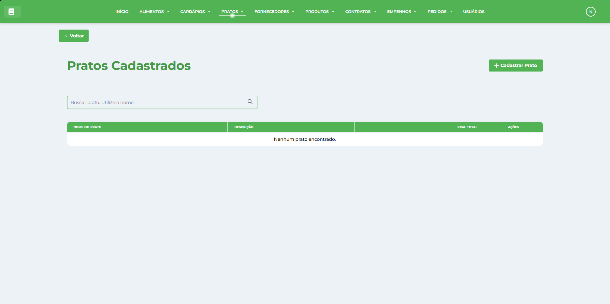

# Pratos

* * *

## Visão Geral

A tela de Gestão de Pratos é um módulo essencial do Sistema de Gestão Nutricional (SGN), responsável pela criação e gerenciamento de receitas e preparações culinárias. Esta interface permite cadastrar, visualizar, editar e organizar pratos completos com seus ingredientes, utilizando a base de _[Alimentos](../../alimento/alimentos/)_ cadastrados e integrando diretamente com o planejamento de _[Cardápios](../../cardapio/cardapios/)_.

## Características da Interface

### Layout e Navegação

*   **Barra superior verde**: Menu principal com acesso a todos os módulos do sistema
*   **Botão Voltar**: Navegação intuitiva para retornar à tela anterior
*   **Design responsivo**: Interface adaptável para diferentes tamanhos de tela
*   **Identidade visual consistente**: Seguindo o padrão verde do SGN

### Área Principal de Dados

A interface apresenta uma tabela organizada com as seguintes colunas:

#### Informações Exibidas

*   **PRATO**: Nome completo e descrição da preparação
*   **DESCRIÇÃO**: Detalhamento da receita e modo de preparo
*   **KCAL TOTAL**: Valor energético total do prato preparado
*   **INGREDIENTES**: Quantidade de alimentos utilizados na composição
*   **AÇÕES**: Botões para visualizar, editar e excluir pratos

### Funcionalidades de Busca

*   **Campo de busca**: "Buscar por Prato" para filtrar registros rapidamente
*   **Filtro em tempo real**: Resultados atualizados conforme digitação
*   **Busca por ingredientes**: Localização de pratos por alimentos específicos

### Ações Disponíveis

*   **Cadastrar Prato**: Botão verde no canto superior direito
*   **Visualizar**: Ícone de olho para ver receita completa e informações nutricionais
*   **Editar**: Ícone de lápis para modificar ingredientes e quantidades
*   **Excluir**: Ícone de lixeira para remover pratos (com proteção contra vínculos)

## Composição dos Pratos

### Estrutura de Receitas

Cada prato é composto por:

*   **Nome e descrição**: Identificação clara da preparação
*   **Lista de ingredientes**: Alimentos selecionados da base de dados
*   **Quantidades precisas**: Medidas em gramas para cada ingrediente
*   **Cálculos automáticos**: Valores nutricionais totais computados
*   **Modo de preparo**: Instruções detalhadas de preparação

### Informações Nutricionais Automáticas

*   **Valor calórico total**: Soma das calorias de todos os ingredientes
*   **Macronutrientes**: Carboidratos, proteínas e gorduras totais
*   **Micronutrientes**: Vitaminas e minerais por porção
*   **Densidade nutricional**: Análise da qualidade nutricional
*   **Adequação dietética**: Verificação de conformidade com diretrizes

## Funcionalidades Principais

### Cadastro de Pratos

*   **Seleção de ingredientes**: Escolha de alimentos da base cadastrada
*   **Definição de quantidades**: Medidas precisas para cada ingrediente
*   **Cálculo automático**: Valores nutricionais computados em tempo real
*   **Validação de dados**: Verificação de informações obrigatórias
*   **Preview nutricional**: Visualização prévia dos resultados

### Visualização Detalhada

*   **Receita completa**: Lista de ingredientes com quantidades exatas
*   **Informações nutricionais**: Valores detalhados por 100g e por porção
*   **Composição nutricional**: Distribuição de macro e micronutrientes

### ✏️ Edição e Atualização

*   **Modificação de ingredientes**: Adição, remoção ou alteração de alimentos
*   **Ajuste de quantidades**: Modificação precisa das medidas
*   **Atualização automática**: Recálculo instantâneo dos valores nutricionais
*   **Validação contínua**: Verificação em tempo real das alterações
*   **Histórico de mudanças**: Registro de modificações realizadas

### Gestão de Ingredientes

*   **Adição inteligente**: Interface intuitiva para seleção de alimentos
*   **Busca avançada**: Filtros por categoria e características nutricionais
*   **Quantidades flexíveis**: Suporte a diferentes unidades de medida
*   **Substituições**: Sugestões de ingredientes alternativos
*   **Validação nutricional**: Verificação de adequação da composição

### Exclusão Controlada

*   **Verificação de vínculos**: Proteção contra exclusão de pratos em uso
*   **Confirmação de segurança**: Diálogo de confirmação antes da remoção
*   **Análise de dependências**: Verificação de uso em cardápios ativos
*   **Backup automático**: Preservação de dados antes da exclusão
*   **Notificações claras**: Mensagens informativas sobre restrições

### Análise Nutricional

*   **Perfil nutricional completo**: Análise detalhada da composição
*   **Adequação às diretrizes**: Verificação de conformidade nutricional
*   **Densidade calórica**: Análise da relação energia/nutrientes
*   **Qualidade proteica**: Avaliação do perfil de aminoácidos
*   **Índice nutricional**: Score de qualidade nutricional

### Integração com Outros Módulos

*   **Alimentos**: Base de dados de ingredientes disponíveis
*   **Cardápios**: Uso direto dos pratos no planejamento de refeições
*   **Compras**: Cálculo automático de ingredientes necessários
*   **Relatórios**: Análises de uso e popularidade dos pratos
*   **Custos**: Estimativa de valores baseada nos ingredientes

## Benefícios do Módulo

### Eficiência na Criação

*   **Interface intuitiva**: Processo simplificado de cadastro
*   **Cálculos automáticos**: Valores nutricionais instantâneos
*   **Reutilização de dados**: Aproveitamento da base de alimentos
*   **Validação em tempo real**: Verificação imediata da composição
*   **Padronização**: Receitas consistentes e reproduzíveis

### Precisão Nutricional

*   **Dados confiáveis**: Cálculos baseados na composição oficial dos alimentos
*   **Atualização automática**: Valores sempre atualizados com a base de dados
*   **Rastreabilidade**: Origem clara de todos os valores nutricionais
*   **Conformidade**: Adequação às normas técnicas de nutrição
*   **Transparência**: Informações detalhadas e verificáveis

### Padronização de Receitas

*   **Receitas padronizadas**: Preparações consistentes e reproduzíveis
*   **Controle de qualidade**: Manutenção dos padrões nutricionais
*   **Treinamento facilitado**: Base para capacitação de cozinheiros
*   **Redução de desperdícios**: Quantidades exatas de ingredientes
*   **Documentação completa**: Registro detalhado de todas as preparações

### Integração Completa

*   **Fluxo contínuo**: Conexão perfeita entre ingredientes, pratos e cardápios
*   **Automatização**: Redução de trabalho manual repetitivo
*   **Consistência**: Dados uniformes em todo o sistema
*   **Rastreabilidade**: Acompanhamento completo do processo
*   **Relatórios integrados**: Análises que abrangem todo o ciclo

* * *

**Dica:** Mantenha sempre as receitas atualizadas e padronizadas para garantir a consistência nutricional e facilitar o planejamento de cardápios. Use a função de visualização para verificar os valores antes de incluir os pratos nos cardápios.