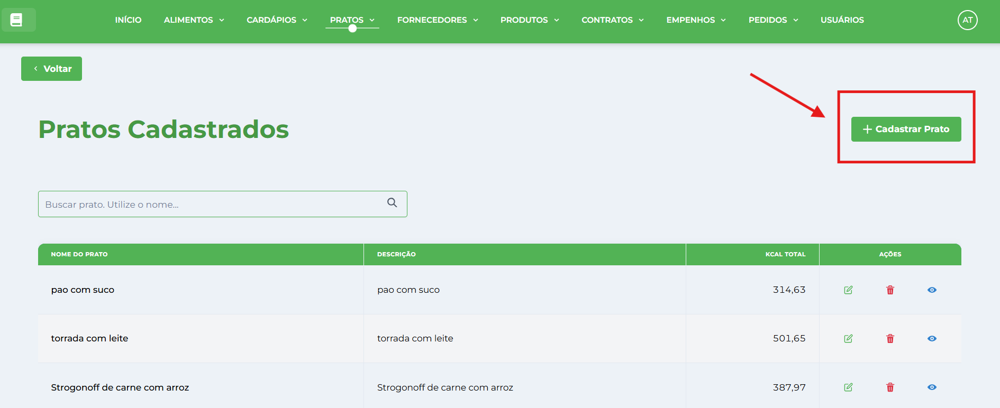
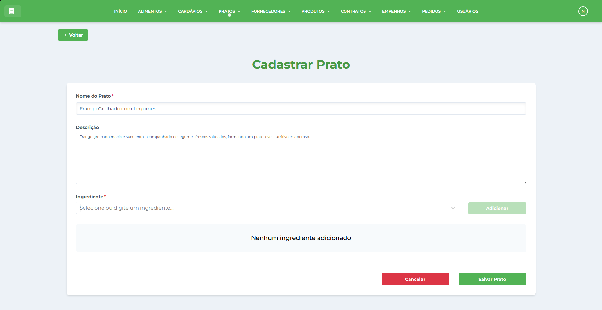
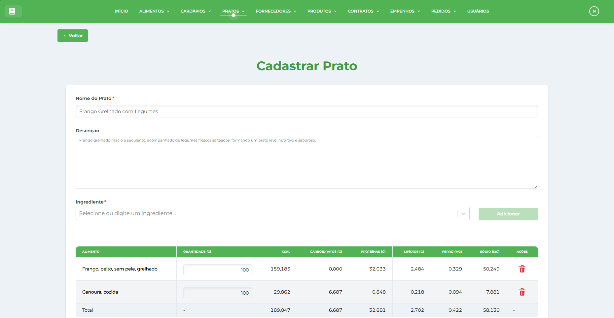
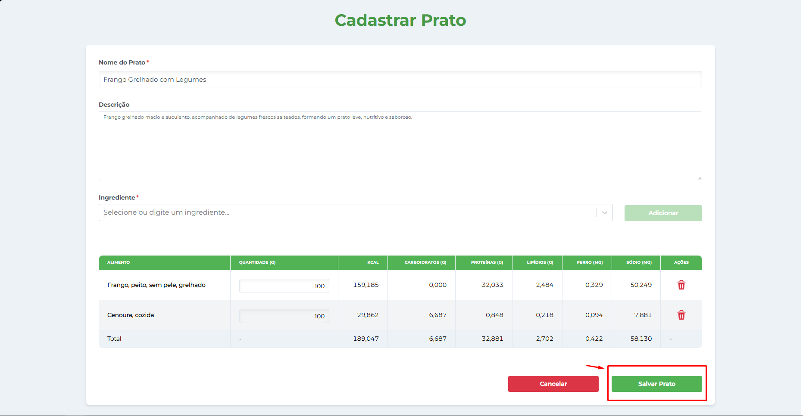
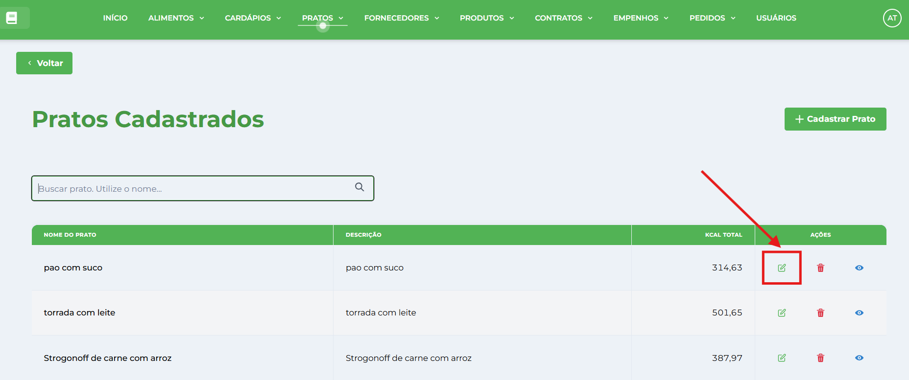
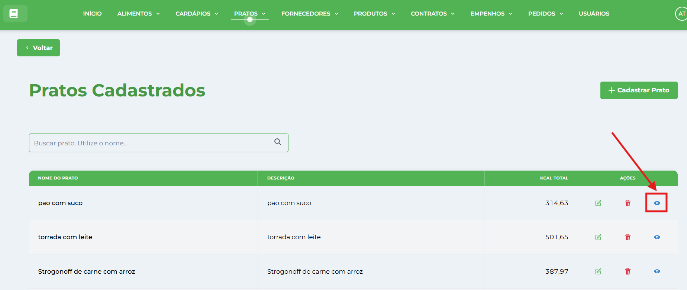
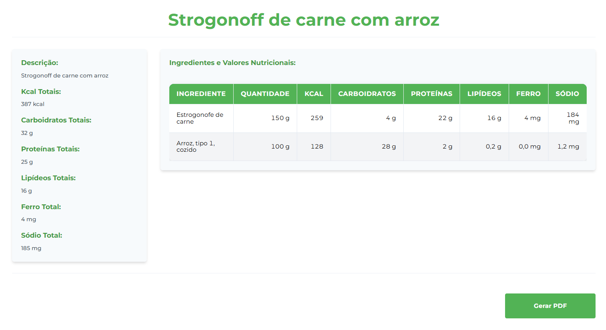
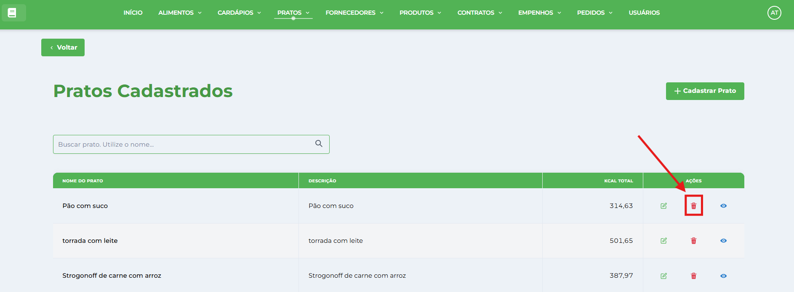

# Pratos

**Localização**: Menu principal → Pratos

## Visão Geral

Nesta tela você gerencia os pratos do sistema: cadastrar, editar, visualizar, excluir e gerar relatórios. Os pratos são receitas criadas com _[Alimentos](../../alimento/alimentos/)_ cadastrados e utilizados na composição de _[Cardápios](../../cardapio/cardapios/)_.

## Ações principais (barra superior)

*   **Cadastrar Prato** — abre a janela de cadastro.
*   **Gerar Relatório** — gera um relatório da listagem atual.
*   **Campo de pesquisa** (à direita) — pesquisa/filtra os registros por nome do prato ou ingredientes.

## Pré-requisitos

⚠️ **Importante**: Antes de criar um prato, você deve ter:

1.  **Alimentos cadastrados** - Siga o manual de [Alimentos](../../alimento/alimentos/)

## Como cadastrar um novo Prato

1.  No menu, clique em **Pratos**.
2.  Clique no botão **Cadastrar Prato**.
    
    
    
3.  Na janela **Cadastrar Prato** preencha os campos:
    
    *   **Nome do Prato** — digite o nome completo e específico (ex.: "Arroz com Feijão", "Frango Grelhado com Legumes").
    *   **Descrição** (opcional) — adicione informações sobre o modo de preparo ou características especiais.
    
    
    
4.  **Adicionar Alimentos ao Prato**:
    
    *   **Buscar alimentos** — use o campo de busca para encontrar os alimentos cadastrados.
    *   **Selecionar alimento** — clique no alimento desejado na lista e clique em **"Adicionar"**.
    *   **Definir quantidade** — para cada alimento selecionado, informe a quantidade (ex: 100g, 150g, 200g).
    *   **Repetir o processo** — adicione todos os alimentos que compõem o prato.
    *   **Remover ingredientes** — use o botão "🗑️ (Lixeira)" para remover alimentos adicionados por engano.
    
    
    
5.  **Cálculos Nutricionais Automáticos**: O sistema calculará em tempo real:
    
    *   **Kcal Totais**: Somatória das calorias de todos os ingredientes
    *   **Macronutrientes**: Carboidratos, Proteínas e Lipídeos
    *   **Micronutrientes**: Sódio e Ferro
    *   **Valores Proporcionais**: Baseados nas quantidades de cada ingrediente
    *   **Atualização Dinâmica**: Recalcula ao adicionar/remover ingredientes
6.  **Visualizar Cálculos**: Acompanhe os valores nutricionais sendo calculados durante o cadastro
    
7.  Clique em **Salvar Prato** para confirmar. A janela será fechada e o registro aparecerá na tabela.
    
    
    

## Como editar um registro

1.  Localize o prato na tabela (use a pesquisa se necessário).
2.  Clique em **Editar** na coluna de Ações da linha desejada.
    
    
    
3.  A janela abrirá em modo de edição — altere os campos desejados, adicione ou remova ingredientes e clique em **Confirmar**.
    

## Como visualizar um prato

### **Visualização Detalhada**

1.  **Acessar**: Na lista, clique em **Visualizar** para abrir análise completa
    
    
    
2.  **Informações Básicas**:
    
    *   Nome e descrição do prato
    *   Lista completa de ingredientes
    *   Quantidades por ingrediente
3.  **Resumo Nutricional**:
    
    *   **Kcal Totais**: Energia total do prato
    *   **Total de Carboidratos**: Macronutriente energético
    *   **Total de Proteínas**: Macronutriente estrutural
    *   **Total de Lipídeos**: Macronutriente energético
    *   **Total de Ferro**: Micronutriente essencial
    *   **Total de Sódio**: Micronutriente para controle
4.  **Tabela Nutricional Detalhada**:
    
    *   Análise por ingrediente individual
    *   Kcal de cada alimento na quantidade usada
    *   Distribuição de macronutrientes por item
    *   Contribuição de micronutrientes por ingrediente
    *   Valores formatados com precisão (2 casas decimais)
    
    
    
5.  **Gerar PDF do Prato**:
    
    *   Botão **"Gerar PDF"** para relatório completo
    *   Inclui todas as informações nutricionais
    *   Tabela formatada com ingredientes e valores
    *   Resumo nutricional consolidado
    *   Arquivo pronto para impressão ou compartilhamento
6.  **Navegação**: Use **"Voltar"** para retornar à listagem
    

## Como excluir um registro

1.  Clique em **Excluir** (ícone de lixeira) na coluna Ações da linha correspondente.
    
    
    
2.  Confirme a exclusão clicando em **Confirmar** no diálogo de confirmação.
    
3.  ⚠️ **Atenção**: Não é possível excluir pratos que estão sendo utilizados em cardápios.

## Sistema de Cálculos Nutricionais

### **Cálculos Automáticos em Tempo Real**

1.  **Base de Cálculo**: Valores nutricionais por 100g de cada alimento
2.  **Proporcionalidade**: Sistema ajusta conforme quantidade definida
3.  **Fórmula**: (Valor\_Nutriente × Quantidade\_Ingrediente) ÷ 100
4.  **Atualização Dinâmica**: Recalcula automaticamente a cada modificação

### **Nutrientes Calculados**

*   **Energia (Kcal)**: Valor energético total do prato
*   **Carboidratos (g)**: Macronutriente energético principal
*   **Proteínas (g)**: Macronutriente para crescimento e reparo
*   **Lipídeos (g)**: Macronutriente energético concentrado
*   **Ferro (mg)**: Micronutriente para prevenção de anemia
*   **Sódio (mg)**: Micronutriente para controle de pressão arterial

### **Precisão e Formato**

*   **Valores Decimais**: Apresentados com 2 casas decimais
*   **Arredondamento Inteligente**: Evita valores zerados desnecessários
*   **Formatação Brasileira**: Vírgula como separador decimal
*   **Unidades Padrão**: g (gramas), mg (miligramas), kcal (quilocalorias)

## Dicas Importantes

#### **Cálculos Nutricionais Inteligentes**

*   **Base de Dados**: Utiliza composição nutricional completa de cada alimento
*   **Proporcionalidade Automática**: Ajusta valores conforme quantidades definidas
*   **Atualização Instantânea**: Recalcula em tempo real durante edições
*   **Precisão Decimal**: Mantém exatidão com 2 casas decimais
*   **Validação Cruzada**: Verifica consistência entre ingredientes

#### **Edição Avançada de Ingredientes**

*   **Adição Inteligente**: Incorpora novos ingredientes sem afetar existentes
*   **Remoção Seletiva**: Remove itens específicos mantendo outros
*   **Atualização de Quantidades**: Modifica porções com recalculo automático
*   **Preservação de Dados**: Mantém ingredientes não alterados
*   **Controle de Versão**: Rastreia alterações na receita

#### **Relatório e Documentação**

*   **Tabelas Formatadas**: Ingredientes e valores organizados
*   **Resumos Nutricionais**: Totais consolidados por macronutriente
*   **Comparação Visual**: Facilita análise entre diferentes pratos
*   **Exportação Flexível**: Formatos para impressão ou digital

#### **Monitoramento Automático**

*   **Alertas de Valores**: Identificação de valores nutricionais extremos
*   **Consistência de Receitas**: Validação de proporções realistas
*   **Controle de Sódio**: Monitoramento especial para saúde cardiovascular
*   **Adequação Energética**: Verificação de valores calóricos
*   **Balanço de Macros**: Análise de distribuição de macronutrientes

#### **Boas Práticas Nutricionais**

*   **Receitas Balanceadas**: Combine diferentes grupos alimentares
*   **Porções Adequadas**: Considere público-alvo e necessidades
*   **Ingredientes Completos**: Inclua todos os componentes, inclusive temperos
*   **Atualização Regular**: Revise receitas conforme mudanças sazonais
*   **Validação Prática**: Teste receitas antes da implementação

#### **Uso em Planejamento**

*   **Seleção Inteligente**: Filtragem por valores nutricionais
*   **Composição de Cardápios**: Combinação automática de pratos
*   **Cálculo de Refeições**: Soma valores nutricionais de múltiplos pratos
*   **Adequação de Metas**: Verificação de recomendações nutricionais
*   **Otimização de Custos**: Consideração de custo-benefício nutricional

#### **Regras de Negócio**

*   **Pratos em Uso**: Sistema impede exclusão quando vinculado a cardápios
*   **Ingredientes Obrigatórios**: Mínimo de um alimento por prato
*   **Quantidades Válidas**: Apenas valores numéricos positivos
*   **Alimentos Cadastrados**: Ingredientes devem existir na base
*   **Nomes Únicos**: Evita duplicação de pratos idênticos

#### **Controles Técnicos**

*   **Validação de Entrada**: Verificação de tipos de dados
*   **Limites de Sistema**: Controle de quantidades máximas
*   **Integridade Relacional**: Mantém consistência entre tabelas
*   **Auditoria de Alterações**: Registro de modificações realizadas
*   **Backup Automático**: Proteção contra perda de dados

#### **Sequência Recomendada**

1.  **[Alimentos](../../alimento/tutoriais-alimento/)**: Cadastre base completa de ingredientes
2.  **Pratos**: Crie receitas com cálculos nutricionais (este manual)
3.  **[Cardápios](../../cardapio/tutoriais-cardapio/)**: Combine pratos em refeições completas
4.  **[Pedidos](../../pedido/tutoriais-pedido/)**: Solicite ingredientes baseado nos cardápios

#### **Dependências do Sistema**

*   **Alimentos**: Base obrigatória para criar qualquer prato
*   **Nutrientes**: Dados nutricionais automaticamente integrados
*   **Cardápios**: Pratos são componentes essenciais
*   **Estoque**: Ingredientes conectados ao controle de produtos

#### **Benefícios da Integração**

*   **Consistência**: Dados nutricionais padronizados em todo sistema
*   **Eficiência**: Reaproveita pratos em múltiplos cardápios
*   **Controle**: Rastreabilidade completa dos ingredientes
*   **Otimização**: Cálculos automáticos reduzem erros manuais

**Próximo Passo**: [Criar Cardápios](../../cardapio/tutoriais-cardapio/) utilizando os pratos cadastrados