# Produtos

**Localização**: Menu principal → Produtos

* * *

## Visão Geral

Nesta tela você gerencia os produtos da instituição: cadastrar, editar, visualizar, excluir e gerar relatórios. Os produtos são utilizados nos [Contratos](../../contrato/tutoriais-contrato/), [Pedidos](../../pedido/tutoriais-pedido/) e podem estar relacionados aos [Alimentos](../../alimento/tutoriais-alimento/).

[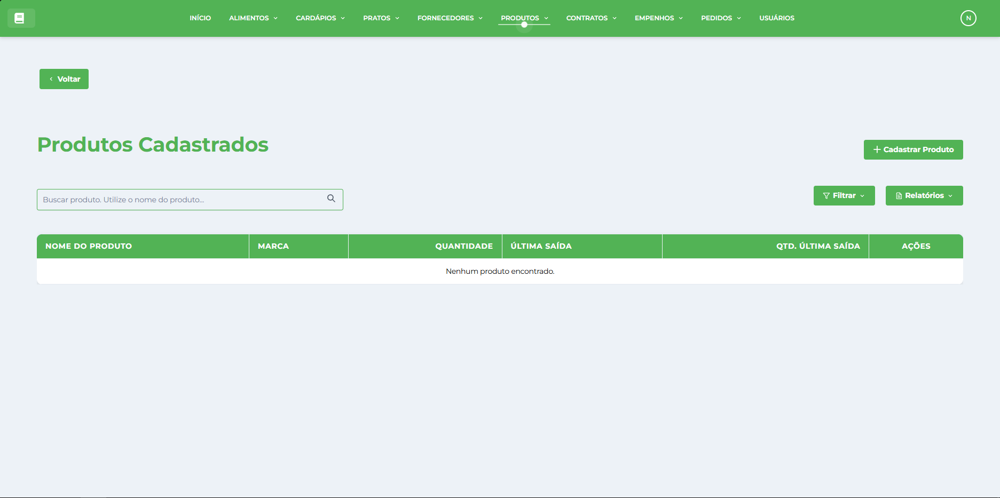](../../img/telaproduto/telaprodutos.png)

## Ações principais

*   **Cadastrar Produto** — abre a janela de cadastro.
*   **Filtros de Estoque** — botões rápidos para filtrar:
    *   **Todos os Produtos** — listagem completa
    *   **Estoque Zerado** — produtos sem estoque disponível
    *   **Estoque Baixo** — produtos com até 10 unidades
    *   **Última Saída** — produtos com histórico de utilização
*   **Gerar Relatório** — relatórios especializados (estoque, saídas, utilização)
*   **Campo de pesquisa** (à direita) — pesquisa/filtra os registros por nome, marca ou categoria.

## Como cadastrar um novo Produto

1.  No menu, clique **Produtos**.
2.  Clique no botão **Cadastrar Produto**.
    
    [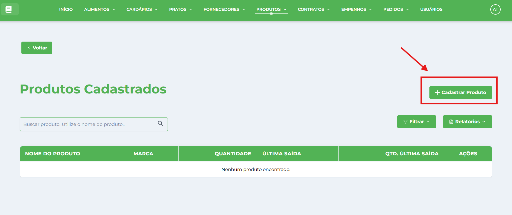](../../img/telaproduto/botaoCadastrar.png)
    
3.  Na janela **Cadastrar Produto** preencha os campos:
    
    *   **Nome** — identificação completa do produto.
    *   **Marca** — fabricante ou marca comercial.
    *   **Quantidade em Estoque** — quantidade presente.
    *   **Unidade de Medida** — unidade padrão para compra e controle (kg, unidade, litro, etc.).
4.  Clique em **Cadastrar Produto** para salvar. A janela será fechada e o registro aparecerá na tabela.
    
    [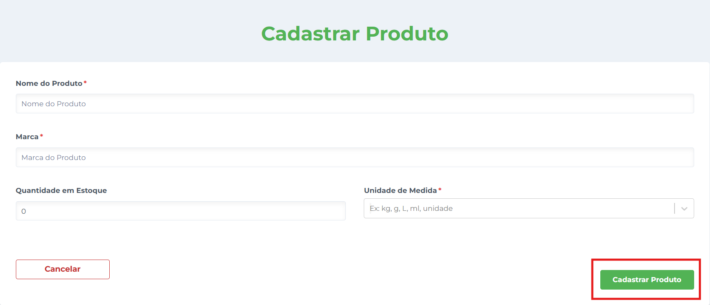](../../img/telaproduto/cadastrar.png)
    

## Como editar um registro

1.  Localize o produto na tabela (use a pesquisa se necessário).
2.  Clique em **Editar** na coluna de Ações da linha desejada.
    
    [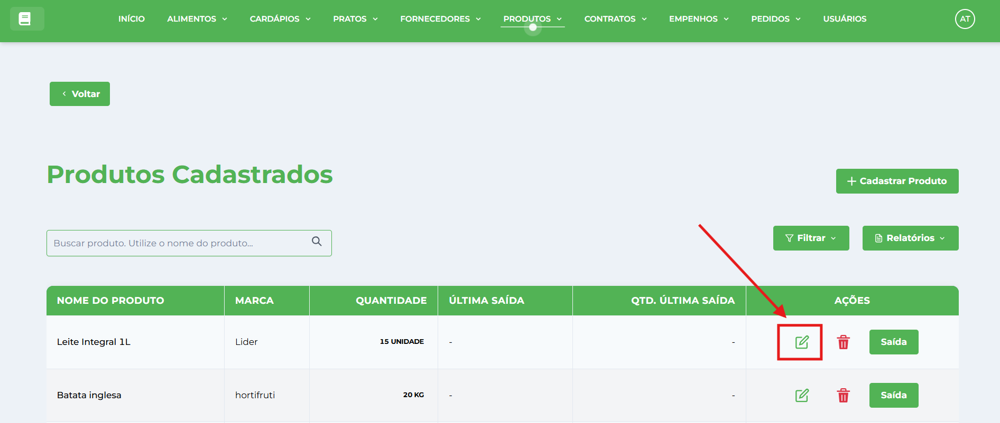](../../img/telaproduto/editar.png)
    
3.  A janela abrirá em modo de edição — altere os campos desejados e clique em **Salvar Alterações**.
    

## Como excluir um produto

1.  Clique em **Excluir** (ícone de lixeira) na coluna Ações da linha correspondente.
    
    [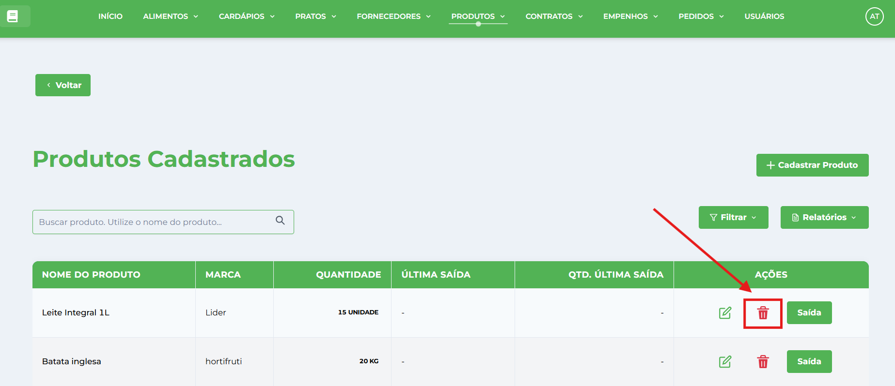](../../img/telaproduto/excluir.png)
    
2.  Confirme a exclusão clicando em **Excluir** no diálogo de confirmação.
    
3.  ⚠️ **Atenção**: Não é possível excluir produtos que estão sendo utilizados em contratos ou pedidos.

## Como gerenciar utilização de produtos

### **Como Registrar Saída de Produtos**

1.  Localize o produto na tabela (use a pesquisa se necessário).
2.  Clique em **Saída** na coluna Ações da linha correspondente.
    
    [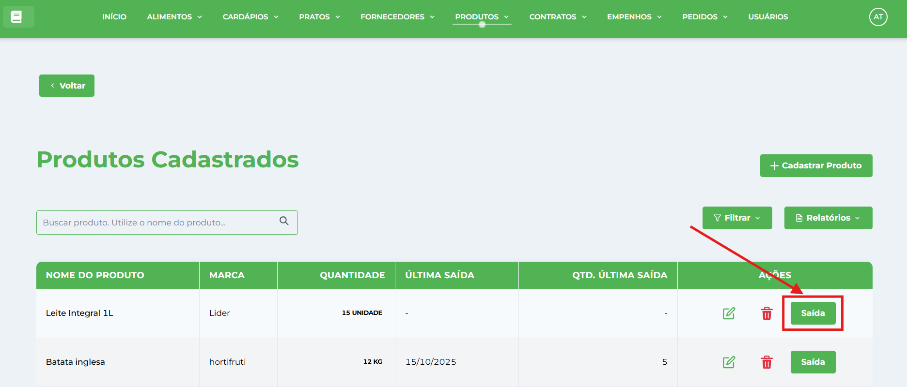](../../img/telaproduto/botaoSaida.png)
    
3.  Na janela **Registrar Utilização** preencha os campos:
    
    *   Quantidade a Utilizar
    *   Data de Saída
    
    [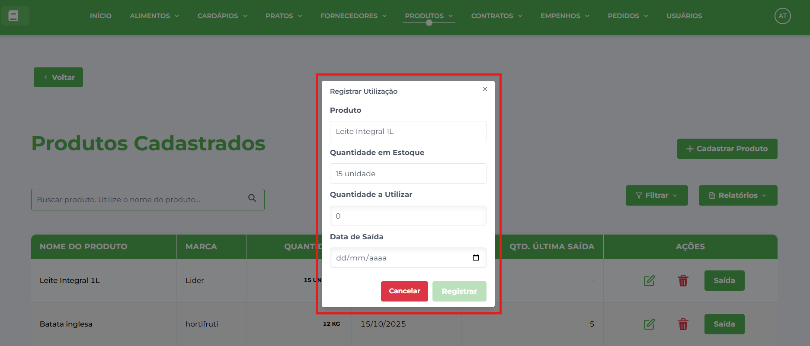](../../img/telaproduto/modalsaida.png)
    
4.  Confirme o registro clicando em **Registrar**.
    
5.  **Validações Automáticas**:
    
    *   Sistema verifica se há estoque suficiente
    *   Bloqueia saídas maiores que o disponível
    *   Atualiza estoque automaticamente após confirmação
    *   Registra histórico de movimentação
    *   Controle de Estoque, o Sistema desconta automaticamente a quantidade utilizada

### **Consultar Histórico de Utilizações**

1.  **Acessar**: Menu → Produtos → Utilização dos Produtos
    
    [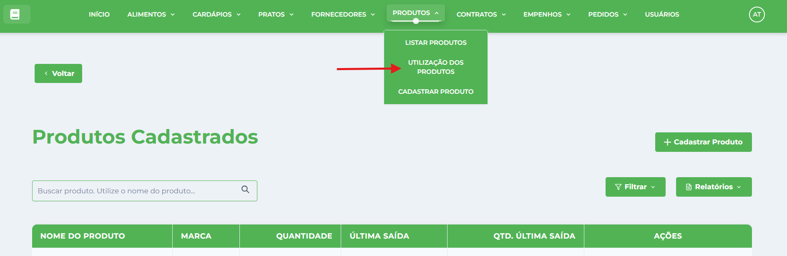](../../img/telaproduto/utilizacao.png)
    
2.  **Visualizações Disponíveis**:
    
    *   Lista completa de todas as saídas
    *   Filtros por período (data inicial e final)
    *   Ordenação por data de saída (mais recentes primeiro)
    
    [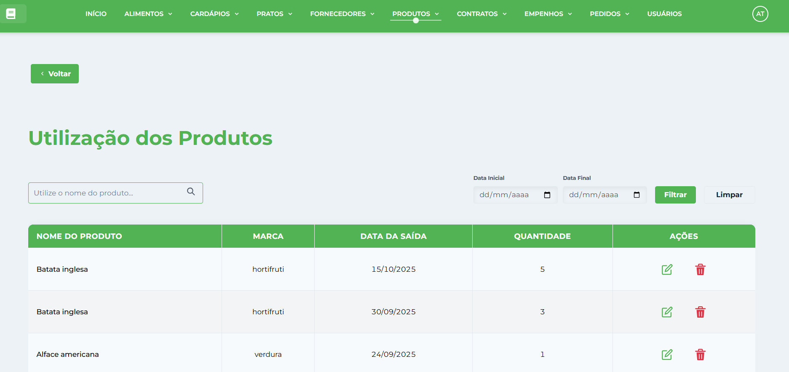](../../img/telaproduto/listaUtilizacaoProdutos.png)
    

### **Como Editar uma Saída de um Produto**

1.  Localize o produto na tabela (use a pesquisa se necessário).
2.  Clique em **Editar** na coluna de Ações da linha desejada.
    
    [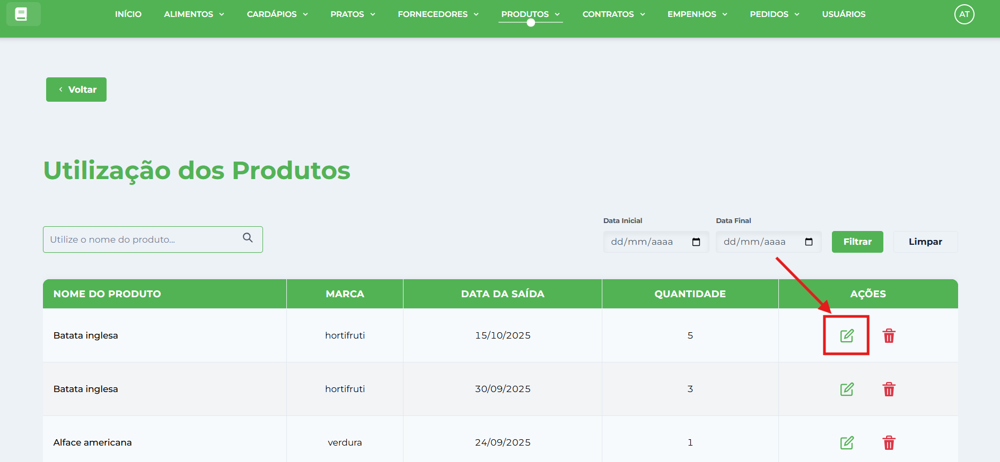](../../img/telaproduto/utilizacaoEditar.png)
    
3.  A janela abrirá em modo de edição — altere os campos desejados e clique em **Salvar Alterações**.
    
    [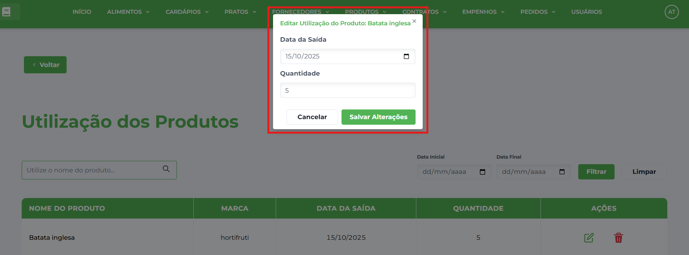](../../img/telaproduto/utilizacaoEditarModal.png)
    
    *   **Altera a Quantidade**: Sistema reajusta estoque automaticamente
    *   **Altera a Data**: Modificação da data de saída
    *   **Cálculo Inteligente**: Devolve quantidade anterior e aplica nova
    *   **Validação**: Verifica disponibilidade antes de aplicar alterações

### **Como Excluir uma Saída de um Produto**

1.  Localize o produto na tabela (use a pesquisa se necessário).
2.  Clique em **Excluir** na coluna Ações da linha correspondente.
    
    [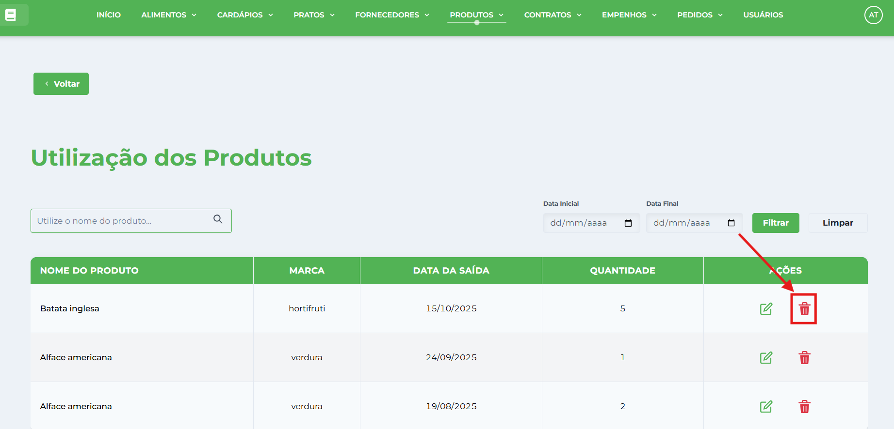](../../img/telaproduto/utilizacaoExcluir.png)
    
3.  Confirme a exclusão clicando em **Excluir** no diálogo de confirmação.
    
    *   **Estorno Automático**: Quantidade é devolvida ao estoque

### **Como gerar Relatório da Saída de um Produto**

1.  Informe o nome do produto na barra de pesquisa.
    
2.  (Opcional) Selecione as datas inicial e final para gerar o relatório referente ao período desejado e clique no botão Filtrar.
    
3.  Clique no botão Gerar PDF caso deseje imprimir o relatório.
    
    [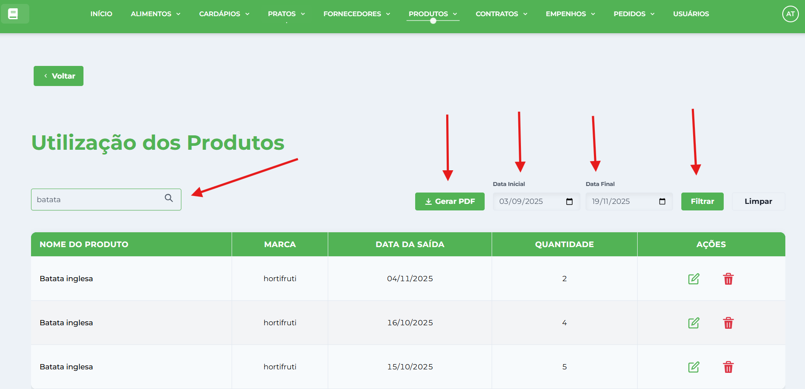](../../img/telaproduto/utilizacaoRelatorio.png)
    
4.  Este relatório refere-se exclusivamente a um único produto, uma vez que o relatório abrangente de todos os produtos é disponibilizado na página **Produtos**.
    

## Sistema de Controle de Estoque

### **Filtros Inteligentes de Estoque**

1.  **Estoque Zerado**:
    
    *   Produtos com quantidade = 0
    *   Identificação de itens para reposição urgente
    *   Alerta visual para gestão de compras
2.  **Estoque Baixo** (Até 10 unidades):
    
    *   Produtos com quantidade entre 1-10 unidades
    *   Alerta preventivo para reposição
    *   Planejamento antecipado de compras
3.  **Histórico de Saídas**:
    
    *   Última data de utilização por produto
    *   Quantidade da última saída registrada
    *   Identificação de produtos em uso ativo

## Como Gerar Relatórios dos Produtos

Clique no botão **Relatórios** e selecione aquele que deseja visualizar: [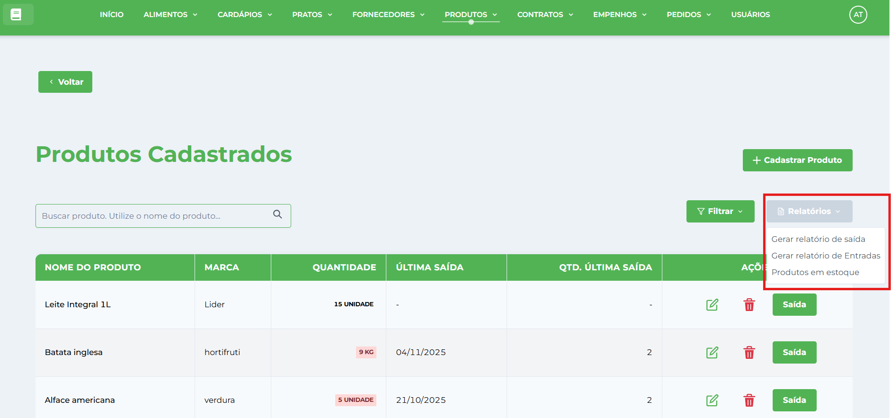](../../img/telaproduto/relatorios.png)

### **Relatório de Produtos de Saída**

1.  Selecione **Gerar Relatório de Saída**
2.  Selecione a data inicial e a data final do período que deseja gerar o relatório.

### **Relatório de Entradas**

1.  Selecione **Gerar Relatório de Entradas**
2.  Selecione a data inicial e a data final do período que deseja gerar o relatório.

### **Relatório de Estoque**

1.  Selecione **Produtos em Estoque**

## Como usar filtros avançados de estoque

Clique no botão **Filtros** e selecione aquele que deseja visualizar: [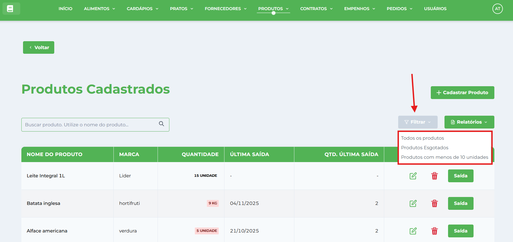](../../img/telaproduto/filtro.png)

#### **Listagem completa dos Produtos**

*   Selecione **Todos os produtos**

#### **Listagem completa dos Produtos Esgotados**

*   Selecione **Produtos Esgotados**

#### **Listagem dos Produtos que possuem menos de 10 unidades em estoque**

*   Selecione **Produtos com menos de 10 unidades**

* * *

## Dicas Importantes

### **Controle Inteligente de Estoque**

#### **Atualização Automática**

*   **Entrada via Pedidos**: Estoque atualizado automaticamente no recebimento
*   **Saída via Utilização**: Desconto imediato ao registrar consumo
*   **Cálculos em Tempo Real**: Saldos sempre atualizados
*   **Consistência**: Evita discordâncias entre registros

#### **Validações de Estoque**

*   **Saídas Controladas**: Impede retiradas maiores que disponível
*   **Estoque Negativo**: Sistema bloqueia operações inválidas
*   **Edição Inteligente**: Reajusta estoque ao modificar utilizações
*   **Estorno Automático**: Devolve quantidades ao excluir registros

### **Sistema de Utilização Avançado**

#### **Registro de Saídas**

*   **Interface Intuitiva**: Formulários simplificados para registro
*   **Validação Instantânea**: Verificação de estoque em tempo real
*   **Histórico Completo**: Rastreabilidade de todas as movimentações
*   **Edição Flexível**: Permite correções com recalculo automático

#### **Relatórios Especializados**

*   **Saídas por Período**: Filtros customizáveis de data
*   **Consumo por Produto**: Análise individual de utilização
*   **Totais Consolidados**: Soma de saídas por produto/período
*   **Formatos Múltiplos**: PDF, visualização em tela, exportação

### **Filtros e Alertas Inteligentes**

#### **Sistema de Alertas**

*   **Estoque Zerado**: Identificação visual de produtos em falta
*   **Estoque Baixo**: Alerta preventivo (configurável até 10 unidades)
*   **Produtos Parados**: Identifica itens sem movimentação recente
*   **Relatórios Automáticos**: Geração periódica de status

#### **Gestão Proativa**

*   **Planejamento de Compras**: Base para criação de pedidos
*   **Controle de Custos**: Evita desperdícios por vencimento
*   **Otimização**: Uso eficiente do espaço de armazenamento
*   **Produtividade**: Processos automatizados reduzem trabalho manual

### **Integração com Outros Módulos**

#### **Fluxo Integrado**

*   **Contratos**: Produtos vinculados a fornecedores específicos
*   **Pedidos**: Entrada automática no estoque após recebimento
*   **Utilização**: Saída controlada com rastreabilidade
*   **Relatórios**: Dados consolidados de todo o ciclo