# Membro de Equipe

O **Membro de Equipe** é um usuário com acesso limitado dentro da plataforma PEPVagas.  
Ele auxilia na **visualização de vagas**, no **acompanhamento de profissionais liberais** e na **gestão do próprio perfil**, sem permissões administrativas completas.  

Este perfil é ideal para **colaboradores internos da PEPVagas** que precisam acompanhar o conteúdo da plataforma e gerenciar suas informações pessoais.

**Principais ações**

- **Publicar vagas** para qualquer empresa cadastrada.  
- **Visualizar e gerenciar suas vagas publicadas** (Minhas Vagas).  
- **Visualizar profissionais liberais** cadastrados na plataforma.  
- **Gerenciar tipos de serviços** disponíveis para profissionais liberais.  
- **Gerenciar seu perfil** (alterar nome e senha).  
- **Sair** da plataforma.  

---

## Login
Para acessar a conta de **Membro de Equipe**, clique no botão **Entrar** no canto superior direito da tela.  

Informe o **e-mail** e **senha** fornecidos pelo Administrador e clique em **Entrar**.

---

## Menu
No canto superior direito, clique no **Menu** para acessar as funcionalidades:  

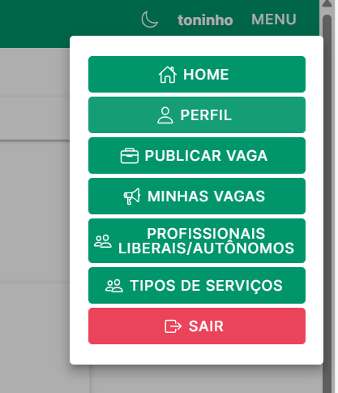

- **Home** – tela inicial com listagem de todas as vagas publicadas.  

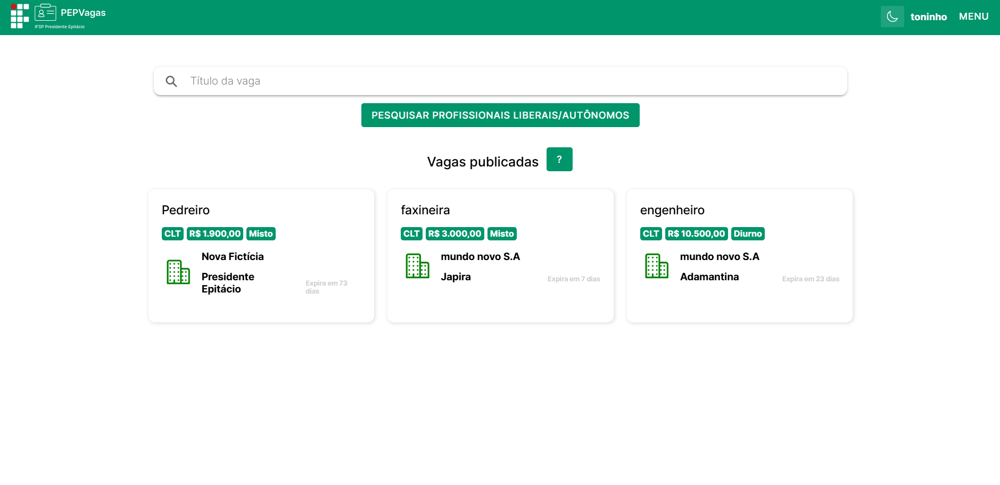

- **Publicar Vaga** – criação de novas vagas para qualquer empresa.  

- **Minhas Vagas** – gerenciamento das vagas criadas pelo próprio membro.  

- **Profissionais Liberais** – visualização e pesquisa de profissionais liberais cadastrados.  

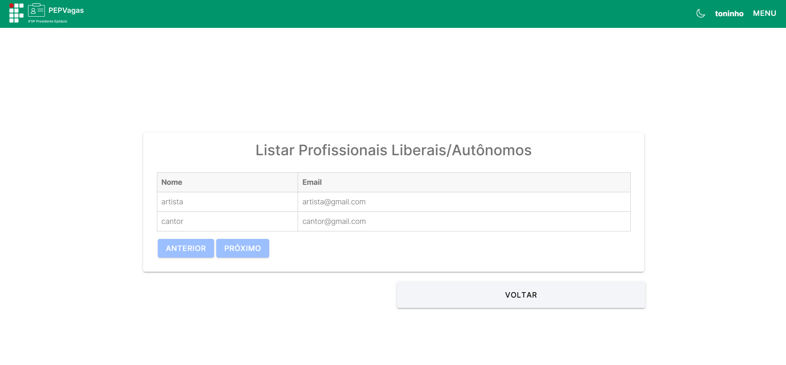

- **Tipos de Serviço** – gerenciamento das categorias de serviços disponíveis.  

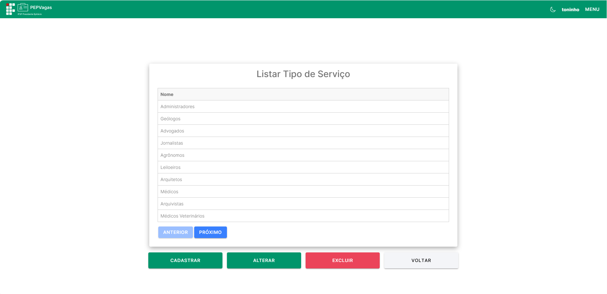

- **Perfil** – gerenciamento das informações pessoais e de acesso.  

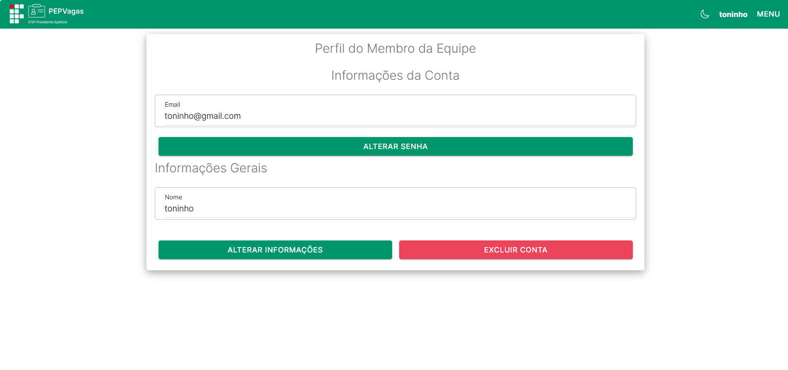

- **Sair** – encerra a sessão e retorna à tela de login.  

---

## Home
(Menu → **Home**)  

Na tela inicial, o Membro de Equipe pode:

- **Visualizar todas as vagas** publicadas na plataforma.  

- Consultar detalhes das vagas para acompanhamento e análise.  

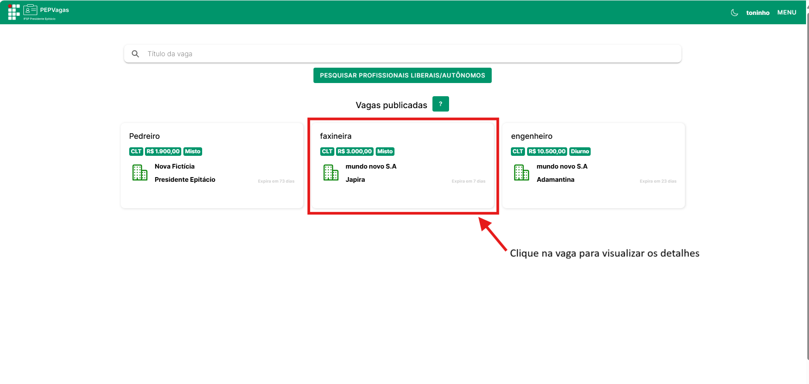

---

## Publicação de Vagas
(Menu → **Publicar Vaga**)  

O Membro de Equipe pode criar vagas para qualquer empresa cadastrada.  

**Como publicar:**

Clique em **Publicar Vaga** no menu.  

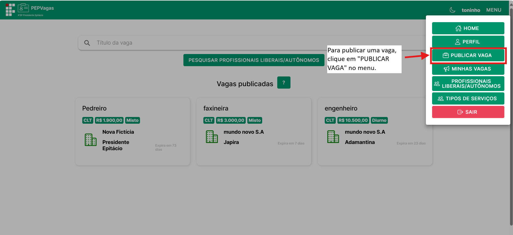

Preencha os campos obrigatórios: Título, Salário, Descrição, Turno, Regime, Modalidade, Área, Cidade, Nível de Instrução, PCD, Data de Encerramento, E-mail para recebimento de currículos.  

Preencha campos opcionais: Site da empresa/vaga, Logo, Banner de divulgação.  
Clique em **Publicar Vaga**.  

---

## Minhas Vagas
(Menu → **Minhas Vagas**)  

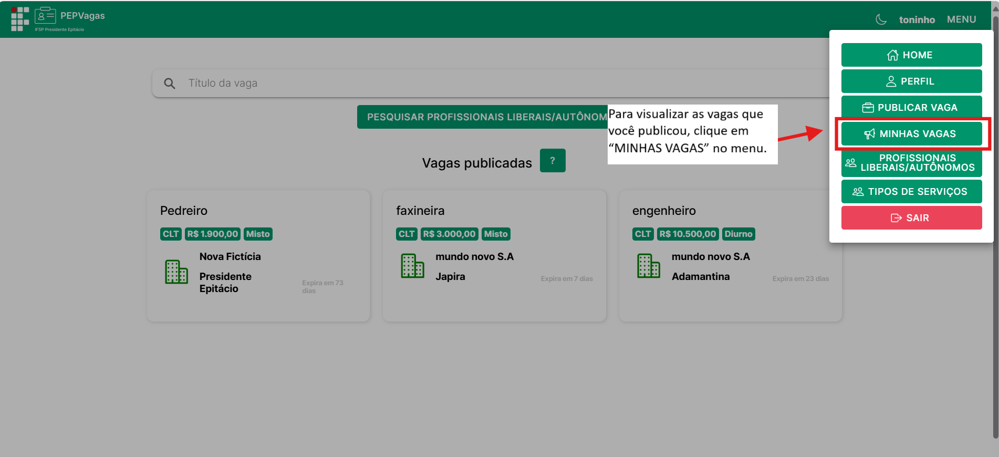

Após clicar em "MINHAS VAGAS" no menu, essa tela é aberta:

Aqui, o Membro de Equipe gerencia suas vagas publicadas: 

Os botões de ações disponíveis:

- **Visualizar:** acessar detalhes da publicação. 
   Ao clicar no botão “Visualizar”, a página com as informações completas da vaga será aberta:

- **Editar:** alterar informações da vaga.  
Ao clicar no botão “Editar”, a página com os dados completos da vaga para alteração será aberta:

- **Excluir:** remover a vaga do sistema.  

> Os botões **Visualizar**, **Editar** e **Excluir** aparecem ao selecionar a vaga desejada na lista.  

---

## Profissionais Liberais
(Menu → **Profissionais Liberais/autonômos**)  

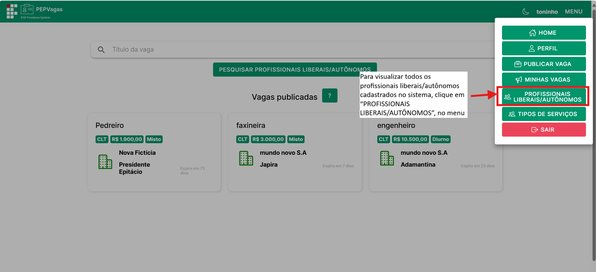

O Membro de Equipe pode:

- **Visualizar todos os profissionais liberais** cadastrados. 

- **Visualizar dados dos profissionais liberais** cadastrados. 

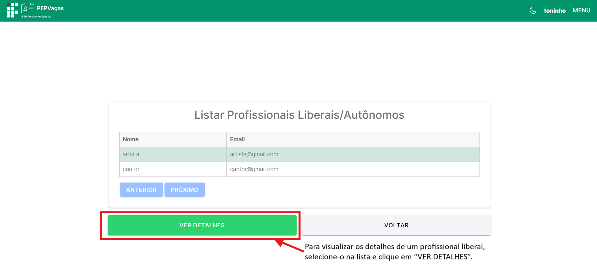

---

## Tipos de Serviço
(Menu → **Tipos de Serviço**) 

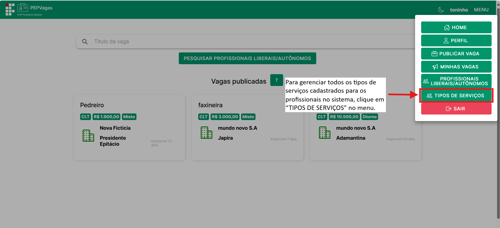

O Membro de Equipe pode:

- **Visualizar** todos os tipos de serviço cadastrados.  

- **Cadastrar** novos tipos de serviço.  
- **Alterar** nomes de serviços existentes.  
- **Excluir** tipos de serviço, se necessário. 

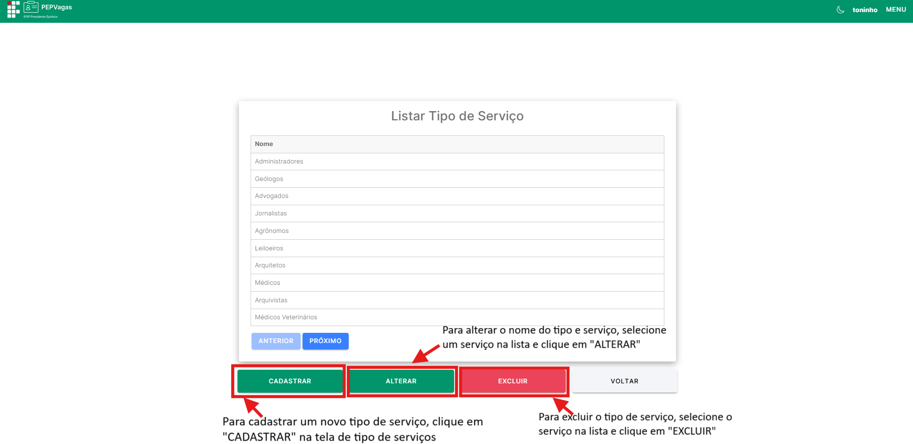

---

## Perfil
(Menu → **Perfil**)  

O Membro de Equipe pode gerenciar suas informações de acesso e dados pessoais.

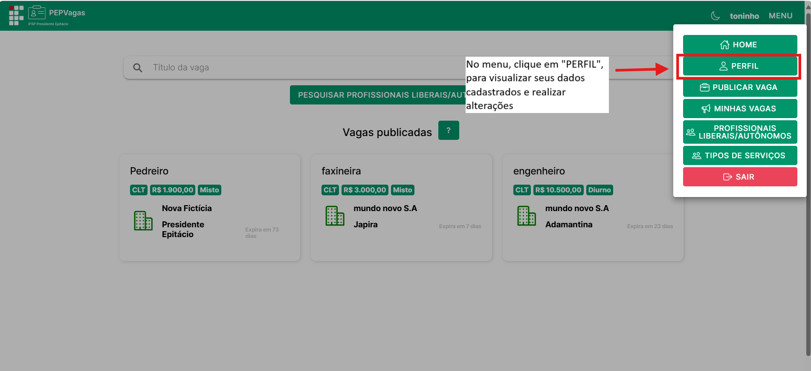

Após clicar em "PERFIL" no menu, essa tela é aberta:

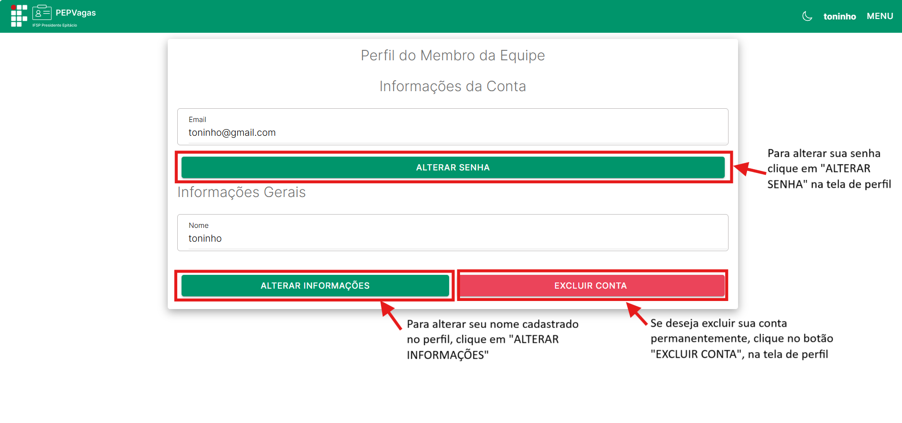

**Alterar Nome**

- Clique no botão **Alterar Informações**.  
- Modifique o **nome** do usuário.  
- Clique em **Enviar** (canto superior direito). 

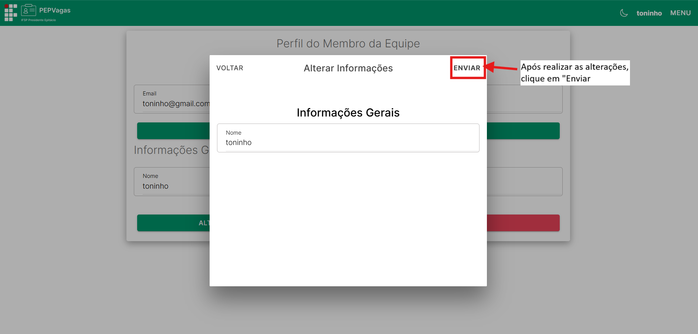

**Alterar Senha**

- Clique no botão **Alterar Senha**.  
- Preencha os campos:  
  - **Senha Atual**  
  - **Nova Senha**  
  - **Confirmar Nova Senha**  
- Clique em **Enviar** (canto superior direito).  

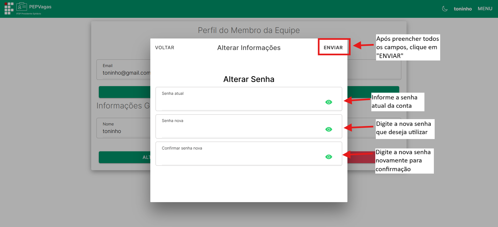

---

## Sair
(Menu → **Sair**)  

Clique em **Sair** para encerrar a sessão. Você será redirecionado para a tela de login.  

---

