# Representante

O **Representante** é um perfil vinculado a uma **Empresa** dentro da plataforma PEPVagas.  
Ele atua como **colaborador autorizado**, podendo publicar, editar e gerenciar vagas em nome da empresa.  

Esse perfil é ideal para **profissionais de RH**, **gestores de áreas** ou colaboradores designados para ajudar na divulgação e acompanhamento das oportunidades da organização.

**Principais ações**

- **Publicar vagas** vinculadas à empresa.  
- **Visualizar todas as vagas da empresa** na tela inicial (Home).  
- **Gerenciar suas próprias vagas** em **Minhas Vagas**, podendo **visualizar, editar ou excluir** apenas as vagas que criou.  
- **Receber candidaturas por e-mail** dos candidatos inscritos.  
- Gerenciar **suas próprias informações de acesso** (e-mail e senha).  

---

## Login
Para acessar a conta de **Representante**, clique no botão **Entrar** no canto superior direito da tela.  

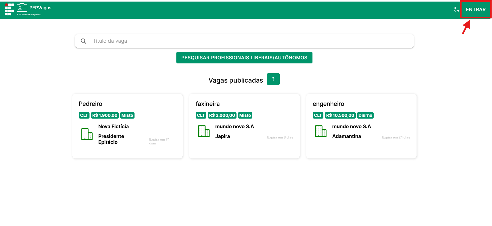

Informe o **e-mail** e **senha** definidos no momento em que a empresa cadastrou o representante e clique em **Entrar**.

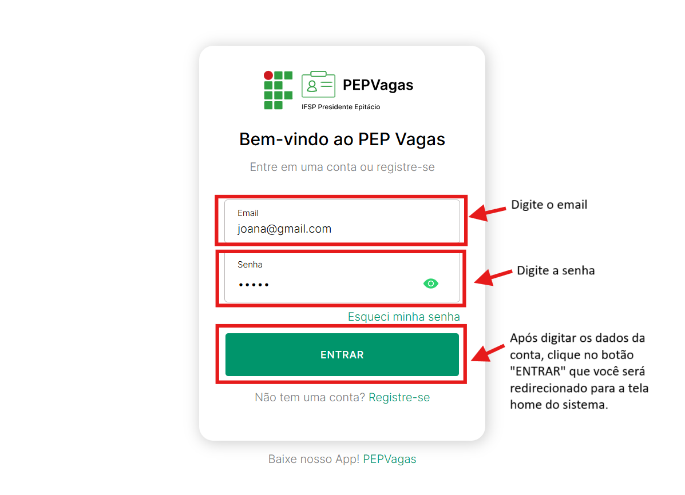

---

## Menu
No canto superior direito, clique no **Menu** para acessar as funcionalidades do representante:

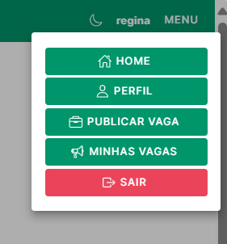

- **Home** – tela inicial com todas as vagas da empresa.  

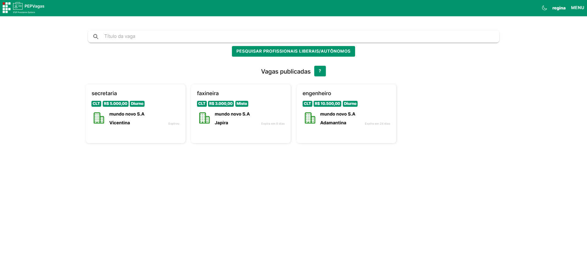

- **Perfil** – gerenciamento dos dados de acesso (e-mail e senha).  

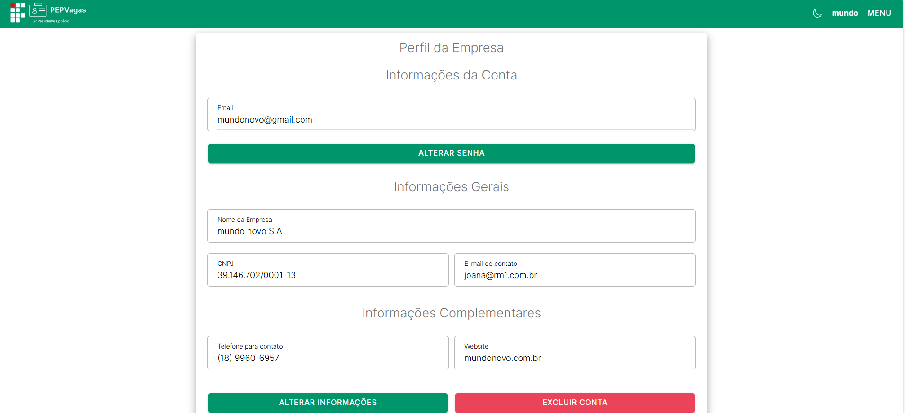

- **Publicar Vaga** – formulário para criação de novas vagas em nome da empresa. 

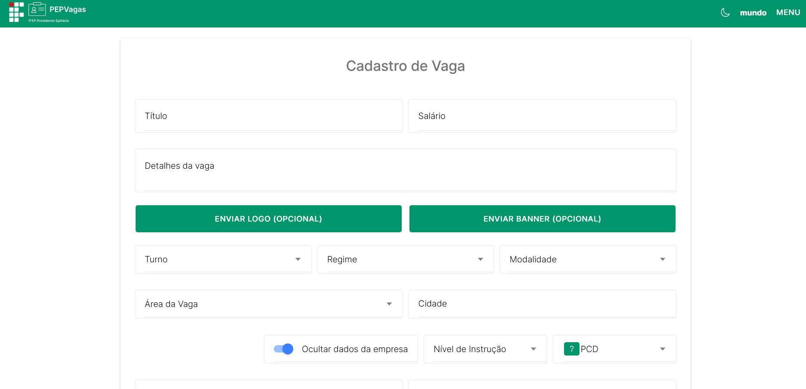

- **Minhas Vagas** – gerenciamento das vagas criadas pelo próprio representante.

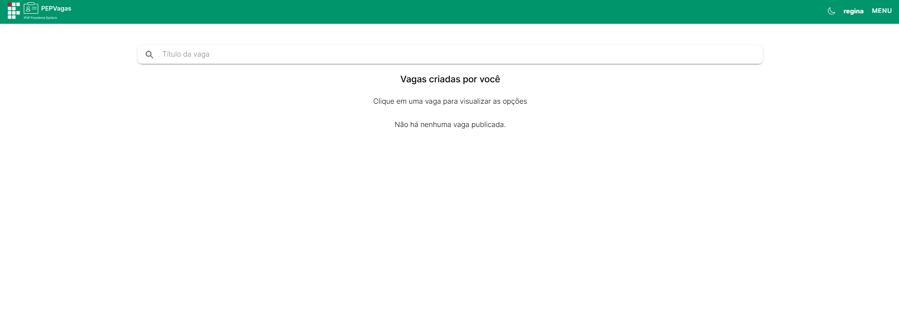

- **Sair** – encerra a sessão e redireciona para a tela de login.  

---

## Publicação de Vagas
(Menu → **Publicar Vaga**)  

O representante pode criar vagas em nome da empresa.

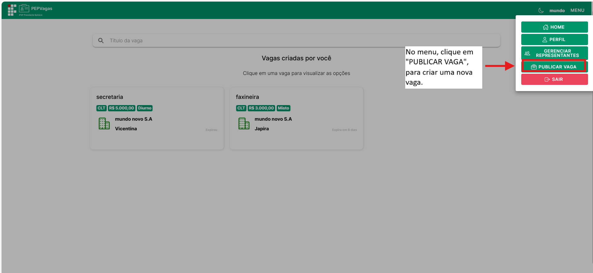

**Como publicar uma vaga:**

1. Clique em **Publicar Vaga** no menu.  
Após clicar em "Publicar Vaga", voce será redirecionado para essa pagina:

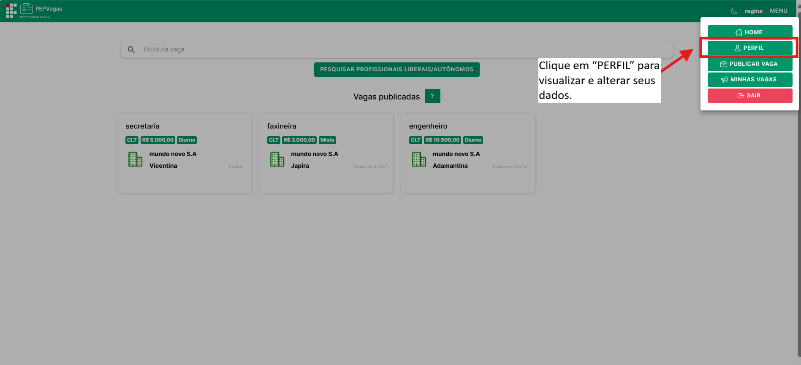

2. Preencha os campos obrigatórios:
   - **Título**  
   - **Salário**  
   - **Detalhes da Vaga** (descrição, requisitos, benefícios)  
   - **Turno**  
   - **Regime**  
   - **Modalidade**  
   - **Área**  
   - **Cidade**  
   - **Nível de Instrução**  
   - **Vaga destinada a PCD?**  
   - **Data de Encerramento**  
   - **E-mail para recebimento de currículos**  
3. Campos opcionais: **Site da empresa/vaga**, **Logo**, **Banner**.  
4. Clique em **Publicar Vaga** para finalizar.  

A vaga ficará associada à empresa e visível para candidatos.  

---

## Gerenciamento de Vagas
(Menu → **Home** e **Minhas Vagas**)  

Na **Home**, todas as vagas da empresa são listadas.  

Em **Minhas Vagas**, o representante consegue gerenciar **apenas as vagas que ele criou**.

**Como gerenciar suas vagas:**
1. Clique em **Minhas Vagas** no menu.  

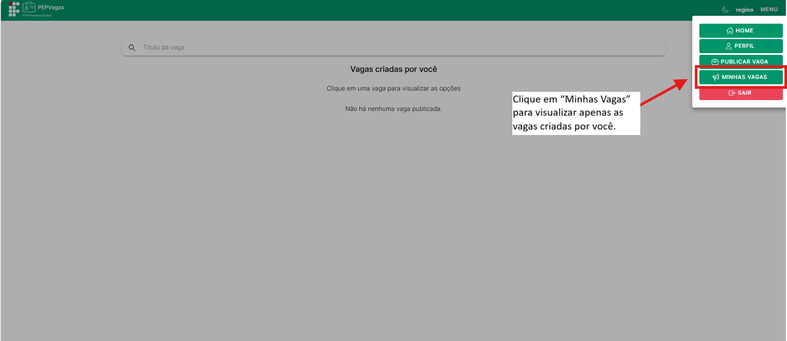

2. Clique sobre a vaga desejada.  
3. Três botões de ação estarão disponíveis:

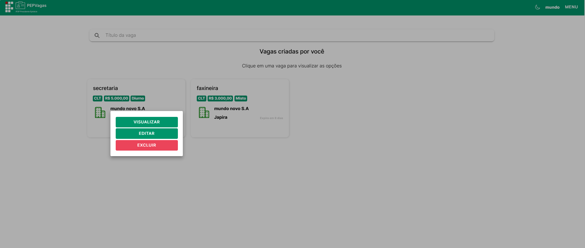

   - **Visualizar** – para conferir detalhes da vaga.
   Ao clicar no botão “Visualizar”, a página com as informações completas da vaga será aberta:

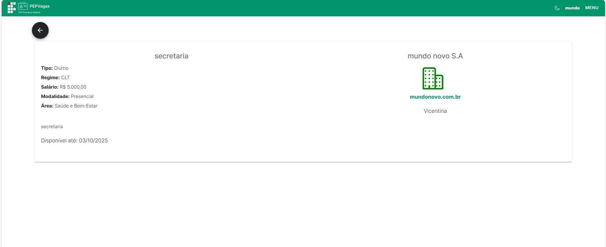

   - **Editar:** alterar informações da vaga.
   
   Ao clicar no botão “Editar”, a página com os dados completos da vaga para alteração será aberta:

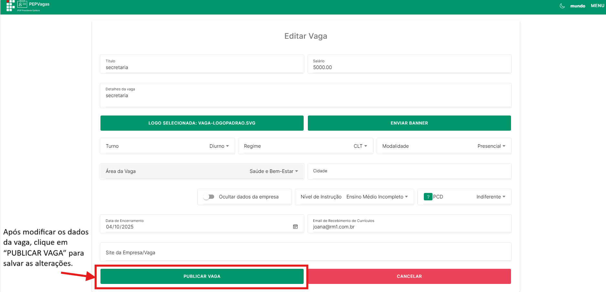

   - **Excluir:** remover a vaga. 

---

## Recebimento de Candidaturas
Quando um candidato se candidata a uma vaga, o **e-mail cadastrado na vaga** recebe automaticamente:

- Dados básicos do candidato  
- Currículo anexado, se disponível  

Segue exemplo de email enviado pelo sistema:

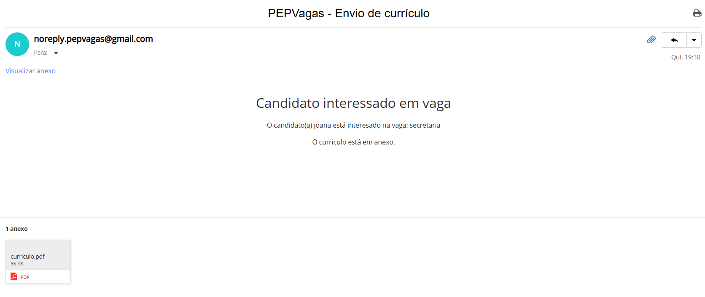

> Importante: o candidato **não pode remover a candidatura**.  

Todo acompanhamento do processo seletivo ocorre fora da plataforma.  

✅ **Dica:** mantenha o e-mail cadastrado correto para não perder candidaturas.

---

## Perfil
(Menu → **Perfil**)  

O representante pode gerenciar suas informações de acesso.

**Botões disponíveis**:

1. **Alterar Informações** – altera apenas o **nome do representante**; clique em **Enviar** no canto superior direito. 

Após clicar em "ALTERAR INFORMAÇÕES", essa pagina será aberta: 

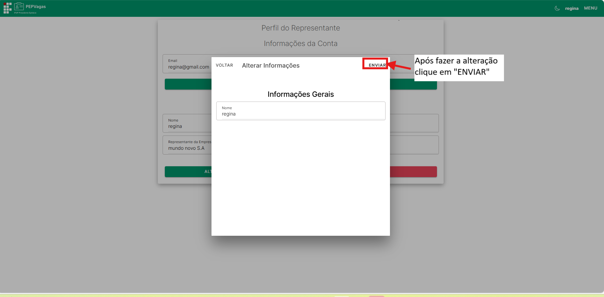

2. **Alterar Senha** – preencha **senha atual**, **nova senha** e confirme; clique em **Enviar**.  

Após clicar no botão “ALTERAR SENHA”, esta página será exibida:

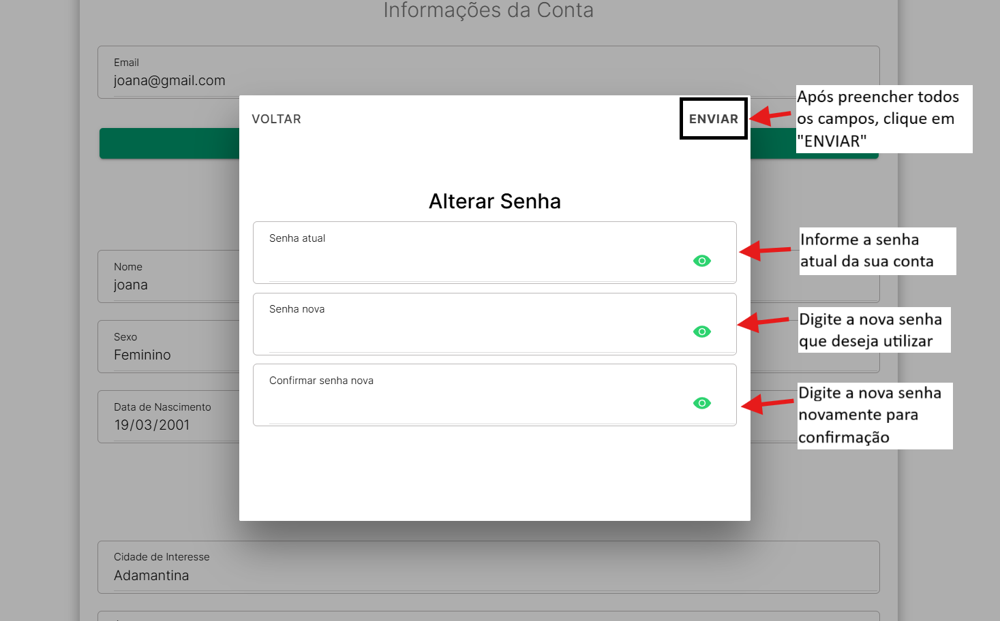

3. **Excluir Conta** – remove permanentemente a conta; confirme a ação.  

---

## Sair
(Menu → **Sair**)  

Clique em **Sair** para encerrar a sessão. Você será redirecionado para a tela de login.  

---
