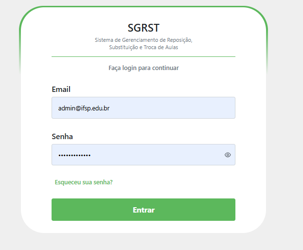

# 🔑 Login no Sistema

## Descrição

Para acessar o SGRST, o usuário deve informar o **nome de usuário** e a **senha** fornecida pela coordenação. Cada perfil (Professor, Coordenador ou CAE) terá acesso apenas às funcionalidades permitidas.

## Passo a passo

1. Abra o navegador e digite o endereço do sistema.
2. Preencha o campo **Usuário**.
3. Digite sua **Senha**.
4. Clique em **Entrar**.

## Capturas de Tela

