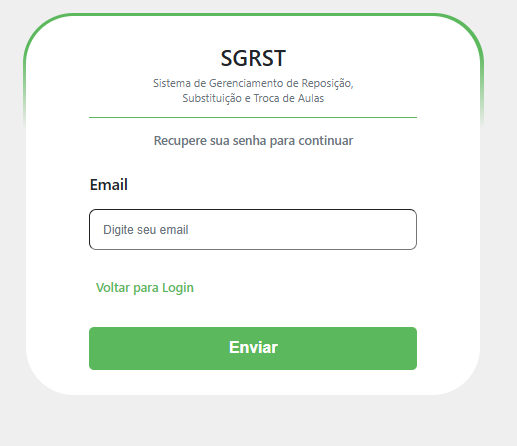
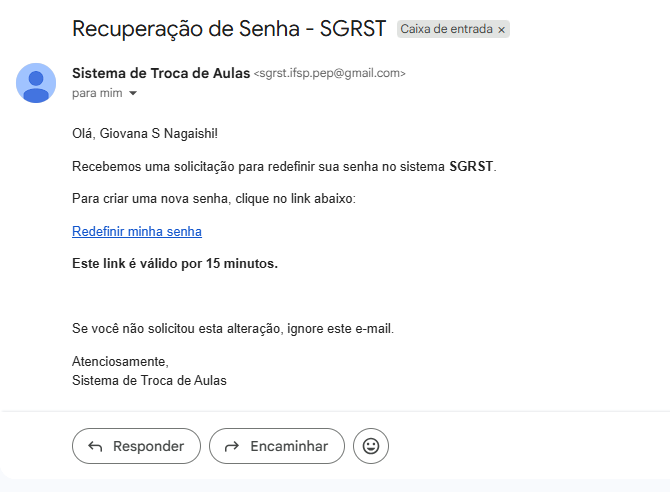
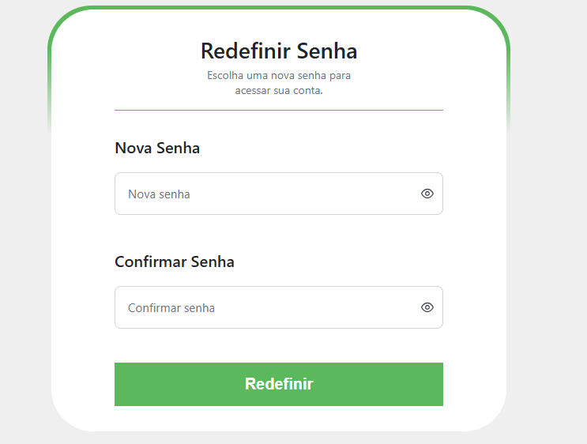

# 🔐 Recuperar / Alterar Senha

## Descrição

Caso o usuário esqueça sua senha ou deseje alterá-la, o sistema oferece a funcionalidade de recuperação e redefinição de senha.

## Recuperar Senha

1. Na tela de login, clique em **Esqueceu sua senha?**.
2. Informe o **e-mail** cadastrado no sistema.
3. Clique em **Enviar**. O sistema enviará um e-mail com o link para redefinição.
4. Acesse o e-mail recebido e clique no link de redefinição.
5. Informe a **nova senha** e confirme.
6. Clique em **Redefinir Senha**.

## Capturas de Tela

