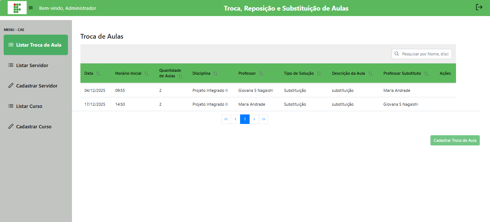

# 📝 Consultar Trocas de Aulas

## Descrição

A CAE pode visualizar todas as trocas de aulas registradas no sistema, mas não pode editar, excluir ou cadastrar novas trocas.

## Passo a passo

1. No menu lateral, clique em **Consultar Trocas**.
2. A lista exibirá todas as trocas de aula registradas com filtros por professor, disciplina e tipo de solução.

## Capturas de Tela

