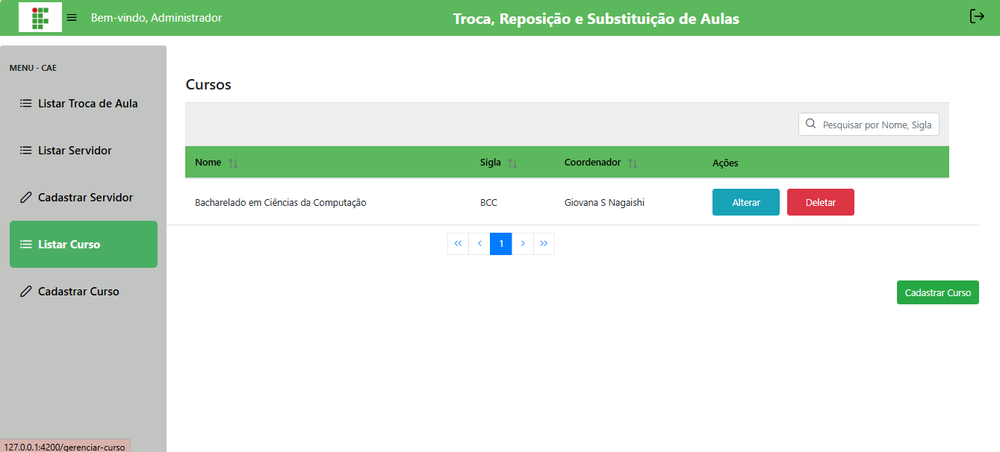
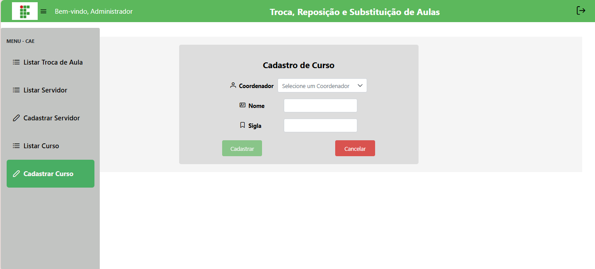
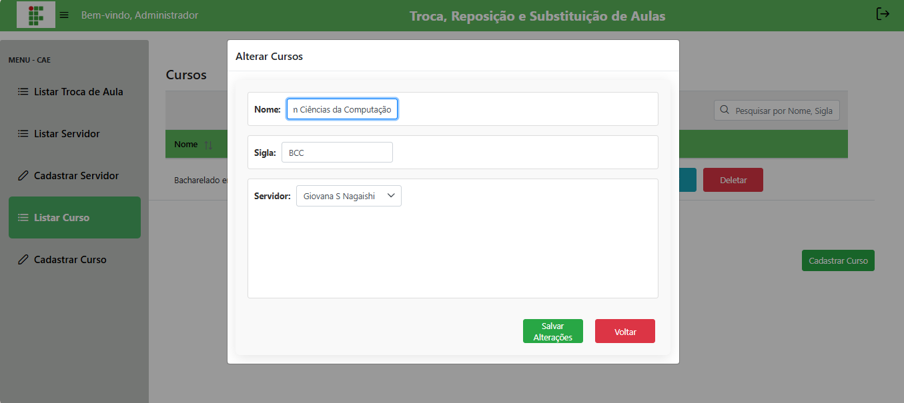

# 📝 Gerenciar Cursos

## Descrição

A CAE pode cadastrar, editar, listar e excluir cursos no sistema.

## Passo a passo

1. No menu lateral, clique em **Cursos**.
2. Para **cadastrar**, preencha nome e sigla e clique em **Cadastrar**.
3. Para **editar**, clique no botão correspondente, altere e salve.
4. Para **excluir**, clique no botão correspondente.

## Capturas de Tela

