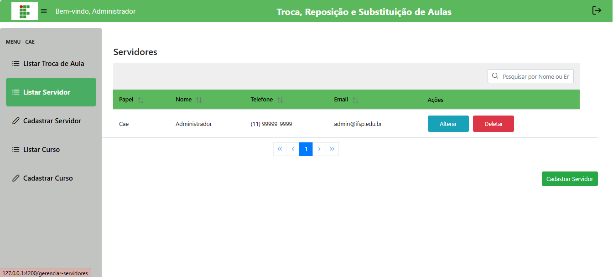
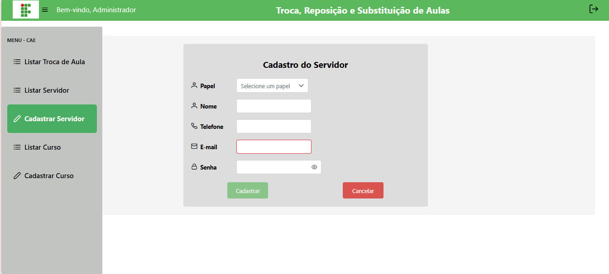
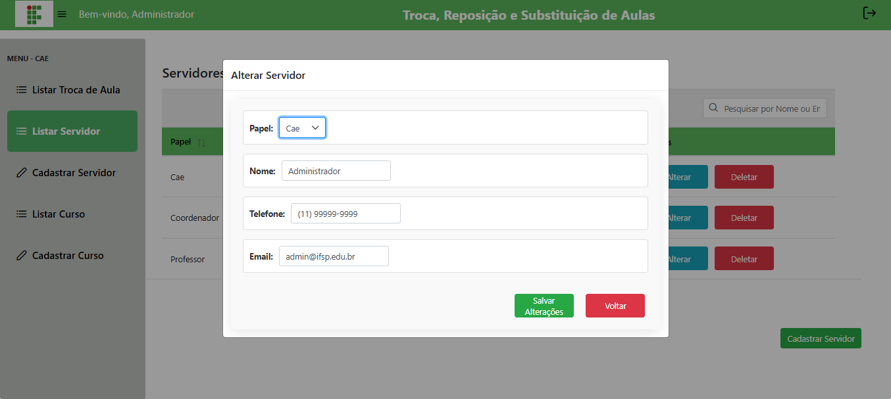

# 📝 Gerenciar Servidores

## Descrição

A CAE pode cadastrar, editar, listar e excluir servidores do sistema.

## Passo a passo

1. No menu lateral, clique em **Servidores**.
2. Para **cadastrar**, preencha nome, papel, e-mail e senha e clique em **Cadastrar**.
3. Para **editar**, clique no botão correspondente, altere e salve.
4. Para **excluir**, clique no botão correspondente.

## Capturas de Tela

