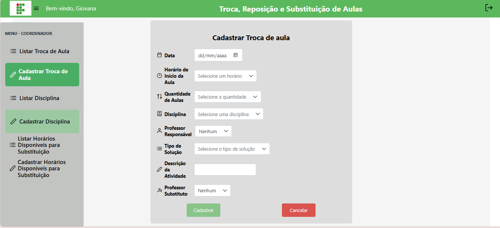
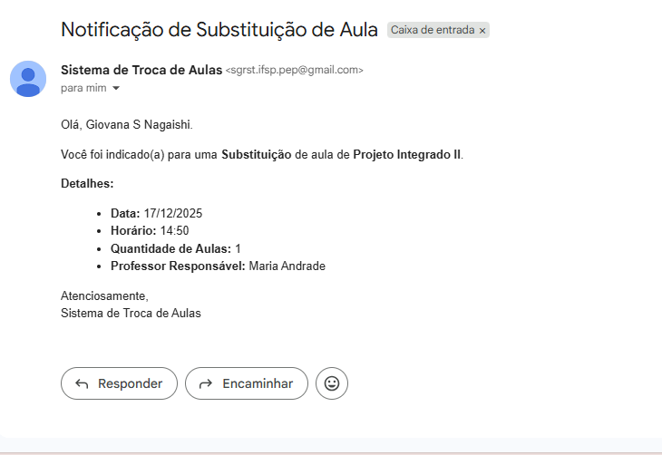

# 📝 Cadastrar Troca de Aulas (Coordenador)

## Descrição

O coordenador pode cadastrar trocas de aulas da mesma forma que o professor, com campos de data, horário, disciplina, tipo de solução e professor substituto. Além disso, o coordenador pode registrar solicitações em nome de qualquer professor.

## Passo a passo

1. No menu lateral, clique em **Cadastrar Troca de Aula**.
2. Preencha os campos do formulário (data, horário, disciplina, tipo, professor substituto, motivo).
3. Clique em **Cadastrar**.
4. Notificação automática é enviada ao professor substituto (quando informado).

## Capturas de Tela

