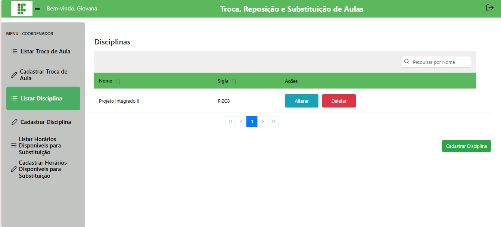
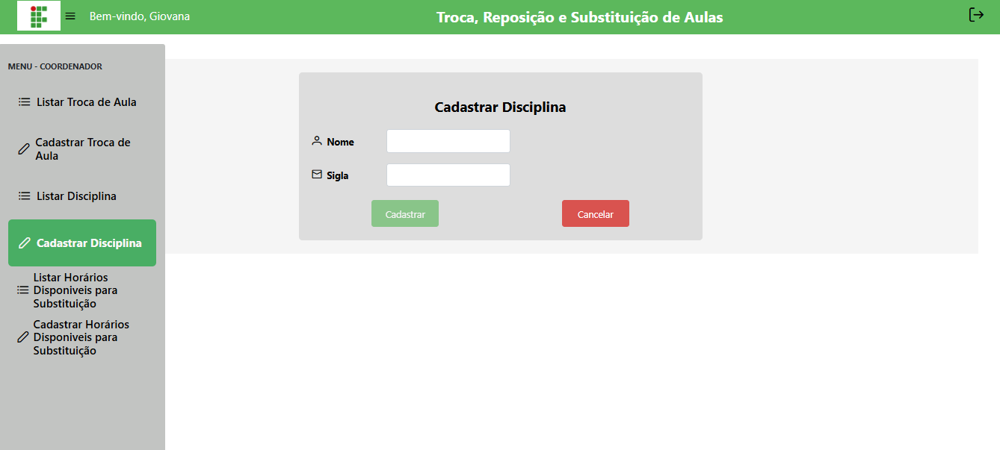
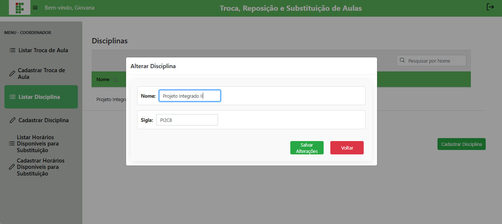

# 📝 Gerenciar Disciplinas

## Descrição

O coordenador pode cadastrar, editar, listar e excluir disciplinas do sistema, mantendo a grade curricular organizada.

## Passo a passo

1. No menu lateral, clique em **Disciplinas**.
2. Para **cadastrar**, preencha nome e sigla e clique em **Cadastrar**.
3. Para **editar**, clique no botão correspondente, altere os campos e salve.
4. Para **excluir**, clique no botão correspondente.

## Capturas de Tela

