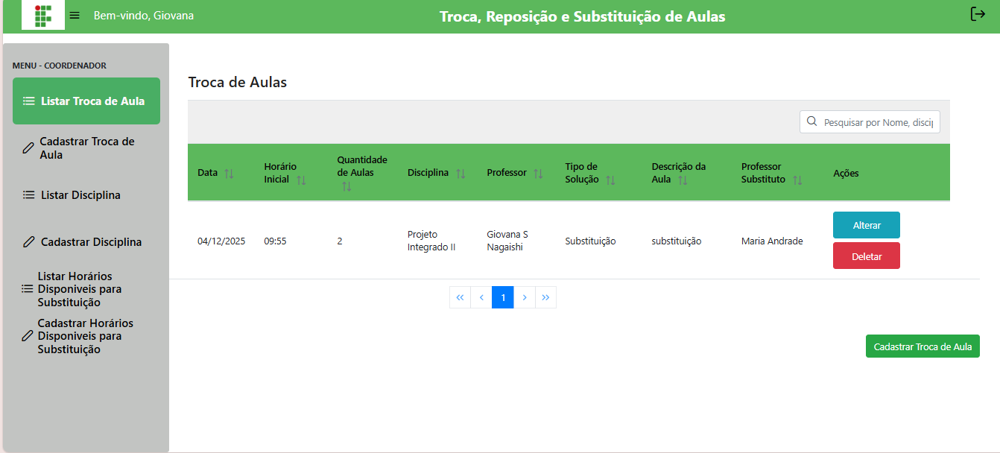
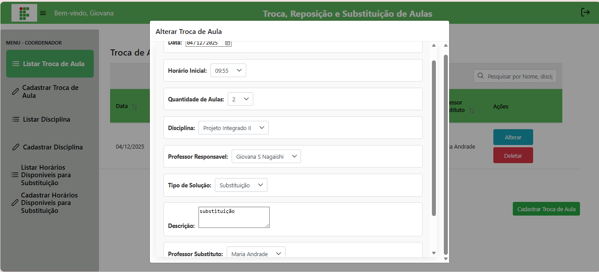

# 📝 Gerenciar Trocas de Aulas (Coordenador)

## Descrição

O coordenador pode listar, editar e excluir todas as trocas de aula registradas no sistema, incluindo as feitas por professores.

## Passo a passo

1. No menu lateral, clique em **Listar Troca de Aulas**.
2. A lista exibirá todas as trocas registradas com botões de **Editar** e **Excluir**.
3. Para **editar**, altere os campos e clique em **Salvar**.
4. Para **excluir**, clique no botão correspondente.

## Capturas de Tela

