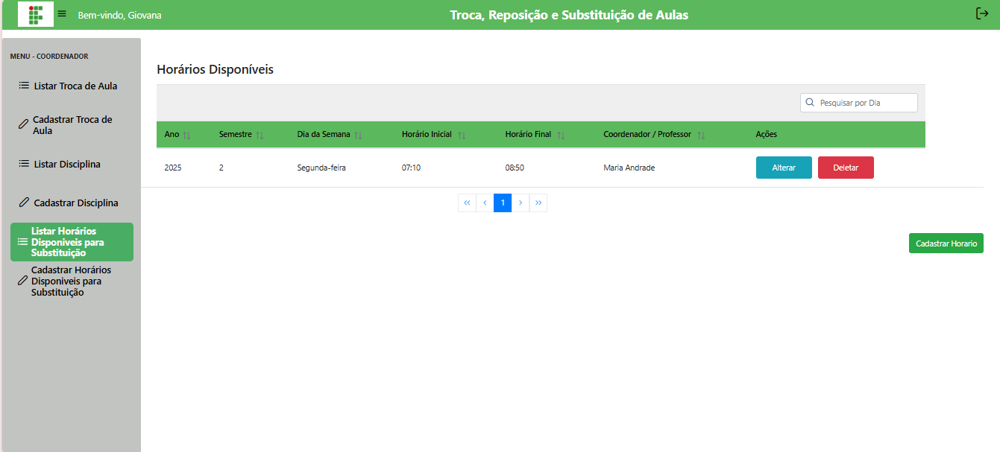
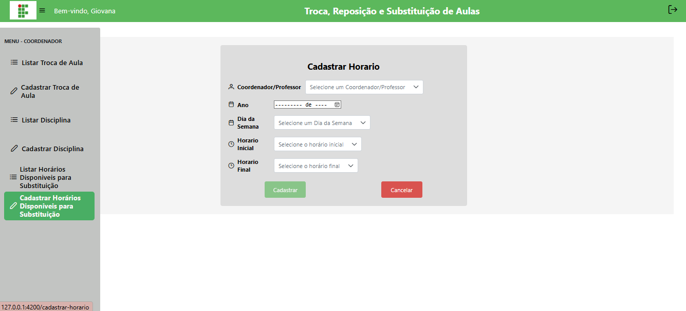
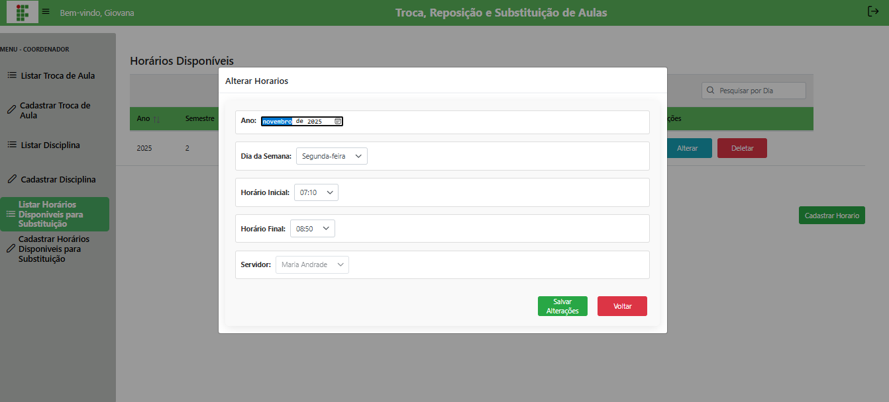

# 📝 Gerenciar Horários (Coordenador)

## Descrição

O coordenador pode gerenciar horários disponíveis de todos os professores, podendo cadastrar, editar e excluir horários para substituição.

## Passo a passo

1. No menu lateral, clique em **Horários**.
2. A lista exibirá todos os horários cadastrados.
3. Para **cadastrar**, preencha ano, dia da semana, horário inicial e final.
4. Para **editar** ou **excluir**, use os botões correspondentes.

## Capturas de Tela

