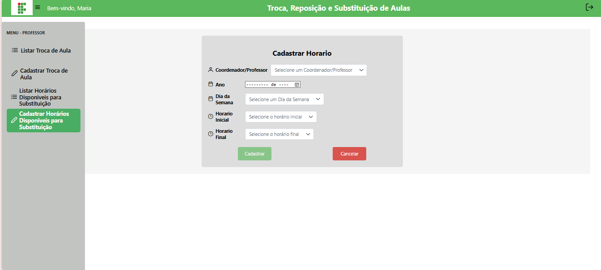

# 📝 Cadastrar Horários Disponíveis

## Descrição

Professores podem informar os horários disponíveis para substituição de aulas. O cadastro inclui ano, dia da semana, horário inicial e horário final.

## Passo a passo

1. No menu lateral, clique em **Cadastrar Horários Disponíveis para Substituição**.
2. Preencha o formulário:
   - **Ano** — selecione o ano letivo.
   - **Dia da semana** — escolha o dia.
   - **Horário inicial** — hora de início do horário disponível.
   - **Horário final** — hora de término do horário disponível.
3. Clique em **Cadastrar**. O sistema validará horários inconsistentes ou sobrepostos.

## Validações importantes

- Horário final deve ser maior que horário inicial.
- Não é permitido cadastrar horários sobrepostos.
- Professor só pode cadastrar horários próprios.
- O semestre é definido automaticamente pelo mês informado:
  - Janeiro a Junho → 1º semestre
  - Julho a Dezembro → 2º semestre

## Capturas de Tela

