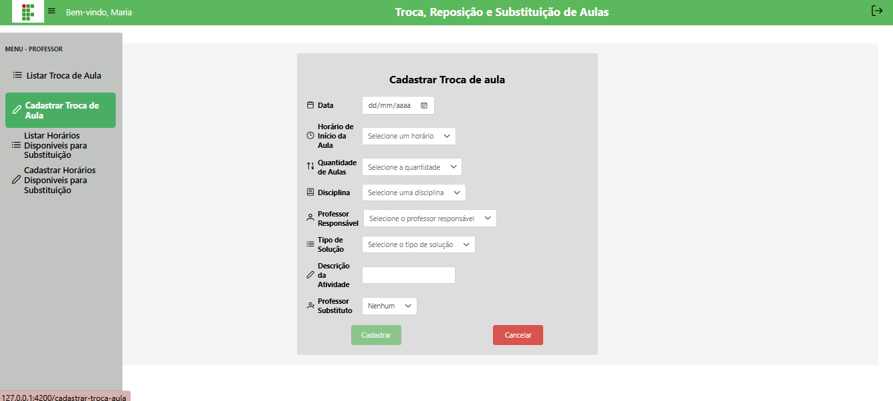

# 📝 Cadastrar Troca de Aulas

## Descrição

Nesta página o professor registra reposição, substituição ou troca de aulas. O cadastro contém data, horário inicial, quantidade de aulas, disciplina, professor responsável, tipo da solução (reposição, substituição ou troca) e, se aplicável, professor substituto. Após criar, o sistema notifica automaticamente o professor substituto (quando informado).

## Passo a passo

1. Na barra lateral, clique em **Cadastrar Troca de Aula**.
2. No formulário preencha:
   - **Data** — selecione a data da aula (não pode ser anterior ao dia atual).
   - **Horário inicial** — escolha o horário (ex.: 07:00, 08:50 etc.).
   - **Quantidade de aulas** — número de aulas consecutivas a serem trocadas.
   - **Disciplina** — selecione a disciplina correspondente.
   - **Professor responsável** — usuário logado (preenchido automaticamente).
   - **Tipo de solução** — Reposição, Substituição ou Troca.
   - **Professor substituto** — (opcional) selecione outro professor para substituir.
   - **Descrição / motivo** — explique o motivo da solicitação.
3. Clique em **Cadastrar**. Se houver erro de validação o sistema exibirá uma mensagem.
4. Após cadastro bem-sucedido, uma notificação é enviada ao professor substituto (quando informado).

## Validações importantes

- O horário final deve ser maior que o horário inicial.
- A data não pode ser anterior ao dia atual.
- A quantidade de aulas máximas permitidas depende do horário inicial.
- O professor substituto, se preenchido, não pode ser o usuário logado.
- Quantidade de aulas respeita o máximo por bloco.

## Capturas de Tela

