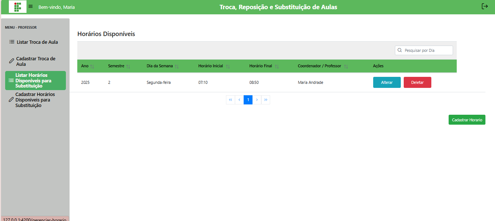
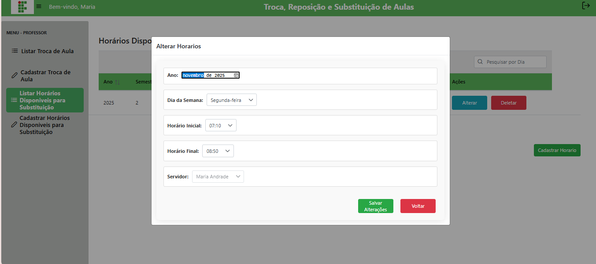

# 📝 Gerenciar Horários Disponíveis

## Descrição

Nesta página o professor pode listar todos os horários que ele cadastrou, além de poder **editar** ou **excluir** um horário.

## Passo a passo

1. No menu lateral, clique em **Listar Horários Disponíveis para Substituição**.
2. A lista exibirá todos os horários cadastrados. Cada registro terá botões de **Editar** e **Excluir**.
3. Para **editar**, clique no botão correspondente, altere os campos desejados e clique em **Salvar**.
4. Para **excluir**, clique no botão correspondente. A ação não poderá ser desfeita.

## Validações importantes

- O professor só pode editar ou excluir seus próprios horários.
- Horários não podem ser sobrepostos.
- Horário final deve ser maior que horário inicial.

## Capturas de Tela

