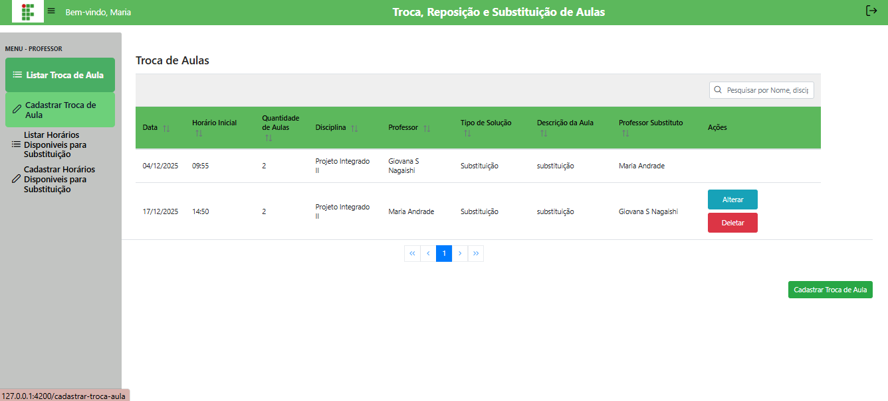
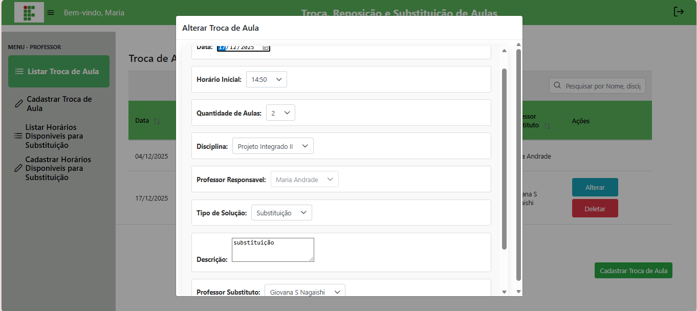
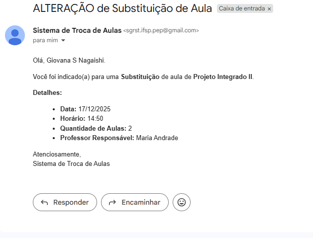

# 📝 Gerenciar Trocas de Aulas

## Descrição

Nesta página o professor pode listar todas as trocas de aula que ele registrou, além de poder **editar** ou **excluir** uma solicitação já feita. O sistema garante que apenas o próprio professor responsável possa alterar ou remover suas trocas.

## Passo a passo

1. No menu lateral, clique em **Listar Troca de Aulas**.
2. A lista exibirá todas as trocas de aula registradas. Para cada registro você verá botões de **Editar** e **Excluir**.
3. Para **editar**, clique no botão correspondente, altere os campos desejados e clique em **Salvar**.
4. Após salvar a edição, o sistema exibirá uma **notificação de alteração de troca de aula** indicando que a atualização foi realizada com sucesso.
5. Para **excluir**, clique no botão correspondente.

## Validações importantes

- O professor só pode editar ou excluir suas próprias trocas.
- Não é possível criar horários inconsistentes ao editar (mesma validação do cadastro).

## Capturas de Tela

